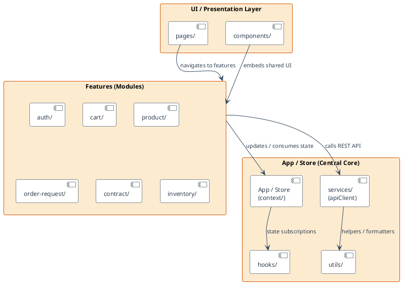

# FS-SIMS - FRONTEND PACKAGE DIAGRAM (FOLDER LEVEL)

```plantuml
@startuml Frontend_Package_Diagram
skinparam packageStyle rectangle
skinparam shadowing false
skinparam roundCorner 6
skinparam defaultFontName Arial
skinparam defaultFontSize 12

' Color settings (Package màu cam nhạt)
skinparam package {
    BackgroundColor #FDEBD0
    BorderColor #D35400
    BorderThickness 1.5
    FontColor #7E5109
    FontStyle bold
}

skinparam component {
    BackgroundColor #FFFFFF
    BorderColor #7F8C8D
    BorderThickness 1
    FontColor #2C3E50
}

skinparam arrow {
    Color #34495E
    FontColor #2C3E50
    FontSize 11
}

package "UI / Presentation Layer" as PKG_UI #FDEBD0 {
    component [pages/] as C_PAGES
    component [components/] as C_COMPONENTS
}

package "Features (Modules)" as PKG_FEATURES #FDEBD0 {
    component [auth/] as F_AUTH
    component [cart/] as F_CART
    component [product/] as F_PROD
    component [order-request/] as F_ORDER
    component [contract/] as F_CONTRACT
    component [inventory/] as F_INV
}

package "App / Store (Central Core)" as PKG_CORE #FDEBD0 {
    component [App / Store\n(context/)] as C_STORE
    component [services/\n(apiClient)] as C_SERVICES
    component [hooks/] as C_HOOKS
    component [utils/] as C_UTILS
}

' Luồng đi: Pages -> Features -> Services/Store
C_PAGES --> PKG_FEATURES : navigates to features
C_COMPONENTS --> PKG_FEATURES : embeds shared UI
PKG_FEATURES --> C_STORE : updates / consumes state
PKG_FEATURES --> C_SERVICES : calls REST API
C_STORE --> C_HOOKS : state subscriptions
C_SERVICES --> C_UTILS : helpers / formatters
@enduml
```
