# TỔNG HỢP SEQUENCE DIAGRAMS HỆ THỐNG FS-SIMS (NHÓM 2.1 ĐẾN 2.14)
> **Dự án**: FS-SIMS (Furniture Sales & Inventory Management System)  
> **Kiến trúc thực tế**: React 18 / Vite + Node.js Express 4 + Sequelize ORM + MySQL 8  
> **Quy chuẩn**: Bám sát 100% codebase thực tế, đủ activation bar, luồng alt (Operation successful / Unexpected error), mã màu chuẩn.

---

## NHÓM 2.1: XÁC THỰC & PHÂN QUYỀN (AUTHENTICATION & AUTHORIZATION)

### Use Case 2.1.1: Customer Sign Up (Đăng ký tài khoản khách hàng)

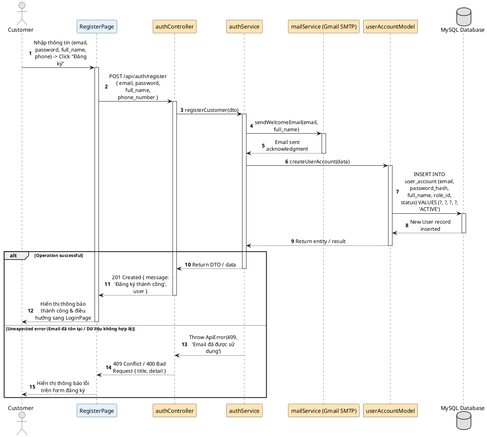
```plantuml
@startuml
skinparam sequenceMessageAlign center
skinparam maxMessageSize 150
autonumber

actor "Customer" as User
participant "RegisterPage" as FE #E3F2FD
participant "authController" as Ctrl #FFE4B5
participant "authService" as Svc #FFE4B5
participant "mailService (Gmail SMTP)" as Ext #FFE4B5
participant "userAccountModel" as Model #FFE4B5
database "MySQL Database" as DB #E0E0E0

User -> FE : Nhập thông tin (email, password, full_name, phone) -> Click "Đăng ký"
activate FE

FE -> Ctrl : POST /api/auth/register { email, password, full_name, phone_number }
activate Ctrl

Ctrl -> Svc : registerCustomer(dto)
activate Svc

Svc -> Ext : sendWelcomeEmail(email, full_name)
activate Ext
Ext --> Svc : Email sent acknowledgment
deactivate Ext

Svc -> Model : createUserAccount(data)
activate Model

Model -> DB : INSERT INTO user_account (email, password_hash, full_name, role_id, status) VALUES (?, ?, ?, ?, 'ACTIVE')
activate DB
DB --> Model : New User record inserted
deactivate DB

Model --> Svc : Return entity / result
deactivate Model

alt Operation successful
  Svc --> Ctrl : Return DTO / data
  deactivate Svc
  Ctrl --> FE : 201 Created { message: 'Đăng ký thành công', user }
  deactivate Ctrl
  FE --> User : Hiển thị thông báo thành công & điều hướng sang LoginPage
  deactivate FE
else Unexpected error (Email đã tồn tại / Dữ liệu không hợp lệ)
  Svc --> Ctrl : Throw ApiError(409, 'Email đã được sử dụng')
  deactivate Svc
  Ctrl --> FE : 409 Conflict / 400 Bad Request { title, detail }
  deactivate Ctrl
  FE --> User : Hiển thị thông báo lỗi trên form đăng ký
  deactivate FE
end
@enduml
```

### Use Case 2.1.2: Customer Sign In (Đăng nhập khách hàng)

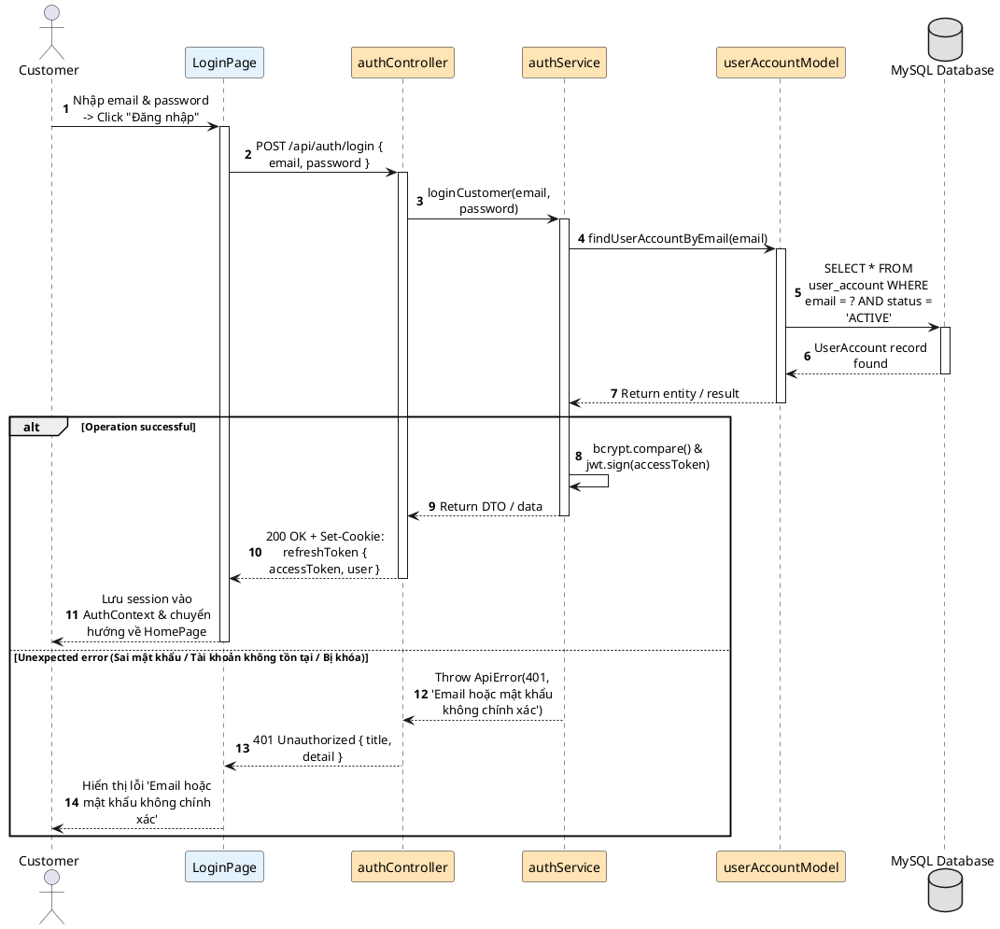
```plantuml
@startuml
skinparam sequenceMessageAlign center
skinparam maxMessageSize 150
autonumber

actor "Customer" as User
participant "LoginPage" as FE #E3F2FD
participant "authController" as Ctrl #FFE4B5
participant "authService" as Svc #FFE4B5
participant "userAccountModel" as Model #FFE4B5
database "MySQL Database" as DB #E0E0E0

User -> FE : Nhập email & password -> Click "Đăng nhập"
activate FE

FE -> Ctrl : POST /api/auth/login { email, password }
activate Ctrl

Ctrl -> Svc : loginCustomer(email, password)
activate Svc

Svc -> Model : findUserAccountByEmail(email)
activate Model

Model -> DB : SELECT * FROM user_account WHERE email = ? AND status = 'ACTIVE'
activate DB
DB --> Model : UserAccount record found
deactivate DB

Model --> Svc : Return entity / result
deactivate Model

alt Operation successful
  Svc -> Svc : bcrypt.compare() & jwt.sign(accessToken)
  Svc --> Ctrl : Return DTO / data
  deactivate Svc
  Ctrl --> FE : 200 OK + Set-Cookie: refreshToken { accessToken, user }
  deactivate Ctrl
  FE --> User : Lưu session vào AuthContext & chuyển hướng về HomePage
  deactivate FE
else Unexpected error (Sai mật khẩu / Tài khoản không tồn tại / Bị khóa)
  Svc --> Ctrl : Throw ApiError(401, 'Email hoặc mật khẩu không chính xác')
  deactivate Svc
  Ctrl --> FE : 401 Unauthorized { title, detail }
  deactivate Ctrl
  FE --> User : Hiển thị lỗi 'Email hoặc mật khẩu không chính xác'
  deactivate FE
end
@enduml
```

### Use Case 2.1.3: Staff Sign In (Đăng nhập nhân sự nội bộ: Sales, Leader, Owner)

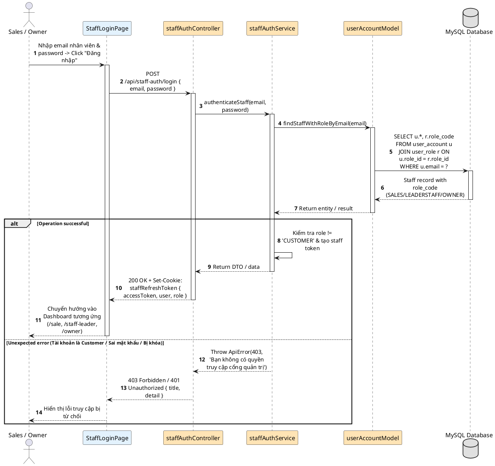
```plantuml
@startuml
skinparam sequenceMessageAlign center
skinparam maxMessageSize 150
autonumber

actor "Sales / Owner" as User
participant "StaffLoginPage" as FE #E3F2FD
participant "staffAuthController" as Ctrl #FFE4B5
participant "staffAuthService" as Svc #FFE4B5
participant "userAccountModel" as Model #FFE4B5
database "MySQL Database" as DB #E0E0E0

User -> FE : Nhập email nhân viên & password -> Click "Đăng nhập"
activate FE

FE -> Ctrl : POST /api/staff-auth/login { email, password }
activate Ctrl

Ctrl -> Svc : authenticateStaff(email, password)
activate Svc

Svc -> Model : findStaffWithRoleByEmail(email)
activate Model

Model -> DB : SELECT u.*, r.role_code FROM user_account u JOIN user_role r ON u.role_id = r.role_id WHERE u.email = ?
activate DB
DB --> Model : Staff record with role_code (SALES/LEADERSTAFF/OWNER)
deactivate DB

Model --> Svc : Return entity / result
deactivate Model

alt Operation successful
  Svc -> Svc : Kiểm tra role != 'CUSTOMER' & tạo staff token
  Svc --> Ctrl : Return DTO / data
  deactivate Svc
  Ctrl --> FE : 200 OK + Set-Cookie: staffRefreshToken { accessToken, user, role }
  deactivate Ctrl
  FE --> User : Chuyển hướng vào Dashboard tương ứng (/sale, /staff-leader, /owner)
  deactivate FE
else Unexpected error (Tài khoản là Customer / Sai mật khẩu / Bị khóa)
  Svc --> Ctrl : Throw ApiError(403, 'Bạn không có quyền truy cập cổng quản trị')
  deactivate Svc
  Ctrl --> FE : 403 Forbidden / 401 Unauthorized { title, detail }
  deactivate Ctrl
  FE --> User : Hiển thị lỗi truy cập bị từ chối
  deactivate FE
end
@enduml
```

---

## NHÓM 2.2: QUẢN LÝ HỒ SƠ & NHÂN SỰ (USER & STAFF MANAGEMENT)

### Use Case 2.2.1: View Personal Profile (Xem thông tin hồ sơ cá nhân)

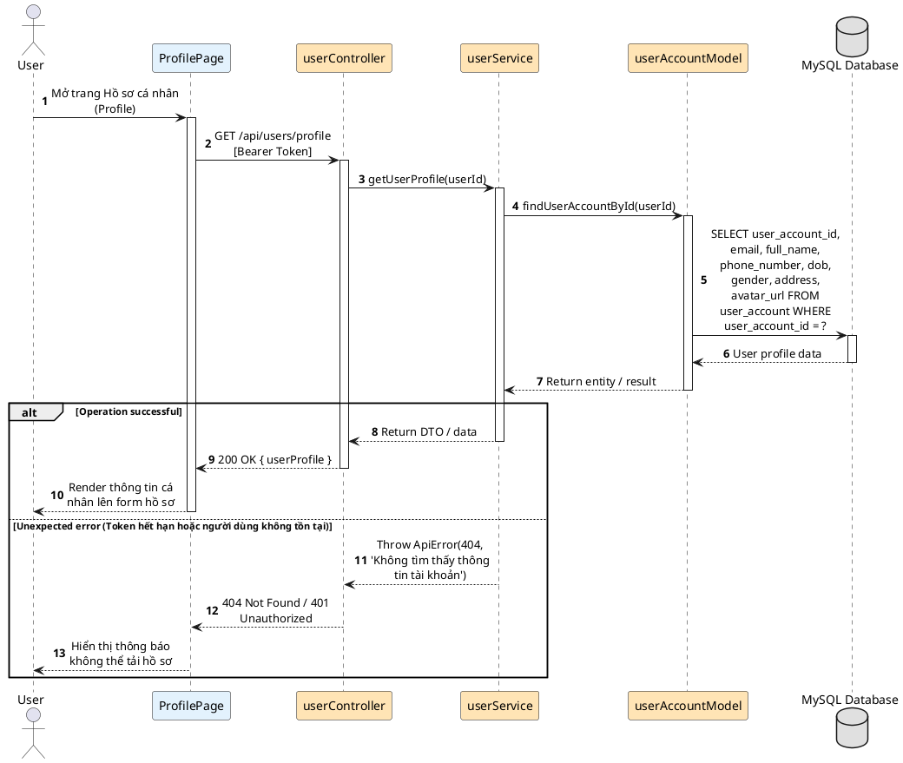
```plantuml
@startuml
skinparam sequenceMessageAlign center
skinparam maxMessageSize 150
autonumber

actor "User" as User
participant "ProfilePage" as FE #E3F2FD
participant "userController" as Ctrl #FFE4B5
participant "userService" as Svc #FFE4B5
participant "userAccountModel" as Model #FFE4B5
database "MySQL Database" as DB #E0E0E0

User -> FE : Mở trang Hồ sơ cá nhân (Profile)
activate FE

FE -> Ctrl : GET /api/users/profile [Bearer Token]
activate Ctrl

Ctrl -> Svc : getUserProfile(userId)
activate Svc

Svc -> Model : findUserAccountById(userId)
activate Model

Model -> DB : SELECT user_account_id, email, full_name, phone_number, dob, gender, address, avatar_url FROM user_account WHERE user_account_id = ?
activate DB
DB --> Model : User profile data
deactivate DB

Model --> Svc : Return entity / result
deactivate Model

alt Operation successful
  Svc --> Ctrl : Return DTO / data
  deactivate Svc
  Ctrl --> FE : 200 OK { userProfile }
  deactivate Ctrl
  FE --> User : Render thông tin cá nhân lên form hồ sơ
  deactivate FE
else Unexpected error (Token hết hạn hoặc người dùng không tồn tại)
  Svc --> Ctrl : Throw ApiError(404, 'Không tìm thấy thông tin tài khoản')
  deactivate Svc
  Ctrl --> FE : 404 Not Found / 401 Unauthorized
  deactivate Ctrl
  FE --> User : Hiển thị thông báo không thể tải hồ sơ
  deactivate FE
end
@enduml
```

### Use Case 2.2.2: Update Profile & Avatar (Cập nhật hồ sơ & Avatar qua Cloudinary)

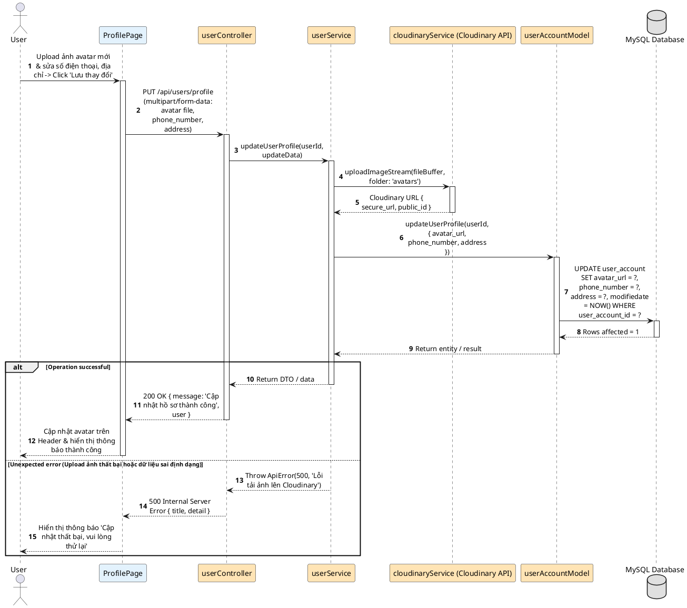
```plantuml
@startuml
skinparam sequenceMessageAlign center
skinparam maxMessageSize 150
autonumber

actor "User" as User
participant "ProfilePage" as FE #E3F2FD
participant "userController" as Ctrl #FFE4B5
participant "userService" as Svc #FFE4B5
participant "cloudinaryService (Cloudinary API)" as Ext #FFE4B5
participant "userAccountModel" as Model #FFE4B5
database "MySQL Database" as DB #E0E0E0

User -> FE : Upload ảnh avatar mới & sửa số điện thoại, địa chỉ -> Click 'Lưu thay đổi'
activate FE

FE -> Ctrl : PUT /api/users/profile (multipart/form-data: avatar file, phone_number, address)
activate Ctrl

Ctrl -> Svc : updateUserProfile(userId, updateData)
activate Svc

Svc -> Ext : uploadImageStream(fileBuffer, folder: 'avatars')
activate Ext
Ext --> Svc : Cloudinary URL { secure_url, public_id }
deactivate Ext

Svc -> Model : updateUserProfile(userId, { avatar_url, phone_number, address })
activate Model

Model -> DB : UPDATE user_account SET avatar_url = ?, phone_number = ?, address = ?, modifiedate = NOW() WHERE user_account_id = ?
activate DB
DB --> Model : Rows affected = 1
deactivate DB

Model --> Svc : Return entity / result
deactivate Model

alt Operation successful
  Svc --> Ctrl : Return DTO / data
  deactivate Svc
  Ctrl --> FE : 200 OK { message: 'Cập nhật hồ sơ thành công', user }
  deactivate Ctrl
  FE --> User : Cập nhật avatar trên Header & hiển thị thông báo thành công
  deactivate FE
else Unexpected error (Upload ảnh thất bại hoặc dữ liệu sai định dạng)
  Svc --> Ctrl : Throw ApiError(500, 'Lỗi tải ảnh lên Cloudinary')
  deactivate Svc
  Ctrl --> FE : 500 Internal Server Error { title, detail }
  deactivate Ctrl
  FE --> User : Hiển thị thông báo 'Cập nhật thất bại, vui lòng thử lại'
  deactivate FE
end
@enduml
```

### Use Case 2.2.3: List Staff Accounts (Chủ xưởng xem danh sách nhân sự)

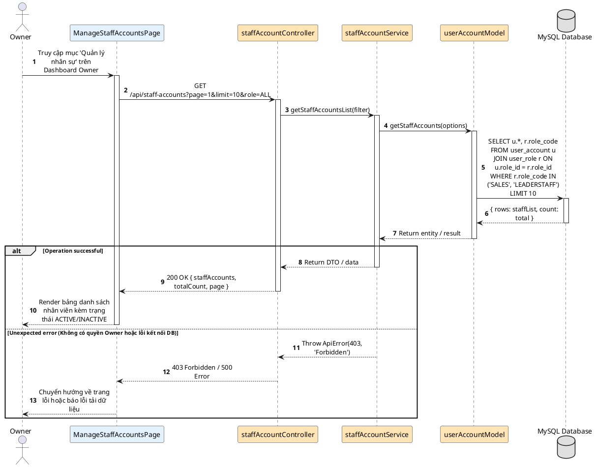
```plantuml
@startuml
skinparam sequenceMessageAlign center
skinparam maxMessageSize 150
autonumber

actor "Owner" as User
participant "ManageStaffAccountsPage" as FE #E3F2FD
participant "staffAccountController" as Ctrl #FFE4B5
participant "staffAccountService" as Svc #FFE4B5
participant "userAccountModel" as Model #FFE4B5
database "MySQL Database" as DB #E0E0E0

User -> FE : Truy cập mục 'Quản lý nhân sự' trên Dashboard Owner
activate FE

FE -> Ctrl : GET /api/staff-accounts?page=1&limit=10&role=ALL
activate Ctrl

Ctrl -> Svc : getStaffAccountsList(filter)
activate Svc

Svc -> Model : getStaffAccounts(options)
activate Model

Model -> DB : SELECT u.*, r.role_code FROM user_account u JOIN user_role r ON u.role_id = r.role_id WHERE r.role_code IN ('SALES', 'LEADERSTAFF') LIMIT 10
activate DB
DB --> Model : { rows: staffList, count: total }
deactivate DB

Model --> Svc : Return entity / result
deactivate Model

alt Operation successful
  Svc --> Ctrl : Return DTO / data
  deactivate Svc
  Ctrl --> FE : 200 OK { staffAccounts, totalCount, page }
  deactivate Ctrl
  FE --> User : Render bảng danh sách nhân viên kèm trạng thái ACTIVE/INACTIVE
  deactivate FE
else Unexpected error (Không có quyền Owner hoặc lỗi kết nối DB)
  Svc --> Ctrl : Throw ApiError(403, 'Forbidden')
  deactivate Svc
  Ctrl --> FE : 403 Forbidden / 500 Error
  deactivate Ctrl
  FE --> User : Chuyển hướng về trang lỗi hoặc báo lỗi tải dữ liệu
  deactivate FE
end
@enduml
```

---

## NHÓM 2.3: QUẢN LÝ SẢN PHẨM & DANH MỤC (PRODUCT & CATALOG)

### Use Case 2.3.1: Get Public Product Metadata (Lấy bộ lọc danh mục & phòng)

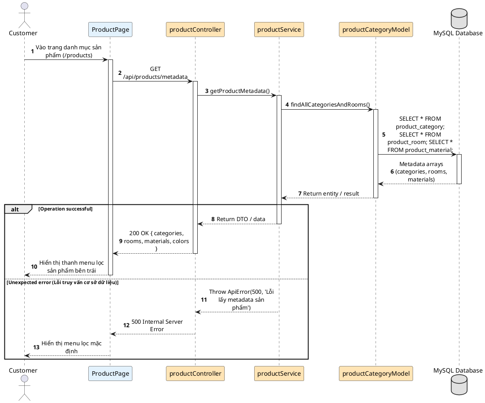
```plantuml
@startuml
skinparam sequenceMessageAlign center
skinparam maxMessageSize 150
autonumber

actor "Customer" as User
participant "ProductPage" as FE #E3F2FD
participant "productController" as Ctrl #FFE4B5
participant "productService" as Svc #FFE4B5
participant "productCategoryModel" as Model #FFE4B5
database "MySQL Database" as DB #E0E0E0

User -> FE : Vào trang danh mục sản phẩm (/products)
activate FE

FE -> Ctrl : GET /api/products/metadata
activate Ctrl

Ctrl -> Svc : getProductMetadata()
activate Svc

Svc -> Model : findAllCategoriesAndRooms()
activate Model

Model -> DB : SELECT * FROM product_category; SELECT * FROM product_room; SELECT * FROM product_material;
activate DB
DB --> Model : Metadata arrays (categories, rooms, materials)
deactivate DB

Model --> Svc : Return entity / result
deactivate Model

alt Operation successful
  Svc --> Ctrl : Return DTO / data
  deactivate Svc
  Ctrl --> FE : 200 OK { categories, rooms, materials, colors }
  deactivate Ctrl
  FE --> User : Hiển thị thanh menu lọc sản phẩm bên trái
  deactivate FE
else Unexpected error (Lỗi truy vấn cơ sở dữ liệu)
  Svc --> Ctrl : Throw ApiError(500, 'Lỗi lấy metadata sản phẩm')
  deactivate Svc
  Ctrl --> FE : 500 Internal Server Error
  deactivate Ctrl
  FE --> User : Hiển thị menu lọc mặc định
  deactivate FE
end
@enduml
```

### Use Case 2.3.2: Browse Products (Khách hàng tìm kiếm & duyệt sản phẩm)

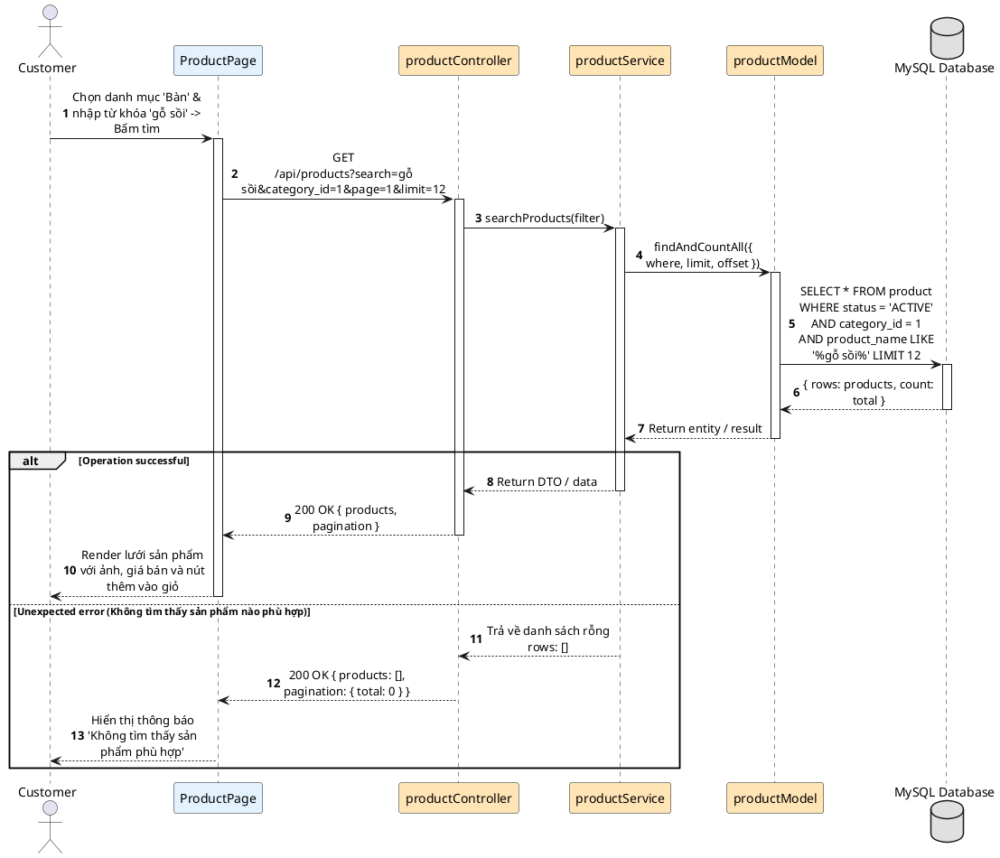
```plantuml
@startuml
skinparam sequenceMessageAlign center
skinparam maxMessageSize 150
autonumber

actor "Customer" as User
participant "ProductPage" as FE #E3F2FD
participant "productController" as Ctrl #FFE4B5
participant "productService" as Svc #FFE4B5
participant "productModel" as Model #FFE4B5
database "MySQL Database" as DB #E0E0E0

User -> FE : Chọn danh mục 'Bàn' & nhập từ khóa 'gỗ sồi' -> Bấm tìm
activate FE

FE -> Ctrl : GET /api/products?search=gỗ sồi&category_id=1&page=1&limit=12
activate Ctrl

Ctrl -> Svc : searchProducts(filter)
activate Svc

Svc -> Model : findAndCountAll({ where, limit, offset })
activate Model

Model -> DB : SELECT * FROM product WHERE status = 'ACTIVE' AND category_id = 1 AND product_name LIKE '%gỗ sồi%' LIMIT 12
activate DB
DB --> Model : { rows: products, count: total }
deactivate DB

Model --> Svc : Return entity / result
deactivate Model

alt Operation successful
  Svc --> Ctrl : Return DTO / data
  deactivate Svc
  Ctrl --> FE : 200 OK { products, pagination }
  deactivate Ctrl
  FE --> User : Render lưới sản phẩm với ảnh, giá bán và nút thêm vào giỏ
  deactivate FE
else Unexpected error (Không tìm thấy sản phẩm nào phù hợp)
  Svc --> Ctrl : Trả về danh sách rỗng rows: []
  deactivate Svc
  Ctrl --> FE : 200 OK { products: [], pagination: { total: 0 } }
  deactivate Ctrl
  FE --> User : Hiển thị thông báo 'Không tìm thấy sản phẩm phù hợp'
  deactivate FE
end
@enduml
```

### Use Case 2.3.3: View Product Detail (Xem thông số chi tiết sản phẩm)

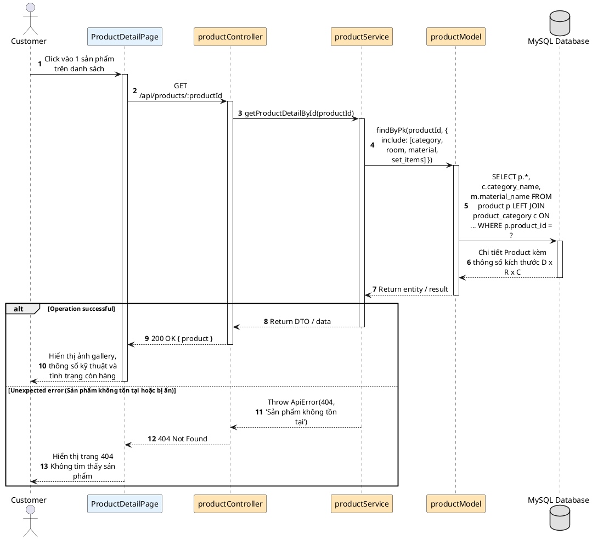
```plantuml
@startuml
skinparam sequenceMessageAlign center
skinparam maxMessageSize 150
autonumber

actor "Customer" as User
participant "ProductDetailPage" as FE #E3F2FD
participant "productController" as Ctrl #FFE4B5
participant "productService" as Svc #FFE4B5
participant "productModel" as Model #FFE4B5
database "MySQL Database" as DB #E0E0E0

User -> FE : Click vào 1 sản phẩm trên danh sách
activate FE

FE -> Ctrl : GET /api/products/:productId
activate Ctrl

Ctrl -> Svc : getProductDetailById(productId)
activate Svc

Svc -> Model : findByPk(productId, { include: [category, room, material, set_items] })
activate Model

Model -> DB : SELECT p.*, c.category_name, m.material_name FROM product p LEFT JOIN product_category c ON ... WHERE p.product_id = ?
activate DB
DB --> Model : Chi tiết Product kèm thông số kích thước D x R x C
deactivate DB

Model --> Svc : Return entity / result
deactivate Model

alt Operation successful
  Svc --> Ctrl : Return DTO / data
  deactivate Svc
  Ctrl --> FE : 200 OK { product }
  deactivate Ctrl
  FE --> User : Hiển thị ảnh gallery, thông số kỹ thuật và tình trạng còn hàng
  deactivate FE
else Unexpected error (Sản phẩm không tồn tại hoặc bị ẩn)
  Svc --> Ctrl : Throw ApiError(404, 'Sản phẩm không tồn tại')
  deactivate Svc
  Ctrl --> FE : 404 Not Found
  deactivate Ctrl
  FE --> User : Hiển thị trang 404 Không tìm thấy sản phẩm
  deactivate FE
end
@enduml
```

---

## NHÓM 2.4: GIỎ HÀNG TRỰC TUYẾN (SHOPPING CART)

### Use Case 2.4.1: View Cart (Khách hàng xem giỏ hàng cá nhân)

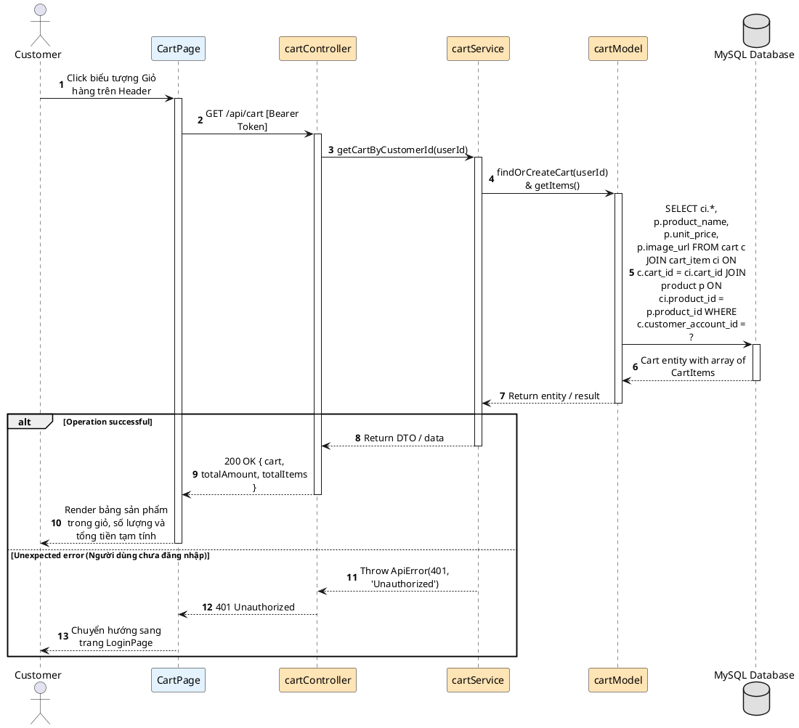
```plantuml
@startuml
skinparam sequenceMessageAlign center
skinparam maxMessageSize 150
autonumber

actor "Customer" as User
participant "CartPage" as FE #E3F2FD
participant "cartController" as Ctrl #FFE4B5
participant "cartService" as Svc #FFE4B5
participant "cartModel" as Model #FFE4B5
database "MySQL Database" as DB #E0E0E0

User -> FE : Click biểu tượng Giỏ hàng trên Header
activate FE

FE -> Ctrl : GET /api/cart [Bearer Token]
activate Ctrl

Ctrl -> Svc : getCartByCustomerId(userId)
activate Svc

Svc -> Model : findOrCreateCart(userId) & getItems()
activate Model

Model -> DB : SELECT ci.*, p.product_name, p.unit_price, p.image_url FROM cart c JOIN cart_item ci ON c.cart_id = ci.cart_id JOIN product p ON ci.product_id = p.product_id WHERE c.customer_account_id = ?
activate DB
DB --> Model : Cart entity with array of CartItems
deactivate DB

Model --> Svc : Return entity / result
deactivate Model

alt Operation successful
  Svc --> Ctrl : Return DTO / data
  deactivate Svc
  Ctrl --> FE : 200 OK { cart, totalAmount, totalItems }
  deactivate Ctrl
  FE --> User : Render bảng sản phẩm trong giỏ, số lượng và tổng tiền tạm tính
  deactivate FE
else Unexpected error (Người dùng chưa đăng nhập)
  Svc --> Ctrl : Throw ApiError(401, 'Unauthorized')
  deactivate Svc
  Ctrl --> FE : 401 Unauthorized
  deactivate Ctrl
  FE --> User : Chuyển hướng sang trang LoginPage
  deactivate FE
end
@enduml
```

### Use Case 2.4.2: Add Item to Cart (Thêm sản phẩm vào giỏ hàng)

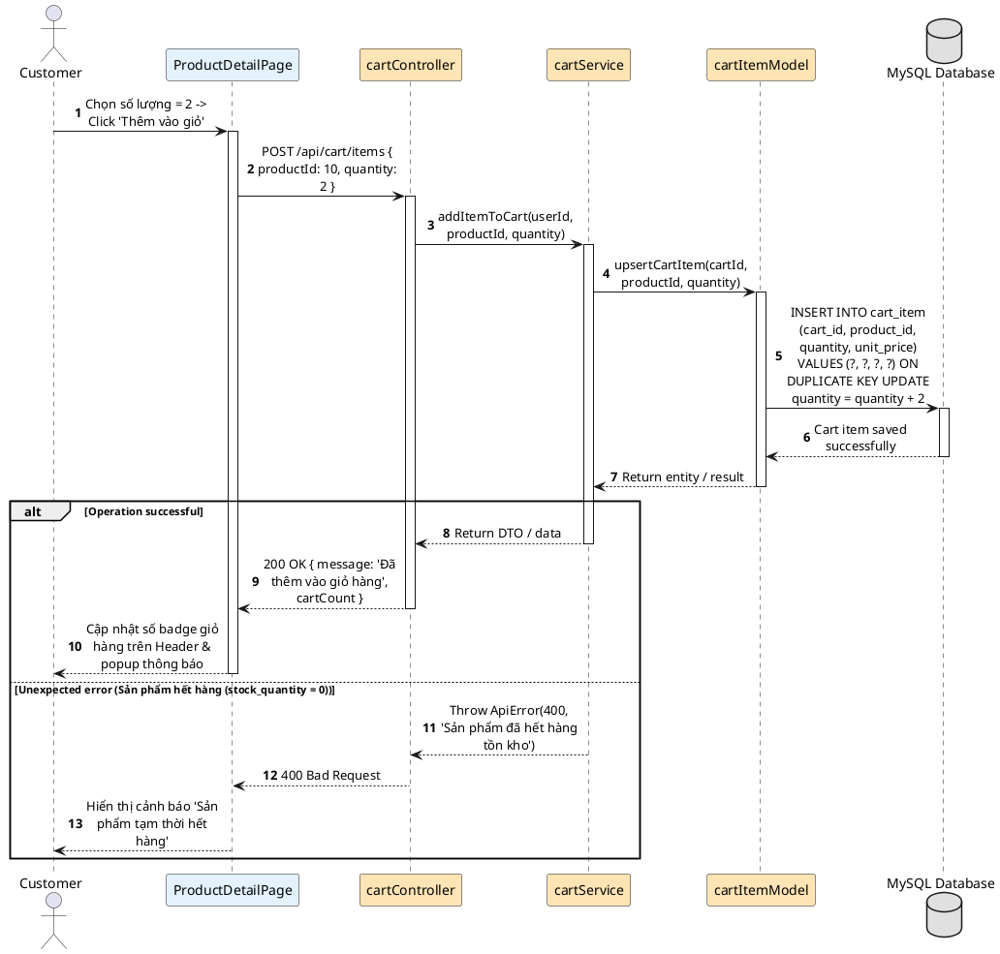
```plantuml
@startuml
skinparam sequenceMessageAlign center
skinparam maxMessageSize 150
autonumber

actor "Customer" as User
participant "ProductDetailPage" as FE #E3F2FD
participant "cartController" as Ctrl #FFE4B5
participant "cartService" as Svc #FFE4B5
participant "cartItemModel" as Model #FFE4B5
database "MySQL Database" as DB #E0E0E0

User -> FE : Chọn số lượng = 2 -> Click 'Thêm vào giỏ'
activate FE

FE -> Ctrl : POST /api/cart/items { productId: 10, quantity: 2 }
activate Ctrl

Ctrl -> Svc : addItemToCart(userId, productId, quantity)
activate Svc

Svc -> Model : upsertCartItem(cartId, productId, quantity)
activate Model

Model -> DB : INSERT INTO cart_item (cart_id, product_id, quantity, unit_price) VALUES (?, ?, ?, ?) ON DUPLICATE KEY UPDATE quantity = quantity + 2
activate DB
DB --> Model : Cart item saved successfully
deactivate DB

Model --> Svc : Return entity / result
deactivate Model

alt Operation successful
  Svc --> Ctrl : Return DTO / data
  deactivate Svc
  Ctrl --> FE : 200 OK { message: 'Đã thêm vào giỏ hàng', cartCount }
  deactivate Ctrl
  FE --> User : Cập nhật số badge giỏ hàng trên Header & popup thông báo
  deactivate FE
else Unexpected error (Sản phẩm hết hàng (stock_quantity = 0))
  Svc --> Ctrl : Throw ApiError(400, 'Sản phẩm đã hết hàng tồn kho')
  deactivate Svc
  Ctrl --> FE : 400 Bad Request
  deactivate Ctrl
  FE --> User : Hiển thị cảnh báo 'Sản phẩm tạm thời hết hàng'
  deactivate FE
end
@enduml
```

### Use Case 2.4.3: Update Cart Item Quantity (Thay đổi số lượng món trong giỏ)

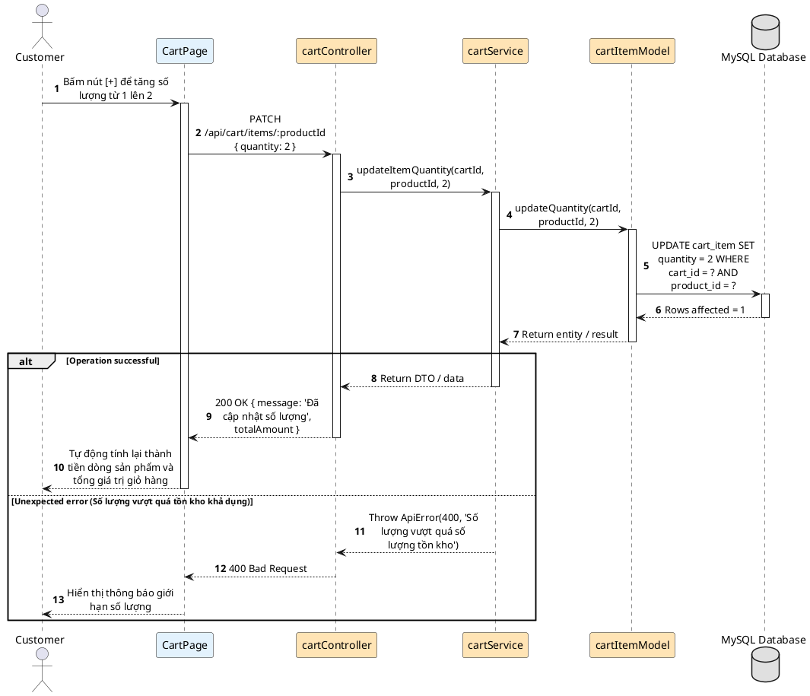
```plantuml
@startuml
skinparam sequenceMessageAlign center
skinparam maxMessageSize 150
autonumber

actor "Customer" as User
participant "CartPage" as FE #E3F2FD
participant "cartController" as Ctrl #FFE4B5
participant "cartService" as Svc #FFE4B5
participant "cartItemModel" as Model #FFE4B5
database "MySQL Database" as DB #E0E0E0

User -> FE : Bấm nút [+] để tăng số lượng từ 1 lên 2
activate FE

FE -> Ctrl : PATCH /api/cart/items/:productId { quantity: 2 }
activate Ctrl

Ctrl -> Svc : updateItemQuantity(cartId, productId, 2)
activate Svc

Svc -> Model : updateQuantity(cartId, productId, 2)
activate Model

Model -> DB : UPDATE cart_item SET quantity = 2 WHERE cart_id = ? AND product_id = ?
activate DB
DB --> Model : Rows affected = 1
deactivate DB

Model --> Svc : Return entity / result
deactivate Model

alt Operation successful
  Svc --> Ctrl : Return DTO / data
  deactivate Svc
  Ctrl --> FE : 200 OK { message: 'Đã cập nhật số lượng', totalAmount }
  deactivate Ctrl
  FE --> User : Tự động tính lại thành tiền dòng sản phẩm và tổng giá trị giỏ hàng
  deactivate FE
else Unexpected error (Số lượng vượt quá tồn kho khả dụng)
  Svc --> Ctrl : Throw ApiError(400, 'Số lượng vượt quá số lượng tồn kho')
  deactivate Svc
  Ctrl --> FE : 400 Bad Request
  deactivate Ctrl
  FE --> User : Hiển thị thông báo giới hạn số lượng
  deactivate FE
end
@enduml
```

---

## NHÓM 2.5: YÊU CẦU ĐẶT HÀNG & THIẾT KẾ (ORDER REQUESTS)

### Use Case 2.5.1: Upload Design Images (Upload ảnh thiết kế / may đo qua Cloudinary)

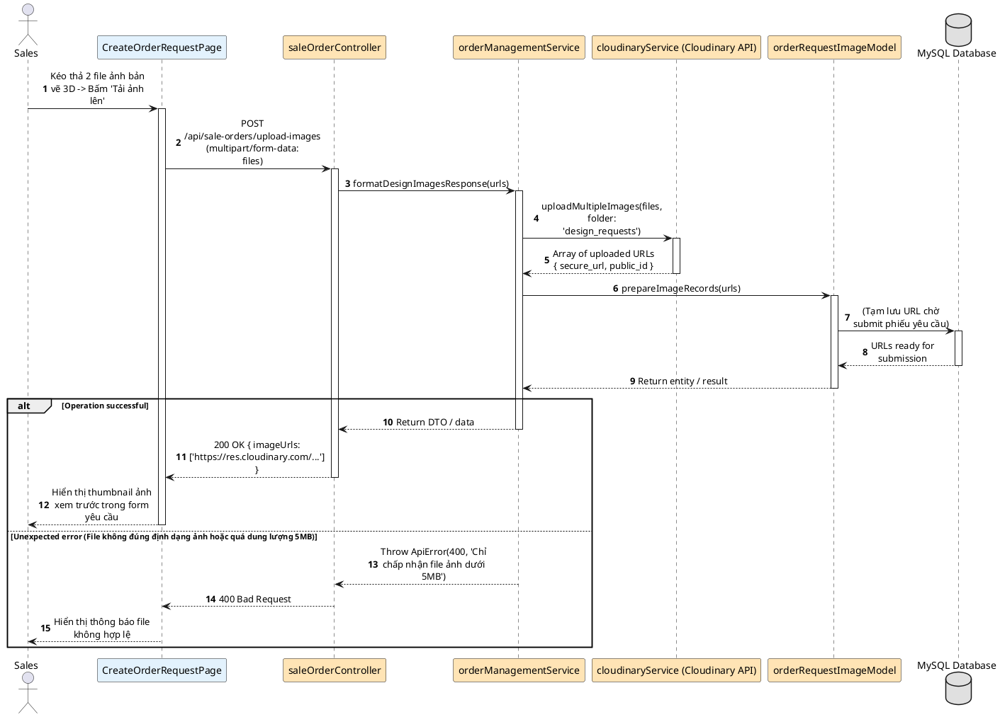
```plantuml
@startuml
skinparam sequenceMessageAlign center
skinparam maxMessageSize 150
autonumber

actor "Sales" as User
participant "CreateOrderRequestPage" as FE #E3F2FD
participant "saleOrderController" as Ctrl #FFE4B5
participant "orderManagementService" as Svc #FFE4B5
participant "cloudinaryService (Cloudinary API)" as Ext #FFE4B5
participant "orderRequestImageModel" as Model #FFE4B5
database "MySQL Database" as DB #E0E0E0

User -> FE : Kéo thả 2 file ảnh bản vẽ 3D -> Bấm 'Tải ảnh lên'
activate FE

FE -> Ctrl : POST /api/sale-orders/upload-images (multipart/form-data: files)
activate Ctrl

Ctrl -> Svc : formatDesignImagesResponse(urls)
activate Svc

Svc -> Ext : uploadMultipleImages(files, folder: 'design_requests')
activate Ext
Ext --> Svc : Array of uploaded URLs { secure_url, public_id }
deactivate Ext

Svc -> Model : prepareImageRecords(urls)
activate Model

Model -> DB : (Tạm lưu URL chờ submit phiếu yêu cầu)
activate DB
DB --> Model : URLs ready for submission
deactivate DB

Model --> Svc : Return entity / result
deactivate Model

alt Operation successful
  Svc --> Ctrl : Return DTO / data
  deactivate Svc
  Ctrl --> FE : 200 OK { imageUrls: ['https://res.cloudinary.com/...'] }
  deactivate Ctrl
  FE --> User : Hiển thị thumbnail ảnh xem trước trong form yêu cầu
  deactivate FE
else Unexpected error (File không đúng định dạng ảnh hoặc quá dung lượng 5MB)
  Svc --> Ctrl : Throw ApiError(400, 'Chỉ chấp nhận file ảnh dưới 5MB')
  deactivate Svc
  Ctrl --> FE : 400 Bad Request
  deactivate Ctrl
  FE --> User : Hiển thị thông báo file không hợp lệ
  deactivate FE
end
@enduml
```

### Use Case 2.5.2: View Customer Requests (Nhân viên Sales xem danh sách yêu cầu)

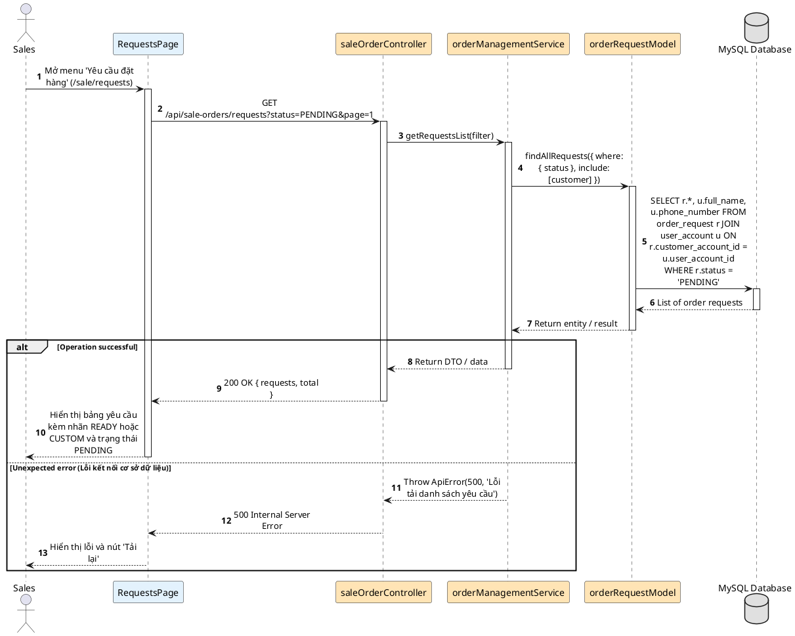
```plantuml
@startuml
skinparam sequenceMessageAlign center
skinparam maxMessageSize 150
autonumber

actor "Sales" as User
participant "RequestsPage" as FE #E3F2FD
participant "saleOrderController" as Ctrl #FFE4B5
participant "orderManagementService" as Svc #FFE4B5
participant "orderRequestModel" as Model #FFE4B5
database "MySQL Database" as DB #E0E0E0

User -> FE : Mở menu 'Yêu cầu đặt hàng' (/sale/requests)
activate FE

FE -> Ctrl : GET /api/sale-orders/requests?status=PENDING&page=1
activate Ctrl

Ctrl -> Svc : getRequestsList(filter)
activate Svc

Svc -> Model : findAllRequests({ where: { status }, include: [customer] })
activate Model

Model -> DB : SELECT r.*, u.full_name, u.phone_number FROM order_request r JOIN user_account u ON r.customer_account_id = u.user_account_id WHERE r.status = 'PENDING'
activate DB
DB --> Model : List of order requests
deactivate DB

Model --> Svc : Return entity / result
deactivate Model

alt Operation successful
  Svc --> Ctrl : Return DTO / data
  deactivate Svc
  Ctrl --> FE : 200 OK { requests, total }
  deactivate Ctrl
  FE --> User : Hiển thị bảng yêu cầu kèm nhãn READY hoặc CUSTOM và trạng thái PENDING
  deactivate FE
else Unexpected error (Lỗi kết nối cơ sở dữ liệu)
  Svc --> Ctrl : Throw ApiError(500, 'Lỗi tải danh sách yêu cầu')
  deactivate Svc
  Ctrl --> FE : 500 Internal Server Error
  deactivate Ctrl
  FE --> User : Hiển thị lỗi và nút 'Tải lại'
  deactivate FE
end
@enduml
```

### Use Case 2.5.3: View Request Detail (Xem chi tiết yêu cầu & ảnh thiết kế)

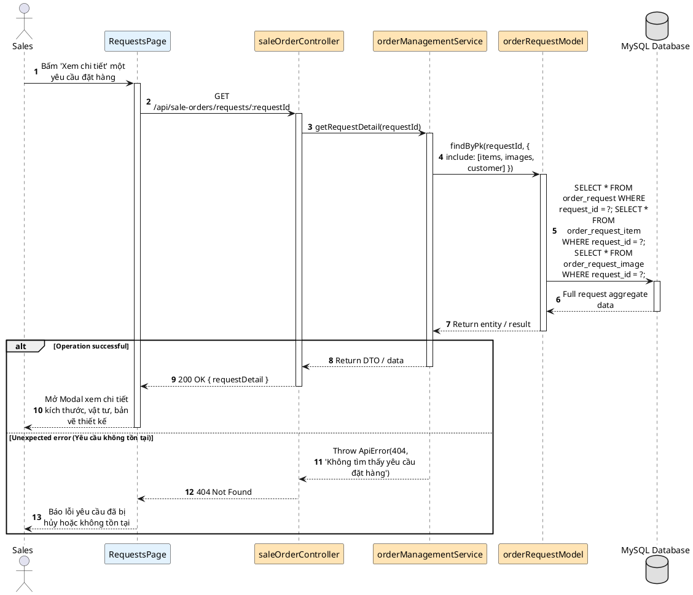
```plantuml
@startuml
skinparam sequenceMessageAlign center
skinparam maxMessageSize 150
autonumber

actor "Sales" as User
participant "RequestsPage" as FE #E3F2FD
participant "saleOrderController" as Ctrl #FFE4B5
participant "orderManagementService" as Svc #FFE4B5
participant "orderRequestModel" as Model #FFE4B5
database "MySQL Database" as DB #E0E0E0

User -> FE : Bấm 'Xem chi tiết' một yêu cầu đặt hàng
activate FE

FE -> Ctrl : GET /api/sale-orders/requests/:requestId
activate Ctrl

Ctrl -> Svc : getRequestDetail(requestId)
activate Svc

Svc -> Model : findByPk(requestId, { include: [items, images, customer] })
activate Model

Model -> DB : SELECT * FROM order_request WHERE request_id = ?; SELECT * FROM order_request_item WHERE request_id = ?; SELECT * FROM order_request_image WHERE request_id = ?;
activate DB
DB --> Model : Full request aggregate data
deactivate DB

Model --> Svc : Return entity / result
deactivate Model

alt Operation successful
  Svc --> Ctrl : Return DTO / data
  deactivate Svc
  Ctrl --> FE : 200 OK { requestDetail }
  deactivate Ctrl
  FE --> User : Mở Modal xem chi tiết kích thước, vật tư, bản vẽ thiết kế
  deactivate FE
else Unexpected error (Yêu cầu không tồn tại)
  Svc --> Ctrl : Throw ApiError(404, 'Không tìm thấy yêu cầu đặt hàng')
  deactivate Svc
  Ctrl --> FE : 404 Not Found
  deactivate Ctrl
  FE --> User : Báo lỗi yêu cầu đã bị hủy hoặc không tồn tại
  deactivate FE
end
@enduml
```

---

## NHÓM 2.6: QUẢN LÝ HỢP ĐỒNG BÁN HÀNG (SALES CONTRACT)

### Use Case 2.6.1: Get POS Warehouse Products (Tra cứu tồn kho sản phẩm tại quầy)

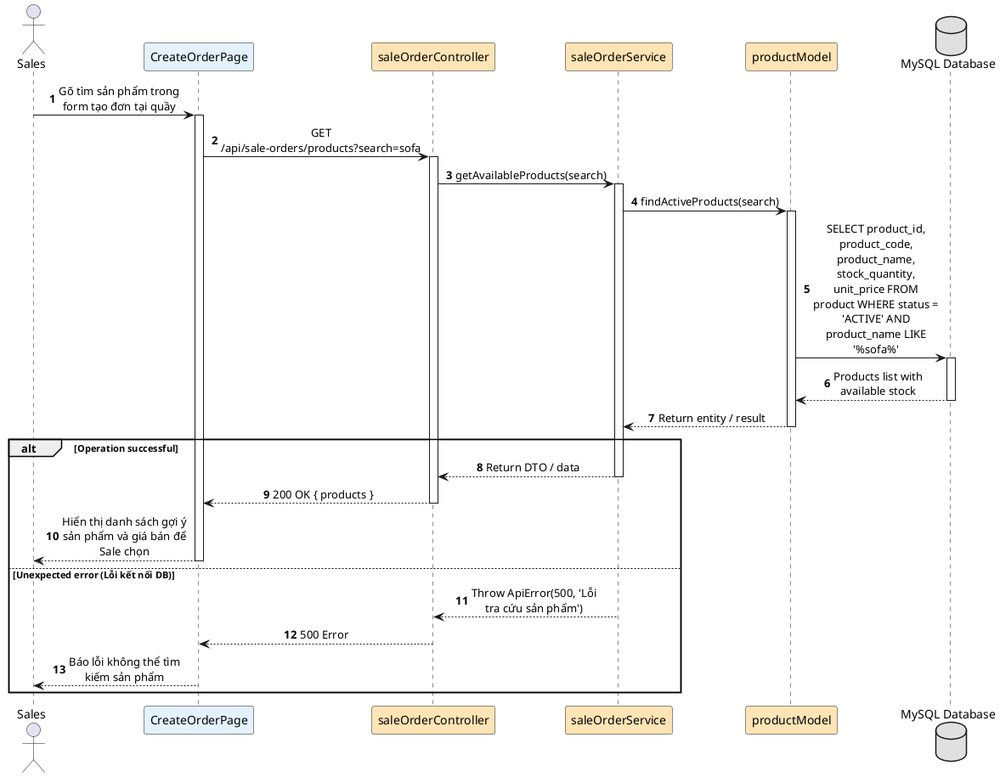
```plantuml
@startuml
skinparam sequenceMessageAlign center
skinparam maxMessageSize 150
autonumber

actor "Sales" as User
participant "CreateOrderPage" as FE #E3F2FD
participant "saleOrderController" as Ctrl #FFE4B5
participant "saleOrderService" as Svc #FFE4B5
participant "productModel" as Model #FFE4B5
database "MySQL Database" as DB #E0E0E0

User -> FE : Gõ tìm sản phẩm trong form tạo đơn tại quầy
activate FE

FE -> Ctrl : GET /api/sale-orders/products?search=sofa
activate Ctrl

Ctrl -> Svc : getAvailableProducts(search)
activate Svc

Svc -> Model : findActiveProducts(search)
activate Model

Model -> DB : SELECT product_id, product_code, product_name, stock_quantity, unit_price FROM product WHERE status = 'ACTIVE' AND product_name LIKE '%sofa%'
activate DB
DB --> Model : Products list with available stock
deactivate DB

Model --> Svc : Return entity / result
deactivate Model

alt Operation successful
  Svc --> Ctrl : Return DTO / data
  deactivate Svc
  Ctrl --> FE : 200 OK { products }
  deactivate Ctrl
  FE --> User : Hiển thị danh sách gợi ý sản phẩm và giá bán để Sale chọn
  deactivate FE
else Unexpected error (Lỗi kết nối DB)
  Svc --> Ctrl : Throw ApiError(500, 'Lỗi tra cứu sản phẩm')
  deactivate Svc
  Ctrl --> FE : 500 Error
  deactivate Ctrl
  FE --> User : Báo lỗi không thể tìm kiếm sản phẩm
  deactivate FE
end
@enduml
```

### Use Case 2.6.2: Search & View Sale Customers (Tra cứu thông tin khách hàng)

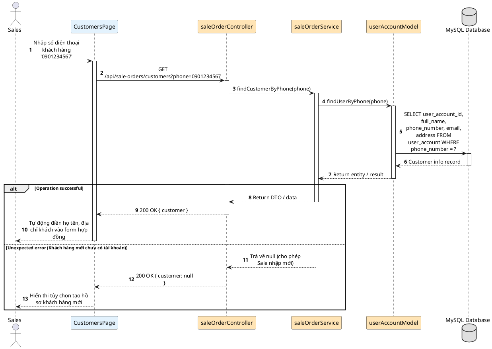
```plantuml
@startuml
skinparam sequenceMessageAlign center
skinparam maxMessageSize 150
autonumber

actor "Sales" as User
participant "CustomersPage" as FE #E3F2FD
participant "saleOrderController" as Ctrl #FFE4B5
participant "saleOrderService" as Svc #FFE4B5
participant "userAccountModel" as Model #FFE4B5
database "MySQL Database" as DB #E0E0E0

User -> FE : Nhập số điện thoại khách hàng '0901234567'
activate FE

FE -> Ctrl : GET /api/sale-orders/customers?phone=0901234567
activate Ctrl

Ctrl -> Svc : findCustomerByPhone(phone)
activate Svc

Svc -> Model : findUserByPhone(phone)
activate Model

Model -> DB : SELECT user_account_id, full_name, phone_number, email, address FROM user_account WHERE phone_number = ?
activate DB
DB --> Model : Customer info record
deactivate DB

Model --> Svc : Return entity / result
deactivate Model

alt Operation successful
  Svc --> Ctrl : Return DTO / data
  deactivate Svc
  Ctrl --> FE : 200 OK { customer }
  deactivate Ctrl
  FE --> User : Tự động điền họ tên, địa chỉ khách vào form hợp đồng
  deactivate FE
else Unexpected error (Khách hàng mới chưa có tài khoản)
  Svc --> Ctrl : Trả về null (cho phép Sale nhập mới)
  deactivate Svc
  Ctrl --> FE : 200 OK { customer: null }
  deactivate Ctrl
  FE --> User : Hiển thị tùy chọn tạo hồ sơ khách hàng mới
  deactivate FE
end
@enduml
```

### Use Case 2.6.3: Create Offline Contract (Lập hợp đồng bán hàng trực tiếp)

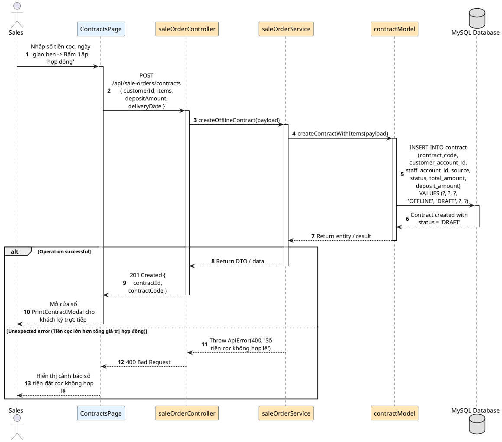
```plantuml
@startuml
skinparam sequenceMessageAlign center
skinparam maxMessageSize 150
autonumber

actor "Sales" as User
participant "ContractsPage" as FE #E3F2FD
participant "saleOrderController" as Ctrl #FFE4B5
participant "saleOrderService" as Svc #FFE4B5
participant "contractModel" as Model #FFE4B5
database "MySQL Database" as DB #E0E0E0

User -> FE : Nhập số tiền cọc, ngày giao hẹn -> Bấm 'Lập hợp đồng'
activate FE

FE -> Ctrl : POST /api/sale-orders/contracts { customerId, items, depositAmount, deliveryDate }
activate Ctrl

Ctrl -> Svc : createOfflineContract(payload)
activate Svc

Svc -> Model : createContractWithItems(payload)
activate Model

Model -> DB : INSERT INTO contract (contract_code, customer_account_id, staff_account_id, source, status, total_amount, deposit_amount) VALUES (?, ?, ?, 'OFFLINE', 'DRAFT', ?, ?)
activate DB
DB --> Model : Contract created with status = 'DRAFT'
deactivate DB

Model --> Svc : Return entity / result
deactivate Model

alt Operation successful
  Svc --> Ctrl : Return DTO / data
  deactivate Svc
  Ctrl --> FE : 201 Created { contractId, contractCode }
  deactivate Ctrl
  FE --> User : Mở cửa sổ PrintContractModal cho khách ký trực tiếp
  deactivate FE
else Unexpected error (Tiền cọc lớn hơn tổng giá trị hợp đồng)
  Svc --> Ctrl : Throw ApiError(400, 'Số tiền cọc không hợp lệ')
  deactivate Svc
  Ctrl --> FE : 400 Bad Request
  deactivate Ctrl
  FE --> User : Hiển thị cảnh báo số tiền đặt cọc không hợp lệ
  deactivate FE
end
@enduml
```

---

## NHÓM 2.7: QUẢN LÝ ĐƠN HÀNG BÁN (CUSTOMER ORDERS)

### Use Case 2.7.1: Create Order From Contract (Sinh đơn hàng từ hợp đồng đã ký)

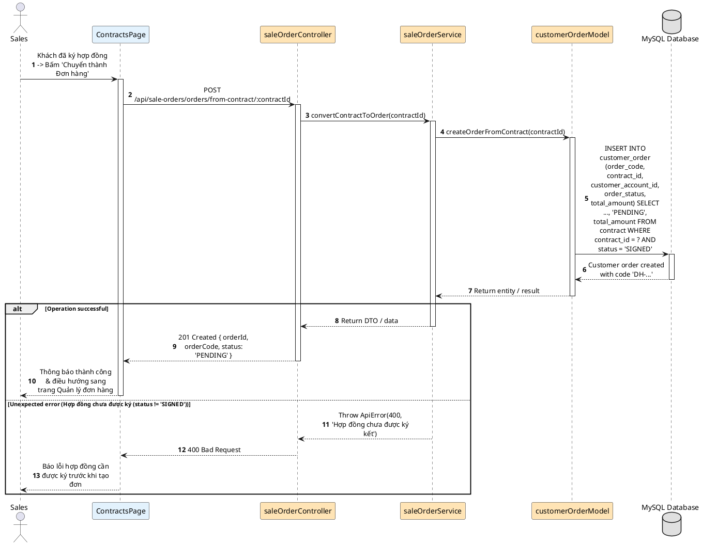
```plantuml
@startuml
skinparam sequenceMessageAlign center
skinparam maxMessageSize 150
autonumber

actor "Sales" as User
participant "ContractsPage" as FE #E3F2FD
participant "saleOrderController" as Ctrl #FFE4B5
participant "saleOrderService" as Svc #FFE4B5
participant "customerOrderModel" as Model #FFE4B5
database "MySQL Database" as DB #E0E0E0

User -> FE : Khách đã ký hợp đồng -> Bấm 'Chuyển thành Đơn hàng'
activate FE

FE -> Ctrl : POST /api/sale-orders/orders/from-contract/:contractId
activate Ctrl

Ctrl -> Svc : convertContractToOrder(contractId)
activate Svc

Svc -> Model : createOrderFromContract(contractId)
activate Model

Model -> DB : INSERT INTO customer_order (order_code, contract_id, customer_account_id, order_status, total_amount) SELECT ..., 'PENDING', total_amount FROM contract WHERE contract_id = ? AND status = 'SIGNED'
activate DB
DB --> Model : Customer order created with code 'DH-...'
deactivate DB

Model --> Svc : Return entity / result
deactivate Model

alt Operation successful
  Svc --> Ctrl : Return DTO / data
  deactivate Svc
  Ctrl --> FE : 201 Created { orderId, orderCode, status: 'PENDING' }
  deactivate Ctrl
  FE --> User : Thông báo thành công & điều hướng sang trang Quản lý đơn hàng
  deactivate FE
else Unexpected error (Hợp đồng chưa được ký (status != 'SIGNED'))
  Svc --> Ctrl : Throw ApiError(400, 'Hợp đồng chưa được ký kết')
  deactivate Svc
  Ctrl --> FE : 400 Bad Request
  deactivate Ctrl
  FE --> User : Báo lỗi hợp đồng cần được ký trước khi tạo đơn
  deactivate FE
end
@enduml
```

### Use Case 2.7.2: List POS Orders (Xem danh sách đơn hàng bán)

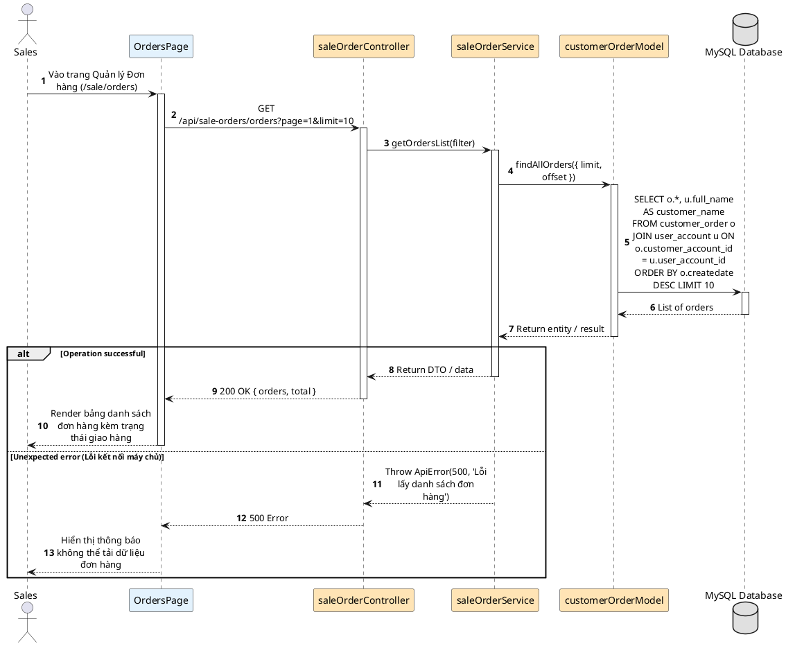
```plantuml
@startuml
skinparam sequenceMessageAlign center
skinparam maxMessageSize 150
autonumber

actor "Sales" as User
participant "OrdersPage" as FE #E3F2FD
participant "saleOrderController" as Ctrl #FFE4B5
participant "saleOrderService" as Svc #FFE4B5
participant "customerOrderModel" as Model #FFE4B5
database "MySQL Database" as DB #E0E0E0

User -> FE : Vào trang Quản lý Đơn hàng (/sale/orders)
activate FE

FE -> Ctrl : GET /api/sale-orders/orders?page=1&limit=10
activate Ctrl

Ctrl -> Svc : getOrdersList(filter)
activate Svc

Svc -> Model : findAllOrders({ limit, offset })
activate Model

Model -> DB : SELECT o.*, u.full_name AS customer_name FROM customer_order o JOIN user_account u ON o.customer_account_id = u.user_account_id ORDER BY o.createdate DESC LIMIT 10
activate DB
DB --> Model : List of orders
deactivate DB

Model --> Svc : Return entity / result
deactivate Model

alt Operation successful
  Svc --> Ctrl : Return DTO / data
  deactivate Svc
  Ctrl --> FE : 200 OK { orders, total }
  deactivate Ctrl
  FE --> User : Render bảng danh sách đơn hàng kèm trạng thái giao hàng
  deactivate FE
else Unexpected error (Lỗi kết nối máy chủ)
  Svc --> Ctrl : Throw ApiError(500, 'Lỗi lấy danh sách đơn hàng')
  deactivate Svc
  Ctrl --> FE : 500 Error
  deactivate Ctrl
  FE --> User : Hiển thị thông báo không thể tải dữ liệu đơn hàng
  deactivate FE
end
@enduml
```

### Use Case 2.7.3: Deliver Order (Bắt đầu xuất kho giao hàng cho khách)

```plantuml
@startuml
skinparam sequenceMessageAlign center
skinparam maxMessageSize 150
autonumber

actor "Sales" as User
participant "OrdersPage" as FE #E3F2FD
participant "saleOrderController" as Ctrl #FFE4B5
participant "saleOrderService" as Svc #FFE4B5
participant "customerOrderModel" as Model #FFE4B5
database "MySQL Database" as DB #E0E0E0

User -> FE : Click 'Bắt đầu giao hàng' trên đơn đã hoàn thiện
activate FE

FE -> Ctrl : POST /api/sale-orders/orders/:orderId/deliver
activate Ctrl

Ctrl -> Svc : markOrderDelivering(orderId)
activate Svc

Svc -> Model : updateOrderStatus(orderId, 'DELIVERING')
activate Model

Model -> DB : UPDATE customer_order SET order_status = 'DELIVERING', modifiedate = NOW() WHERE order_id = ? AND order_status = 'COMPLETED'
activate DB
DB --> Model : Rows affected = 1
deactivate DB

Model --> Svc : Return entity / result
deactivate Model

alt Operation successful
  Svc --> Ctrl : Return DTO / data
  deactivate Svc
  Ctrl --> FE : 200 OK { message: 'Đơn hàng đang được giao' }
  deactivate Ctrl
  FE --> User : Cập nhật badge trạng thái đơn hàng thành 'Đang giao hàng'
  deactivate FE
else Unexpected error (Đơn hàng chưa hoàn thiện gia công)
  Svc --> Ctrl : Throw ApiError(400, 'Đơn hàng chưa đủ điều kiện giao')
  deactivate Svc
  Ctrl --> FE : 400 Bad Request
  deactivate Ctrl
  FE --> User : Cảnh báo đơn hàng chưa nghiệm thu hoàn tất
  deactivate FE
end
@enduml
```

---

## NHÓM 2.8: QUẢN LÝ NHÀ CUNG CẤP (SUPPLIER MANAGEMENT)

### Use Case 2.8.1: List Suppliers (Xem danh sách đối tác cung ứng)

```plantuml
@startuml
skinparam sequenceMessageAlign center
skinparam maxMessageSize 150
autonumber

actor "Owner" as User
participant "ManageSuppliersPage" as FE #E3F2FD
participant "supplierController" as Ctrl #FFE4B5
participant "supplierService" as Svc #FFE4B5
participant "supplierModel" as Model #FFE4B5
database "MySQL Database" as DB #E0E0E0

User -> FE : Mở menu 'Nhà cung cấp' trên Dashboard Owner
activate FE

FE -> Ctrl : GET /api/suppliers?page=1&limit=10
activate Ctrl

Ctrl -> Svc : getSuppliers(filter)
activate Svc

Svc -> Model : findAndCountAll({ limit, offset })
activate Model

Model -> DB : SELECT * FROM supplier ORDER BY createdate DESC LIMIT 10
activate DB
DB --> Model : { rows: suppliers, count: total }
deactivate DB

Model --> Svc : Return entity / result
deactivate Model

alt Operation successful
  Svc --> Ctrl : Return DTO / data
  deactivate Svc
  Ctrl --> FE : 200 OK { suppliers, total }
  deactivate Ctrl
  FE --> User : Render bảng danh sách nhà cung cấp kèm mã, SĐT, mã số thuế
  deactivate FE
else Unexpected error (Lỗi kết nối CSDL)
  Svc --> Ctrl : Throw ApiError(500, 'Lỗi lấy danh sách nhà cung cấp')
  deactivate Svc
  Ctrl --> FE : 500 Error
  deactivate Ctrl
  FE --> User : Báo lỗi không thể tải danh sách nhà cung cấp
  deactivate FE
end
@enduml
```

### Use Case 2.8.2: Get Active Suppliers (Lấy danh sách NCC phục vụ nhập kho)

```plantuml
@startuml
skinparam sequenceMessageAlign center
skinparam maxMessageSize 150
autonumber

actor "Owner" as User
participant "ManagePurchaseReceiptsPage" as FE #E3F2FD
participant "supplierController" as Ctrl #FFE4B5
participant "supplierService" as Svc #FFE4B5
participant "supplierModel" as Model #FFE4B5
database "MySQL Database" as DB #E0E0E0

User -> FE : Mở form 'Lập phiếu nhập kho nguyên vật liệu'
activate FE

FE -> Ctrl : GET /api/suppliers/active
activate Ctrl

Ctrl -> Svc : getActiveSuppliers()
activate Svc

Svc -> Model : findAll({ where: { status: 'ACTIVE' } })
activate Model

Model -> DB : SELECT supplier_id, supplier_code, supplier_name FROM supplier WHERE status = 'ACTIVE'
activate DB
DB --> Model : Active suppliers array
deactivate DB

Model --> Svc : Return entity / result
deactivate Model

alt Operation successful
  Svc --> Ctrl : Return DTO / data
  deactivate Svc
  Ctrl --> FE : 200 OK { suppliers }
  deactivate Ctrl
  FE --> User : Điền danh sách NCC vào dropdown combobox để người dùng chọn
  deactivate FE
else Unexpected error (Không có NCC nào đang hoạt động)
  Svc --> Ctrl : Trả về mảng rỗng []
  deactivate Svc
  Ctrl --> FE : 200 OK { suppliers: [] }
  deactivate Ctrl
  FE --> User : Hiển thị cảnh báo 'Cần thêm Nhà cung cấp trước khi nhập kho'
  deactivate FE
end
@enduml
```

### Use Case 2.8.3: Create Supplier (Thêm mới đối tác cung ứng gỗ/vật tư)

```plantuml
@startuml
skinparam sequenceMessageAlign center
skinparam maxMessageSize 150
autonumber

actor "Owner" as User
participant "ManageSuppliersPage" as FE #E3F2FD
participant "supplierController" as Ctrl #FFE4B5
participant "supplierService" as Svc #FFE4B5
participant "supplierModel" as Model #FFE4B5
database "MySQL Database" as DB #E0E0E0

User -> FE : Điền tên NCC, MST, SĐT, địa chỉ -> Bấm 'Tạo nhà cung cấp'
activate FE

FE -> Ctrl : POST /api/suppliers { supplier_name, contact_name, phone_number, tax_code, address }
activate Ctrl

Ctrl -> Svc : createSupplier(payload)
activate Svc

Svc -> Model : create(payload)
activate Model

Model -> DB : INSERT INTO supplier (supplier_code, supplier_name, contact_name, phone_number, address, status) VALUES (?, ?, ?, ?, ?, 'ACTIVE')
activate DB
DB --> Model : Supplier record created with code 'NCC-...'
deactivate DB

Model --> Svc : Return entity / result
deactivate Model

alt Operation successful
  Svc --> Ctrl : Return DTO / data
  deactivate Svc
  Ctrl --> FE : 201 Created { supplier }
  deactivate Ctrl
  FE --> User : Đóng modal & cập nhật thêm dòng NCC mới vào bảng
  deactivate FE
else Unexpected error (Mã số thuế hoặc SĐT đã tồn tại)
  Svc --> Ctrl : Throw ApiError(409, 'Nhà cung cấp đã tồn tại')
  deactivate Svc
  Ctrl --> FE : 409 Conflict
  deactivate Ctrl
  FE --> User : Hiển thị lỗi trùng lặp thông tin
  deactivate FE
end
@enduml
```

---

## NHÓM 2.9: QUẢN LÝ NGUYÊN VẬT LIỆU & TỒN KHO (RAW MATERIAL)

### Use Case 2.9.1: Get Raw Material Stock Summary (Thống kê tổng quan tồn kho NVL)

```plantuml
@startuml
skinparam sequenceMessageAlign center
skinparam maxMessageSize 150
autonumber

actor "Owner" as User
participant "ManageMaterialsPage" as FE #E3F2FD
participant "rawMaterialController" as Ctrl #FFE4B5
participant "rawMaterialService" as Svc #FFE4B5
participant "rawMaterialModel" as Model #FFE4B5
database "MySQL Database" as DB #E0E0E0

User -> FE : Truy cập trang Quản lý kho nguyên vật liệu
activate FE

FE -> Ctrl : GET /api/raw-materials/stock-summary
activate Ctrl

Ctrl -> Svc : getStockSummary()
activate Svc

Svc -> Model : calculateStockMetrics()
activate Model

Model -> DB : SELECT COUNT(*) as total_items, SUM(quantity_on_hand * latest_import_price) as total_value, SUM(CASE WHEN quantity_on_hand <= minimum_stock_level THEN 1 ELSE 0 END) as low_stock_count FROM raw_material
activate DB
DB --> Model : Stock summary metrics
deactivate DB

Model --> Svc : Return entity / result
deactivate Model

alt Operation successful
  Svc --> Ctrl : Return DTO / data
  deactivate Svc
  Ctrl --> FE : 200 OK { totalItems, totalValue, lowStockCount }
  deactivate Ctrl
  FE --> User : Hiển thị 3 thẻ Card thống kê (Tổng mặt hàng, Giá trị tồn, Cảnh báo sắp hết)
  deactivate FE
else Unexpected error (Lỗi truy vấn DB)
  Svc --> Ctrl : Throw ApiError(500, 'Lỗi thống kê kho')
  deactivate Svc
  Ctrl --> FE : 500 Error
  deactivate Ctrl
  FE --> User : Hiển thị giá trị 0
  deactivate FE
end
@enduml
```

### Use Case 2.9.2: List Raw Materials (Xem danh mục nguyên vật liệu)

```plantuml
@startuml
skinparam sequenceMessageAlign center
skinparam maxMessageSize 150
autonumber

actor "Owner" as User
participant "ManageMaterialsPage" as FE #E3F2FD
participant "rawMaterialController" as Ctrl #FFE4B5
participant "rawMaterialService" as Svc #FFE4B5
participant "rawMaterialModel" as Model #FFE4B5
database "MySQL Database" as DB #E0E0E0

User -> FE : Xem bảng danh sách vật tư kèm lọc theo loại
activate FE

FE -> Ctrl : GET /api/raw-materials?page=1&limit=10
activate Ctrl

Ctrl -> Svc : getRawMaterials(filter)
activate Svc

Svc -> Model : findAndCountAll({ limit, offset })
activate Model

Model -> DB : SELECT * FROM raw_material ORDER BY material_name ASC LIMIT 10
activate DB
DB --> Model : Raw materials list
deactivate DB

Model --> Svc : Return entity / result
deactivate Model

alt Operation successful
  Svc --> Ctrl : Return DTO / data
  deactivate Svc
  Ctrl --> FE : 200 OK { rawMaterials, total }
  deactivate Ctrl
  FE --> User : Render bảng danh sách gỗ, sơn, keo kèm số lượng tồn kho `quantity_on_hand`
  deactivate FE
else Unexpected error (Lỗi kết nối)
  Svc --> Ctrl : Throw ApiError(500, 'Lỗi tải danh mục vật tư')
  deactivate Svc
  Ctrl --> FE : 500 Error
  deactivate Ctrl
  FE --> User : Báo lỗi không thể tải danh sách
  deactivate FE
end
@enduml
```

### Use Case 2.9.3: Create Raw Material (Thêm mới loại nguyên vật liệu vào kho)

```plantuml
@startuml
skinparam sequenceMessageAlign center
skinparam maxMessageSize 150
autonumber

actor "Owner" as User
participant "ManageMaterialsPage" as FE #E3F2FD
participant "rawMaterialController" as Ctrl #FFE4B5
participant "rawMaterialService" as Svc #FFE4B5
participant "rawMaterialModel" as Model #FFE4B5
database "MySQL Database" as DB #E0E0E0

User -> FE : Nhập 'Gỗ Sồi Nga', ĐVT: 'tấm', ngưỡng an toàn: 10 -> Bấm Lưu
activate FE

FE -> Ctrl : POST /api/raw-materials { material_name, unit: 'tấm', minimum_stock_level: 10 }
activate Ctrl

Ctrl -> Svc : createRawMaterial(payload)
activate Svc

Svc -> Model : create(payload)
activate Model

Model -> DB : INSERT INTO raw_material (material_code, material_name, unit, quantity_on_hand, minimum_stock_level, status) VALUES (?, 'Gỗ Sồi Nga', 'tấm', 0, 10, 'ACTIVE')
activate DB
DB --> Model : New raw material created with quantity_on_hand = 0
deactivate DB

Model --> Svc : Return entity / result
deactivate Model

alt Operation successful
  Svc --> Ctrl : Return DTO / data
  deactivate Svc
  Ctrl --> FE : 201 Created { rawMaterial }
  deactivate Ctrl
  FE --> User : Đóng modal & hiển thị vật tư mới trên bảng
  deactivate FE
else Unexpected error (Tên nguyên vật liệu bị trùng)
  Svc --> Ctrl : Throw ApiError(409, 'Tên nguyên vật liệu đã tồn tại')
  deactivate Svc
  Ctrl --> FE : 409 Conflict
  deactivate Ctrl
  FE --> User : Báo lỗi trùng tên nguyên vật liệu
  deactivate FE
end
@enduml
```

---

## NHÓM 2.10: NHẬP KHO NGUYÊN VẬT LIỆU (MATERIAL PURCHASE & RECEIPT)

### Use Case 2.10.1: Get Purchase Receipt Summary (Thống kê phiếu nhập kho)

```plantuml
@startuml
skinparam sequenceMessageAlign center
skinparam maxMessageSize 150
autonumber

actor "Owner" as User
participant "ManagePurchaseReceiptsPage" as FE #E3F2FD
participant "purchaseReceiptController" as Ctrl #FFE4B5
participant "purchaseReceiptService" as Svc #FFE4B5
participant "materialReceiptModel" as Model #FFE4B5
database "MySQL Database" as DB #E0E0E0

User -> FE : Mở trang Nhập kho nguyên vật liệu
activate FE

FE -> Ctrl : GET /api/purchase-receipts/summary
activate Ctrl

Ctrl -> Svc : getReceiptSummary()
activate Svc

Svc -> Model : calculateReceiptSummary()
activate Model

Model -> DB : SELECT COUNT(*) as total_receipts, SUM(total_amount) as total_spent, SUM(CASE WHEN status = 'DRAFT' THEN 1 ELSE 0 END) as draft_count FROM material_receipt
activate DB
DB --> Model : Summary numbers
deactivate DB

Model --> Svc : Return entity / result
deactivate Model

alt Operation successful
  Svc --> Ctrl : Return DTO / data
  deactivate Svc
  Ctrl --> FE : 200 OK { totalReceipts, totalSpent, draftCount }
  deactivate Ctrl
  FE --> User : Hiển thị các Card tóm tắt chi phí nhập hàng và số phiếu nháp
  deactivate FE
else Unexpected error (Lỗi kết nối)
  Svc --> Ctrl : Throw ApiError(500, 'Lỗi lấy thống kê')
  deactivate Svc
  Ctrl --> FE : 500 Error
  deactivate Ctrl
  FE --> User : Hiển thị 0
  deactivate FE
end
@enduml
```

### Use Case 2.10.2: List Purchase Receipts (Xem danh sách phiếu nhập kho)

```plantuml
@startuml
skinparam sequenceMessageAlign center
skinparam maxMessageSize 150
autonumber

actor "Owner" as User
participant "ManagePurchaseReceiptsPage" as FE #E3F2FD
participant "purchaseReceiptController" as Ctrl #FFE4B5
participant "purchaseReceiptService" as Svc #FFE4B5
participant "materialReceiptModel" as Model #FFE4B5
database "MySQL Database" as DB #E0E0E0

User -> FE : Xem bảng các phiếu nhập kho gần nhất
activate FE

FE -> Ctrl : GET /api/purchase-receipts?page=1&limit=10
activate Ctrl

Ctrl -> Svc : getReceipts(filter)
activate Svc

Svc -> Model : findAllReceipts({ limit, offset, include: [supplier] })
activate Model

Model -> DB : SELECT r.*, s.supplier_name FROM material_receipt r JOIN supplier s ON r.supplier_id = s.supplier_id ORDER BY r.receipt_date DESC LIMIT 10
activate DB
DB --> Model : Receipts list
deactivate DB

Model --> Svc : Return entity / result
deactivate Model

alt Operation successful
  Svc --> Ctrl : Return DTO / data
  deactivate Svc
  Ctrl --> FE : 200 OK { receipts, total }
  deactivate Ctrl
  FE --> User : Render bảng danh sách phiếu nhập kèm trạng thái DRAFT / CONFIRMED
  deactivate FE
else Unexpected error (Lỗi server)
  Svc --> Ctrl : Throw ApiError(500, 'Lỗi server')
  deactivate Svc
  Ctrl --> FE : 500 Error
  deactivate Ctrl
  FE --> User : Báo lỗi không thể tải danh sách phiếu nhập
  deactivate FE
end
@enduml
```

### Use Case 2.10.3: Confirm Purchase Receipt (Xác nhận nhập kho chính thức & tăng tồn kho)

```plantuml
@startuml
skinparam sequenceMessageAlign center
skinparam maxMessageSize 150
autonumber

actor "Owner" as User
participant "ManagePurchaseReceiptsPage" as FE #E3F2FD
participant "purchaseReceiptController" as Ctrl #FFE4B5
participant "purchaseReceiptService" as Svc #FFE4B5
participant "materialReceiptModel & rawMaterialModel" as Model #FFE4B5
database "MySQL Database" as DB #E0E0E0

User -> FE : Kiểm tra hàng thực nhận -> Bấm 'Xác nhận nhập kho'
activate FE

FE -> Ctrl : POST /api/purchase-receipts/:receiptId/confirm
activate Ctrl

Ctrl -> Svc : confirmReceipt(receiptId)
activate Svc

Svc -> Model : confirmReceiptAndUpdateStock(receiptId)
activate Model

Model -> DB : UPDATE material_receipt SET status = 'CONFIRMED' WHERE receipt_id = ?; UPDATE raw_material SET quantity_on_hand = quantity_on_hand + ? WHERE material_id = ?;
activate DB
DB --> Model : Receipt status changed to CONFIRMED & stock quantity incremented
deactivate DB

Model --> Svc : Return entity / result
deactivate Model

alt Operation successful
  Svc --> Ctrl : Return DTO / data
  deactivate Svc
  Ctrl --> FE : 200 OK { message: 'Đã xác nhận nhập kho và cộng dồn tồn kho' }
  deactivate Ctrl
  FE --> User : Chuyển badge trạng thái thành 'Đã nhập kho' & vô hiệu hóa nút sửa
  deactivate FE
else Unexpected error (Phiếu đã ở trạng thái CONFIRMED hoặc CANCELLED)
  Svc --> Ctrl : Throw ApiError(400, 'Phiếu không ở trạng thái DRAFT')
  deactivate Svc
  Ctrl --> FE : 400 Bad Request
  deactivate Ctrl
  FE --> User : Báo lỗi trạng thái phiếu không hợp lệ
  deactivate FE
end
@enduml
```

---

## NHÓM 2.11: LỆNH SẢN XUẤT & GIA CÔNG XƯỞNG (PRODUCTION ORDERS)

### Use Case 2.11.1: Get Eligible Orders for Production (Lấy đơn hàng đủ điều kiện gia công)

```plantuml
@startuml
skinparam sequenceMessageAlign center
skinparam maxMessageSize 150
autonumber

actor "Owner" as User
participant "ManageProductionOrdersPage" as FE #E3F2FD
participant "productionOrderController" as Ctrl #FFE4B5
participant "productionOrderService" as Svc #FFE4B5
participant "customerOrderModel" as Model #FFE4B5
database "MySQL Database" as DB #E0E0E0

User -> FE : Bấm 'Tạo lệnh sản xuất mới'
activate FE

FE -> Ctrl : GET /api/production-orders/eligible-orders
activate Ctrl

Ctrl -> Svc : getEligibleOrders()
activate Svc

Svc -> Model : findCustomOrdersWithoutProduction()
activate Model

Model -> DB : SELECT order_id, order_code, total_amount FROM customer_order WHERE order_type = 'CUSTOM' AND order_status = 'PENDING'
activate DB
DB --> Model : Eligible orders array
deactivate DB

Model --> Svc : Return entity / result
deactivate Model

alt Operation successful
  Svc --> Ctrl : Return DTO / data
  deactivate Svc
  Ctrl --> FE : 200 OK { orders }
  deactivate Ctrl
  FE --> User : Hiển thị danh sách đơn cần gia công vào dropdown
  deactivate FE
else Unexpected error (Không có đơn hàng nào cần đóng mới)
  Svc --> Ctrl : Trả về danh sách rỗng []
  deactivate Svc
  Ctrl --> FE : 200 OK { orders: [] }
  deactivate Ctrl
  FE --> User : Hiển thị thông báo 'Hiện không có đơn hàng nào cần gia công'
  deactivate FE
end
@enduml
```

### Use Case 2.11.2: Create Production Order (Tạo lệnh gia công & phân công Tổ trưởng)

```plantuml
@startuml
skinparam sequenceMessageAlign center
skinparam maxMessageSize 150
autonumber

actor "Owner" as User
participant "ManageProductionOrdersPage" as FE #E3F2FD
participant "productionOrderController" as Ctrl #FFE4B5
participant "productionOrderService" as Svc #FFE4B5
participant "productionOrderModel" as Model #FFE4B5
database "MySQL Database" as DB #E0E0E0

User -> FE : Chọn đơn hàng, chọn Tổ trưởng xưởng, hạn hoàn thành -> Bấm 'Giao việc'
activate FE

FE -> Ctrl : POST /api/production-orders { orderId, leaderId, dueDate, items }
activate Ctrl

Ctrl -> Svc : createProductionOrder(payload)
activate Svc

Svc -> Model : createOrderWithItems(payload)
activate Model

Model -> DB : INSERT INTO production_order (production_order_code, customer_order_id, leader_account_id, due_date, status, progress_percent) VALUES (?, ?, ?, ?, 'PENDING', 0)
activate DB
DB --> Model : Production order created with code 'LSX-...'
deactivate DB

Model --> Svc : Return entity / result
deactivate Model

alt Operation successful
  Svc --> Ctrl : Return DTO / data
  deactivate Svc
  Ctrl --> FE : 201 Created { productionOrder }
  deactivate Ctrl
  FE --> User : Thông báo giao việc thành công & hiển thị lệnh trên bảng tiến độ
  deactivate FE
else Unexpected error (Tổ trưởng xưởng không tồn tại hoặc bị khóa)
  Svc --> Ctrl : Throw ApiError(400, 'Tổ trưởng không hợp lệ')
  deactivate Svc
  Ctrl --> FE : 400 Bad Request
  deactivate Ctrl
  FE --> User : Báo lỗi không thể giao việc
  deactivate FE
end
@enduml
```

### Use Case 2.11.3: Update Manufacturing Progress (Tổ trưởng cập nhật tiến độ thi công)

```plantuml
@startuml
skinparam sequenceMessageAlign center
skinparam maxMessageSize 150
autonumber

actor "LeaderStaff" as User
participant "LeaderOrdersPage" as FE #E3F2FD
participant "leaderStaffController" as Ctrl #FFE4B5
participant "leaderStaffService" as Svc #FFE4B5
participant "productionOrderModel" as Model #FFE4B5
database "MySQL Database" as DB #E0E0E0

User -> FE : Kéo thanh tiến độ lên 70% (đã sơn lót, chờ lắp ráp) -> Bấm 'Cập nhật'
activate FE

FE -> Ctrl : POST /api/leader-staff/orders/:orderId/progress { progressPercent: 70, notes: 'Đã hoàn thiện sơn lót' }
activate Ctrl

Ctrl -> Svc : updateProgress(orderId, 70, notes)
activate Svc

Svc -> Model : updateProgressPercent(orderId, 70)
activate Model

Model -> DB : UPDATE production_order SET progress_percent = 70, status = 'IN_PROGRESS', notes = ?, modifiedate = NOW() WHERE production_order_id = ?
activate DB
DB --> Model : Rows affected = 1
deactivate DB

Model --> Svc : Return entity / result
deactivate Model

alt Operation successful
  Svc --> Ctrl : Return DTO / data
  deactivate Svc
  Ctrl --> FE : 200 OK { message: 'Cập nhật tiến độ thành công', progressPercent: 70 }
  deactivate Ctrl
  FE --> User : Cập nhật thanh Progress Bar thành 70% màu xanh
  deactivate FE
else Unexpected error (Tiến độ nhỏ hơn 0 hoặc lớn hơn 100)
  Svc --> Ctrl : Throw ApiError(400, 'Tỷ lệ tiến độ phải từ 0 đến 100')
  deactivate Svc
  Ctrl --> FE : 400 Bad Request
  deactivate Ctrl
  FE --> User : Hiển thị cảnh báo giá trị không hợp lệ
  deactivate FE
end
@enduml
```

---

## NHÓM 2.12: XUẤT KHO NGUYÊN VẬT LIỆU (MATERIAL EXPORT / ISSUE)

### Use Case 2.12.1: Get Material Export Summary (Thống kê phiếu xuất kho NVL)

```plantuml
@startuml
skinparam sequenceMessageAlign center
skinparam maxMessageSize 150
autonumber

actor "Owner" as User
participant "ManageMaterialExportPage" as FE #E3F2FD
participant "materialExportController" as Ctrl #FFE4B5
participant "materialExportService" as Svc #FFE4B5
participant "materialIssueModel" as Model #FFE4B5
database "MySQL Database" as DB #E0E0E0

User -> FE : Mở trang Xuất kho nguyên vật liệu
activate FE

FE -> Ctrl : GET /api/material-exports/summary
activate Ctrl

Ctrl -> Svc : getExportSummary()
activate Svc

Svc -> Model : calculateExportMetrics()
activate Model

Model -> DB : SELECT COUNT(*) as total_exports, SUM(total_cost) as total_value_issued FROM material_issue WHERE status = 'CONFIRMED'
activate DB
DB --> Model : Summary metrics
deactivate DB

Model --> Svc : Return entity / result
deactivate Model

alt Operation successful
  Svc --> Ctrl : Return DTO / data
  deactivate Svc
  Ctrl --> FE : 200 OK { totalExports, totalCost }
  deactivate Ctrl
  FE --> User : Hiển thị Card thống kê chi phí vật tư đã cấp phát cho xưởng
  deactivate FE
else Unexpected error (Lỗi kết nối)
  Svc --> Ctrl : Throw ApiError(500, 'Lỗi thống kê')
  deactivate Svc
  Ctrl --> FE : 500 Error
  deactivate Ctrl
  FE --> User : Hiển thị 0
  deactivate FE
end
@enduml
```

### Use Case 2.12.2: List Material Exports (Xem danh sách phiếu xuất kho)

```plantuml
@startuml
skinparam sequenceMessageAlign center
skinparam maxMessageSize 150
autonumber

actor "Owner" as User
participant "ManageMaterialExportPage" as FE #E3F2FD
participant "materialExportController" as Ctrl #FFE4B5
participant "materialExportService" as Svc #FFE4B5
participant "materialIssueModel" as Model #FFE4B5
database "MySQL Database" as DB #E0E0E0

User -> FE : Xem bảng các phiếu xuất vật tư gần nhất
activate FE

FE -> Ctrl : GET /api/material-exports?page=1&limit=10
activate Ctrl

Ctrl -> Svc : getMaterialExports(filter)
activate Svc

Svc -> Model : findAllIssues({ limit, offset, include: [production_order] })
activate Model

Model -> DB : SELECT i.*, p.production_order_code FROM material_issue i JOIN production_order p ON i.production_order_id = p.production_order_id ORDER BY i.issue_date DESC LIMIT 10
activate DB
DB --> Model : Exports list
deactivate DB

Model --> Svc : Return entity / result
deactivate Model

alt Operation successful
  Svc --> Ctrl : Return DTO / data
  deactivate Svc
  Ctrl --> FE : 200 OK { exports, total }
  deactivate Ctrl
  FE --> User : Render bảng danh sách phiếu xuất vật tư kèm trạng thái DRAFT/CONFIRMED
  deactivate FE
else Unexpected error (Lỗi kết nối)
  Svc --> Ctrl : Throw ApiError(500, 'Lỗi tải phiếu xuất')
  deactivate Svc
  Ctrl --> FE : 500 Error
  deactivate Ctrl
  FE --> User : Báo lỗi không thể tải danh sách
  deactivate FE
end
@enduml
```

### Use Case 2.12.3: Confirm Material Export Slip (Xác nhận xuất kho & trừ tồn kho NVL)

```plantuml
@startuml
skinparam sequenceMessageAlign center
skinparam maxMessageSize 150
autonumber

actor "Owner" as User
participant "ManageMaterialExportPage" as FE #E3F2FD
participant "materialExportController" as Ctrl #FFE4B5
participant "materialExportService" as Svc #FFE4B5
participant "materialIssueModel & rawMaterialModel" as Model #FFE4B5
database "MySQL Database" as DB #E0E0E0

User -> FE : Bàn giao gỗ/ốc vít cho thợ -> Bấm 'Xác nhận xuất kho'
activate FE

FE -> Ctrl : POST /api/material-exports/:issueId/confirm
activate Ctrl

Ctrl -> Svc : confirmMaterialExport(issueId)
activate Svc

Svc -> Model : confirmIssueAndDeductStock(issueId)
activate Model

Model -> DB : UPDATE material_issue SET status = 'CONFIRMED' WHERE issue_id = ?; UPDATE raw_material SET quantity_on_hand = quantity_on_hand - ? WHERE material_id = ?;
activate DB
DB --> Model : Status = CONFIRMED & stock quantity decremented
deactivate DB

Model --> Svc : Return entity / result
deactivate Model

alt Operation successful
  Svc --> Ctrl : Return DTO / data
  deactivate Svc
  Ctrl --> FE : 200 OK { message: 'Đã xuất kho và giảm tồn kho nguyên vật liệu' }
  deactivate Ctrl
  FE --> User : Chuyển nhãn thành 'Đã xuất kho' & cập nhật số lượng tồn mới
  deactivate FE
else Unexpected error (Tồn kho không đủ để xuất)
  Svc --> Ctrl : Throw ApiError(400, 'Số lượng tồn kho không đủ để xuất')
  deactivate Svc
  Ctrl --> FE : 400 Bad Request
  deactivate Ctrl
  FE --> User : Báo lỗi tồn kho không đủ để xuất cho lệnh gia công
  deactivate FE
end
@enduml
```

---

## NHÓM 2.13: NGHIỆM THU & NHẬP KHO THÀNH PHẨM (FINISHED GOODS)

### Use Case 2.13.1: Upload Inspection Images (Tổ trưởng tải ảnh thành phẩm qua Cloudinary)

```plantuml
@startuml
skinparam sequenceMessageAlign center
skinparam maxMessageSize 150
autonumber

actor "LeaderStaff" as User
participant "LeaderOrdersPage" as FE #E3F2FD
participant "leaderStaffController" as Ctrl #FFE4B5
participant "leaderStaffService" as Svc #FFE4B5
participant "cloudinaryService (Cloudinary API)" as Ext #FFE4B5
participant "customerOrderImageModel" as Model #FFE4B5
database "MySQL Database" as DB #E0E0E0

User -> FE : Chụp ảnh sản phẩm hoàn thiện ở 3 góc độ -> Bấm 'Tải ảnh nghiệm thu'
activate FE

FE -> Ctrl : POST /api/leader-staff/upload-inspection-image (multipart/form-data: images)
activate Ctrl

Ctrl -> Svc : saveInspectionImageUrls(orderId, urls)
activate Svc

Svc -> Ext : uploadMultipleImages(images, folder: 'finished_goods_inspection')
activate Ext
Ext --> Svc : Cloudinary URLs array
deactivate Ext

Svc -> Model : createInspectionImages(orderId, urls)
activate Model

Model -> DB : INSERT INTO customer_order_image (order_id, image_url, image_type) VALUES (?, ?, 'INSPECTION')
activate DB
DB --> Model : Images saved
deactivate DB

Model --> Svc : Return entity / result
deactivate Model

alt Operation successful
  Svc --> Ctrl : Return DTO / data
  deactivate Svc
  Ctrl --> FE : 200 OK { imageUrls }
  deactivate Ctrl
  FE --> User : Hiển thị ảnh thành phẩm trên form nộp nghiệm thu
  deactivate FE
else Unexpected error (Lỗi tải ảnh lên Cloudinary)
  Svc --> Ctrl : Throw ApiError(500, 'Lỗi tải ảnh')
  deactivate Svc
  Ctrl --> FE : 500 Error
  deactivate Ctrl
  FE --> User : Báo lỗi tải ảnh thất bại
  deactivate FE
end
@enduml
```

### Use Case 2.13.2: Submit for Inspection (Tổ trưởng gửi yêu cầu nghiệm thu lên Chủ xưởng)

```plantuml
@startuml
skinparam sequenceMessageAlign center
skinparam maxMessageSize 150
autonumber

actor "LeaderStaff" as User
participant "LeaderOrdersPage" as FE #E3F2FD
participant "leaderStaffController" as Ctrl #FFE4B5
participant "leaderStaffService" as Svc #FFE4B5
participant "finishedGoodsReceiptModel" as Model #FFE4B5
database "MySQL Database" as DB #E0E0E0

User -> FE : Kiểm tra sản phẩm đạt yêu cầu -> Bấm 'Gửi nghiệm thu'
activate FE

FE -> Ctrl : POST /api/leader-staff/orders/:orderId/submit-inspection { notes }
activate Ctrl

Ctrl -> Svc : submitInspection(orderId, notes)
activate Svc

Svc -> Model : createInspectionReceipt(orderId, notes)
activate Model

Model -> DB : INSERT INTO finished_goods_receipt (receipt_code, customer_order_id, inspection_status) VALUES (?, ?, 'PENDING'); UPDATE customer_order SET order_status = 'INSPECTING' WHERE order_id = ?;
activate DB
DB --> Model : Receipt created with status PENDING & order status = INSPECTING
deactivate DB

Model --> Svc : Return entity / result
deactivate Model

alt Operation successful
  Svc --> Ctrl : Return DTO / data
  deactivate Svc
  Ctrl --> FE : 200 OK { message: 'Đã gửi yêu cầu nghiệm thu lên Chủ xưởng' }
  deactivate Ctrl
  FE --> User : Hiển thị trạng thái 'Chờ Chủ xưởng nghiệm thu'
  deactivate FE
else Unexpected error (Chưa upload ảnh thành phẩm thực tế)
  Svc --> Ctrl : Throw ApiError(400, 'Phải có ít nhất 1 ảnh chụp thực tế')
  deactivate Svc
  Ctrl --> FE : 400 Bad Request
  deactivate Ctrl
  FE --> User : Cảnh báo cần chụp ảnh thành phẩm trước khi gửi nghiệm thu
  deactivate FE
end
@enduml
```

### Use Case 2.13.3: Owner Inspect & Accept (Chủ xưởng thẩm định, duyệt Đạt & tăng tồn kho)

```plantuml
@startuml
skinparam sequenceMessageAlign center
skinparam maxMessageSize 150
autonumber

actor "Owner" as User
participant "ManageOrdersPage" as FE #E3F2FD
participant "orderManagementController" as Ctrl #FFE4B5
participant "orderManagementService" as Svc #FFE4B5
participant "finishedGoodsReceiptModel & productModel" as Model #FFE4B5
database "MySQL Database" as DB #E0E0E0

User -> FE : Xem ảnh chụp thành phẩm -> Đánh giá Đạt -> Bấm 'Nghiệm thu Đạt'
activate FE

FE -> Ctrl : POST /api/order-management/orders/:orderId/inspect { decision: 'PASSED', qualityGrade: 'A' }
activate Ctrl

Ctrl -> Svc : approveInspection(orderId, grade)
activate Svc

Svc -> Model : confirmInspectionAndIncrementStock(orderId)
activate Model

Model -> DB : UPDATE finished_goods_receipt SET inspection_status = 'PASSED' WHERE customer_order_id = ?; UPDATE product SET stock_quantity = stock_quantity + 1 WHERE ...; UPDATE customer_order SET order_status = 'COMPLETED';
activate DB
DB --> Model : Inspection marked PASSED, stock quantity incremented, order ready to deliver
deactivate DB

Model --> Svc : Return entity / result
deactivate Model

alt Operation successful
  Svc --> Ctrl : Return DTO / data
  deactivate Svc
  Ctrl --> FE : 200 OK { message: 'Nghiệm thu thành công, đã nhập kho thành phẩm' }
  deactivate Ctrl
  FE --> User : Chuyển trạng thái đơn sang 'Hoàn thành gia công / Sẵn sàng giao hàng'
  deactivate FE
else Unexpected error (Sản phẩm lỗi không đạt tiêu chuẩn kỹ thuật (decision: 'REJECTED'))
  Svc --> Ctrl : Update inspection_status = 'REJECTED' & order_status = 'IN_PROGRESS'
  deactivate Svc
  Ctrl --> FE : 200 OK { message: 'Đã từ chối nghiệm thu, chuyển trả xưởng chỉnh sửa' }
  deactivate Ctrl
  FE --> User : Chuyển đơn về cho Tổ trưởng gia công lại kèm ghi chú lỗi
  deactivate FE
end
@enduml
```

---

## NHÓM 2.14: BÁO CÁO TÀI CHÍNH & DOANH THU (FINANCIAL REPORTS)

### Use Case 2.14.1: View Financial Summary & Charts (Chủ xưởng xem tổng quan doanh thu)

```plantuml
@startuml
skinparam sequenceMessageAlign center
skinparam maxMessageSize 150
autonumber

actor "Owner" as User
participant "ManageFinancialReportsPage" as FE #E3F2FD
participant "financialReportController" as Ctrl #FFE4B5
participant "financialReportService" as Svc #FFE4B5
participant "customerOrderModel & materialReceiptModel" as Model #FFE4B5
database "MySQL Database" as DB #E0E0E0

User -> FE : Mở trang 'Báo cáo tài chính & Doanh thu' trên Dashboard
activate FE

FE -> Ctrl : GET /api/financial-reports/summary?month=11&year=2026
activate Ctrl

Ctrl -> Svc : calculateFinancialSummary(month, year)
activate Svc

Svc -> Model : aggregateRevenueAndExpenses(month, year)
activate Model

Model -> DB : SELECT SUM(total_amount) as revenue FROM customer_order WHERE order_status = 'COMPLETED'; SELECT SUM(total_amount) as expenses FROM material_receipt WHERE status = 'CONFIRMED';
activate DB
DB --> Model : Aggregated financial numbers
deactivate DB

Model --> Svc : Return entity / result
deactivate Model

alt Operation successful
  Svc --> Ctrl : Return DTO / data
  deactivate Svc
  Ctrl --> FE : 200 OK { totalRevenue, totalExpenses, grossProfit, chartData, topProducts }
  deactivate Ctrl
  FE --> User : Render 3 thẻ doanh thu/chi phí/lợi nhuận gộp & biểu đồ cột doanh thu 12 tháng
  deactivate FE
else Unexpected error (Khoảng thời gian không hợp lệ)
  Svc --> Ctrl : Throw ApiError(400, 'Tháng/năm không hợp lệ')
  deactivate Svc
  Ctrl --> FE : 400 Bad Request
  deactivate Ctrl
  FE --> User : Báo lỗi thời gian thống kê
  deactivate FE
end
@enduml
```

### Use Case 2.14.2: View Order Revenue Breakdown (Xem bảng kê doanh thu theo đơn hàng)

```plantuml
@startuml
skinparam sequenceMessageAlign center
skinparam maxMessageSize 150
autonumber

actor "Owner" as User
participant "ManageFinancialReportsPage" as FE #E3F2FD
participant "financialReportController" as Ctrl #FFE4B5
participant "financialReportService" as Svc #FFE4B5
participant "customerOrderModel" as Model #FFE4B5
database "MySQL Database" as DB #E0E0E0

User -> FE : Chọn tab 'Bảng kê đơn hàng'
activate FE

FE -> Ctrl : GET /api/financial-reports/orders?startDate=2026-01-01&endDate=2026-11-30
activate Ctrl

Ctrl -> Svc : getOrderRevenueBreakdown(dateRange)
activate Svc

Svc -> Model : findCompletedOrders(dateRange)
activate Model

Model -> DB : SELECT order_code, createdate, total_amount, deposit_amount, remaining_amount, order_status FROM customer_order WHERE createdate BETWEEN ? AND ?
activate DB
DB --> Model : Orders breakdown array
deactivate DB

Model --> Svc : Return entity / result
deactivate Model

alt Operation successful
  Svc --> Ctrl : Return DTO / data
  deactivate Svc
  Ctrl --> FE : 200 OK { ordersBreakdown, totalRevenue }
  deactivate Ctrl
  FE --> User : Render bảng danh sách từng đơn hàng, tiền cọc, số tiền đã thu, công nợ
  deactivate FE
else Unexpected error (Lỗi kết nối)
  Svc --> Ctrl : Throw ApiError(500, 'Lỗi tải bảng kê')
  deactivate Svc
  Ctrl --> FE : 500 Error
  deactivate Ctrl
  FE --> User : Báo lỗi không thể tải dữ liệu
  deactivate FE
end
@enduml
```

### Use Case 2.14.3: View Material Expense Breakdown (Xem bảng kê chi phí mua vật tư)

```plantuml
@startuml
skinparam sequenceMessageAlign center
skinparam maxMessageSize 150
autonumber

actor "Owner" as User
participant "ManageFinancialReportsPage" as FE #E3F2FD
participant "financialReportController" as Ctrl #FFE4B5
participant "financialReportService" as Svc #FFE4B5
participant "materialReceiptModel" as Model #FFE4B5
database "MySQL Database" as DB #E0E0E0

User -> FE : Chọn tab 'Chi phí vật tư'
activate FE

FE -> Ctrl : GET /api/financial-reports/receipts?startDate=2026-01-01&endDate=2026-11-30
activate Ctrl

Ctrl -> Svc : getExpenseBreakdown(dateRange)
activate Svc

Svc -> Model : findConfirmedReceipts(dateRange)
activate Model

Model -> DB : SELECT r.receipt_code, r.receipt_date, s.supplier_name, r.total_amount FROM material_receipt r JOIN supplier s ON r.supplier_id = s.supplier_id WHERE r.status = 'CONFIRMED'
activate DB
DB --> Model : Material expense array
deactivate DB

Model --> Svc : Return entity / result
deactivate Model

alt Operation successful
  Svc --> Ctrl : Return DTO / data
  deactivate Svc
  Ctrl --> FE : 200 OK { receiptsBreakdown, totalExpenses }
  deactivate Ctrl
  FE --> User : Render bảng chi tiết các đợt thanh toán mua gỗ, vật tư cho từng nhà cung cấp
  deactivate FE
else Unexpected error (Lỗi kết nối máy chủ)
  Svc --> Ctrl : Throw ApiError(500, 'Lỗi kết nối')
  deactivate Svc
  Ctrl --> FE : 500 Error
  deactivate Ctrl
  FE --> User : Báo lỗi không thể tải danh sách chi phí
  deactivate FE
end
@enduml
```

---

