

# SEQUENCE DIAGRAMS FS-SIMS THEO UC REPORT
> **Dự án**: FS-SIMS (Furniture Sales & Inventory Management System)  
> **Kiến trúc thực tế**: React 18 / Vite + Node.js Express 4
> **Luồng backend thực tế**: Trang React (gọi `frontend/src/services/*` qua Axios) → Express route/middleware → controller → hàm truy vấn trong `backend/src/models/` → data store. Controller gọi model trực tiếp; tích hợp ngoài như mail/Cloudinary dùng service tương ứng. Các nhánh `alt` mô tả kết quả nghiệp vụ hoặc lỗi thực tế.

---

## 1 Authentication & Account Access

### Sequence 2.1.1: Register

> Đối chiếu code hiện tại: route đăng ký đang trỏ tới `authController.register`, nhưng controller chưa khai báo handler này. Sơ đồ thể hiện luồng nghiệp vụ dự kiến; endpoint chưa chạy được cho đến khi handler được khôi phục.

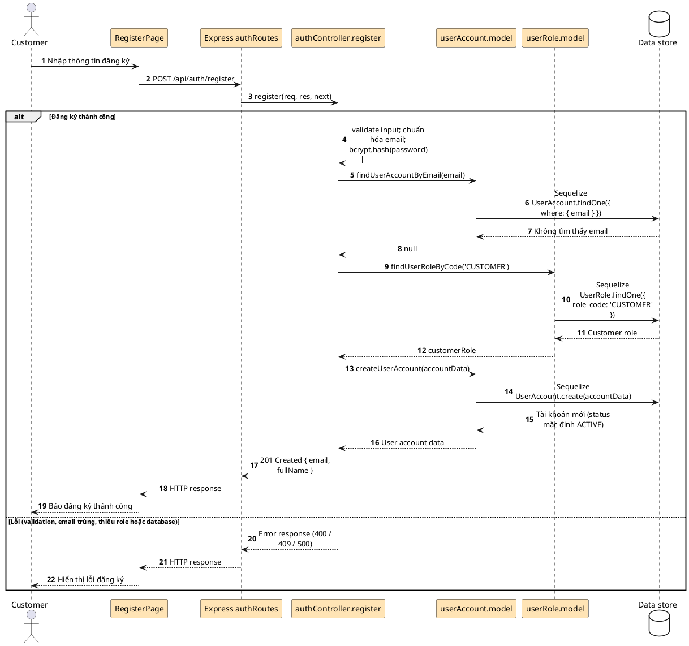
```plantuml
@startuml
skinparam sequenceMessageAlign center
skinparam maxMessageSize 150
autonumber

actor "Customer" as User
participant "RegisterPage" as FE #FFE4B5
participant "Express authRoutes" as Route #FFE4B5
participant "authController.register" as Ctrl #FFE4B5
participant "userAccount.model" as Model #FFE4B5
participant "userRole.model" as RoleModel #FFE4B5
database "Data store" as DB #FFFFFF

User -> FE : Nhập thông tin đăng ký
FE -> Route : POST /api/auth/register
Route -> Ctrl : register(req, res, next)
alt Đăng ký thành công
  Ctrl -> Ctrl : validate input; chuẩn hóa email; bcrypt.hash(password)
  Ctrl -> Model : findUserAccountByEmail(email)
  Model -> DB : Sequelize UserAccount.findOne({ where: { email } })
  DB --> Model : Không tìm thấy email
  Model --> Ctrl : null
  Ctrl -> RoleModel : findUserRoleByCode('CUSTOMER')
  RoleModel -> DB : Sequelize UserRole.findOne({ role_code: 'CUSTOMER' })
  DB --> RoleModel : Customer role
  RoleModel --> Ctrl : customerRole
  Ctrl -> Model : createUserAccount(accountData)
  Model -> DB : Sequelize UserAccount.create(accountData)
  DB --> Model : Tài khoản mới (status mặc định ACTIVE)
  Model --> Ctrl : User account data
  Ctrl --> Route : 201 Created { email, fullName }
  Route --> FE : HTTP response
  FE --> User : Báo đăng ký thành công
else Lỗi (validation, email trùng, thiếu role hoặc database)
  Ctrl --> Route : Error response (400 / 409 / 500)
  Route --> FE : HTTP response
  FE --> User : Hiển thị lỗi đăng ký
end
@enduml
```

### Sequence 2.1.2 + 2.1.3 + 2.1.5: Login System

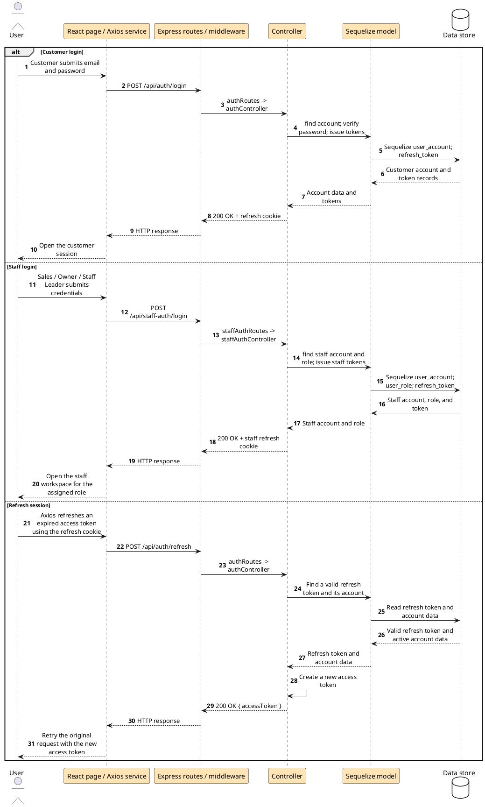
```plantuml
@startuml
skinparam sequenceMessageAlign center
skinparam maxMessageSize 150
autonumber

actor "User" as User
participant "React page / Axios service" as FE #FFE4B5
participant "Express routes / middleware" as Route #FFE4B5
participant "Controller" as Ctrl #FFE4B5
participant "Sequelize model" as Model #FFE4B5
database "Data store" as DB #FFFFFF

alt Customer login
  User -> FE : Customer submits email and password
  FE -> Route : POST /api/auth/login
  Route -> Ctrl : authRoutes -> authController
  Ctrl -> Model : find account; verify password; issue tokens
  Model -> DB : Sequelize user_account; refresh_token
  DB --> Model : Customer account and token records
  Model --> Ctrl : Account data and tokens
  Ctrl --> Route : 200 OK + refresh cookie
  Route --> FE : HTTP response
  FE --> User : Open the customer session
else Staff login
  User -> FE : Sales / Owner / Staff Leader submits credentials
  FE -> Route : POST /api/staff-auth/login
  Route -> Ctrl : staffAuthRoutes -> staffAuthController
  Ctrl -> Model : find staff account and role; issue staff tokens
  Model -> DB : Sequelize user_account; user_role; refresh_token
  DB --> Model : Staff account, role, and token
  Model --> Ctrl : Staff account and role
  Ctrl --> Route : 200 OK + staff refresh cookie
  Route --> FE : HTTP response
  FE --> User : Open the staff workspace for the assigned role
else Refresh session
  User -> FE : Axios refreshes an expired access token using the refresh cookie
  FE -> Route : POST /api/auth/refresh
  Route -> Ctrl : authRoutes -> authController
  Ctrl -> Model : Find a valid refresh token and its account
  Model -> DB : Read refresh token and account data
  DB --> Model : Valid refresh token and active account data
  Model --> Ctrl : Refresh token and account data
  Ctrl -> Ctrl : Create a new access token
  Ctrl --> Route : 200 OK { accessToken }
  Route --> FE : HTTP response
  FE --> User : Retry the original request with the new access token
end
@enduml
```

### Sequence 2.1.4: Forgot Password

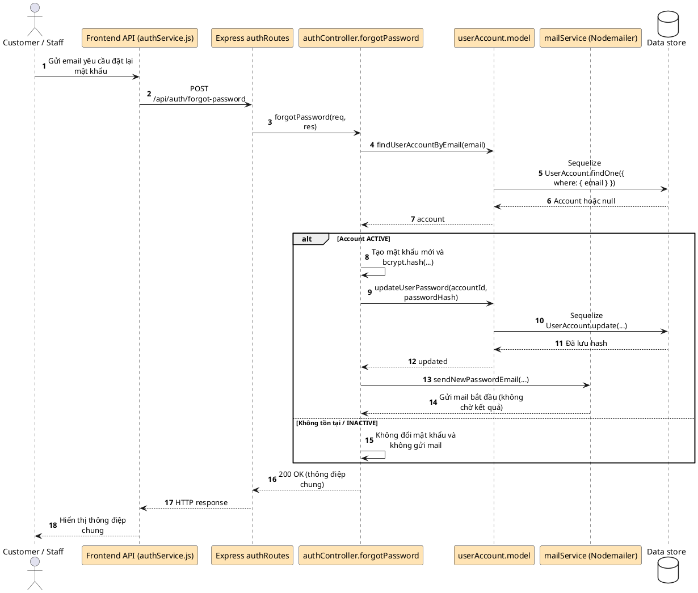
```plantuml
@startuml
skinparam maxMessageSize 150
skinparam sequenceMessageAlign center
autonumber

actor "Customer / Staff" as User
participant "Frontend API (authService.js)" as FE #FFE4B5
participant "Express authRoutes" as Route #FFE4B5
participant "authController.forgotPassword" as Ctrl #FFE4B5
participant "userAccount.model" as Model #FFE4B5
participant "mailService (Nodemailer)" as Mail #FFE4B5
database "Data store" as DB #FFFFFF

User -> FE : Gửi email yêu cầu đặt lại mật khẩu
FE -> Route : POST /api/auth/forgot-password
Route -> Ctrl : forgotPassword(req, res)
Ctrl -> Model : findUserAccountByEmail(email)
Model -> DB : Sequelize UserAccount.findOne({ where: { email } })
DB --> Model : Account hoặc null
Model --> Ctrl : account
alt Account ACTIVE
  Ctrl -> Ctrl : Tạo mật khẩu mới và bcrypt.hash(...)
  Ctrl -> Model : updateUserPassword(accountId, passwordHash)
  Model -> DB : Sequelize UserAccount.update(...)
  DB --> Model : Đã lưu hash
  Model --> Ctrl : updated
  Ctrl -> Mail : sendNewPasswordEmail(...)
  Mail --> Ctrl : Gửi mail bắt đầu (không chờ kết quả)
else Không tồn tại / INACTIVE
  Ctrl -> Ctrl : Không đổi mật khẩu và không gửi mail
end
Ctrl --> Route : 200 OK (thông điệp chung)
Route --> FE : HTTP response
FE --> User : Hiển thị thông điệp chung
@enduml
```

### Sequence 2.1.6: Log Out

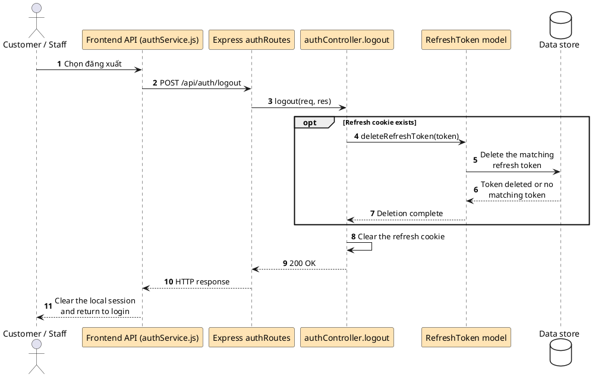
```plantuml
@startuml
skinparam maxMessageSize 150
skinparam sequenceMessageAlign center
autonumber
actor "Customer / Staff" as User
participant "Frontend API (authService.js)" as FE #FFE4B5
participant "Express authRoutes" as Route #FFE4B5
participant "authController.logout" as Ctrl #FFE4B5
participant "RefreshToken model" as Model #FFE4B5
database "Data store" as DB #FFFFFF
User -> FE : Chọn đăng xuất
FE -> Route : POST /api/auth/logout
Route -> Ctrl : logout(req, res)
opt Refresh cookie exists
  Ctrl -> Model : deleteRefreshToken(token)
  Model -> DB : Delete the matching refresh token
  DB --> Model : Token deleted or no matching token
  Model --> Ctrl : Deletion complete
end
Ctrl -> Ctrl : Clear the refresh cookie
Ctrl --> Route : 200 OK
Route --> FE : HTTP response
FE --> User : Clear the local session and return to login
@enduml
```

## 2 Manage Profile

### Sequence 2.1.7: Change password

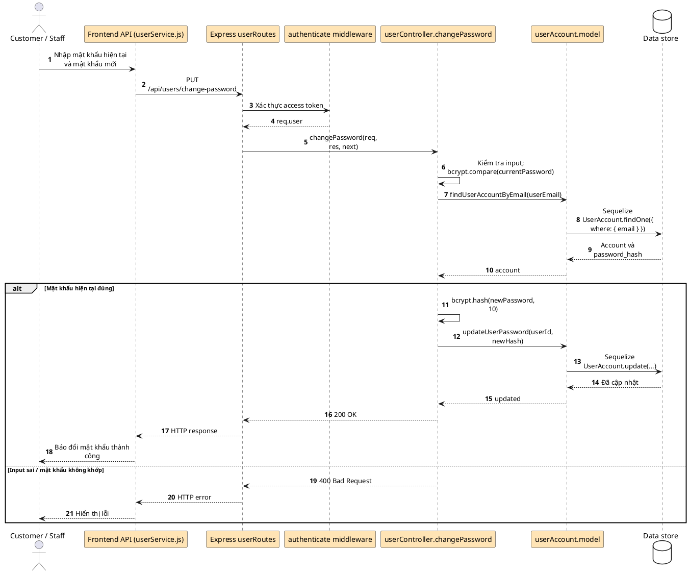
```plantuml
@startuml
skinparam maxMessageSize 150
skinparam sequenceMessageAlign center
autonumber

actor "Customer / Staff" as User
participant "Frontend API (userService.js)" as FE #FFE4B5
participant "Express userRoutes" as Route #FFE4B5
participant "authenticate middleware" as Auth #FFE4B5
participant "userController.changePassword" as Ctrl #FFE4B5
participant "userAccount.model" as Model #FFE4B5
database "Data store" as DB #FFFFFF

User -> FE : Nhập mật khẩu hiện tại và mật khẩu mới
FE -> Route : PUT /api/users/change-password
Route -> Auth : Xác thực access token
Auth --> Route : req.user
Route -> Ctrl : changePassword(req, res, next)
Ctrl -> Ctrl : Kiểm tra input; bcrypt.compare(currentPassword)
Ctrl -> Model : findUserAccountByEmail(userEmail)
Model -> DB : Sequelize UserAccount.findOne({ where: { email } })
DB --> Model : Account và password_hash
Model --> Ctrl : account
alt Mật khẩu hiện tại đúng
  Ctrl -> Ctrl : bcrypt.hash(newPassword, 10)
  Ctrl -> Model : updateUserPassword(userId, newHash)
  Model -> DB : Sequelize UserAccount.update(...)
  DB --> Model : Đã cập nhật
  Model --> Ctrl : updated
  Ctrl --> Route : 200 OK
  Route --> FE : HTTP response
  FE --> User : Báo đổi mật khẩu thành công
else Input sai / mật khẩu không khớp
  Ctrl --> Route : 400 Bad Request
  Route --> FE : HTTP error
  FE --> User : Hiển thị lỗi
end
@enduml
```

---

### Sequence 2.2.1: View profile

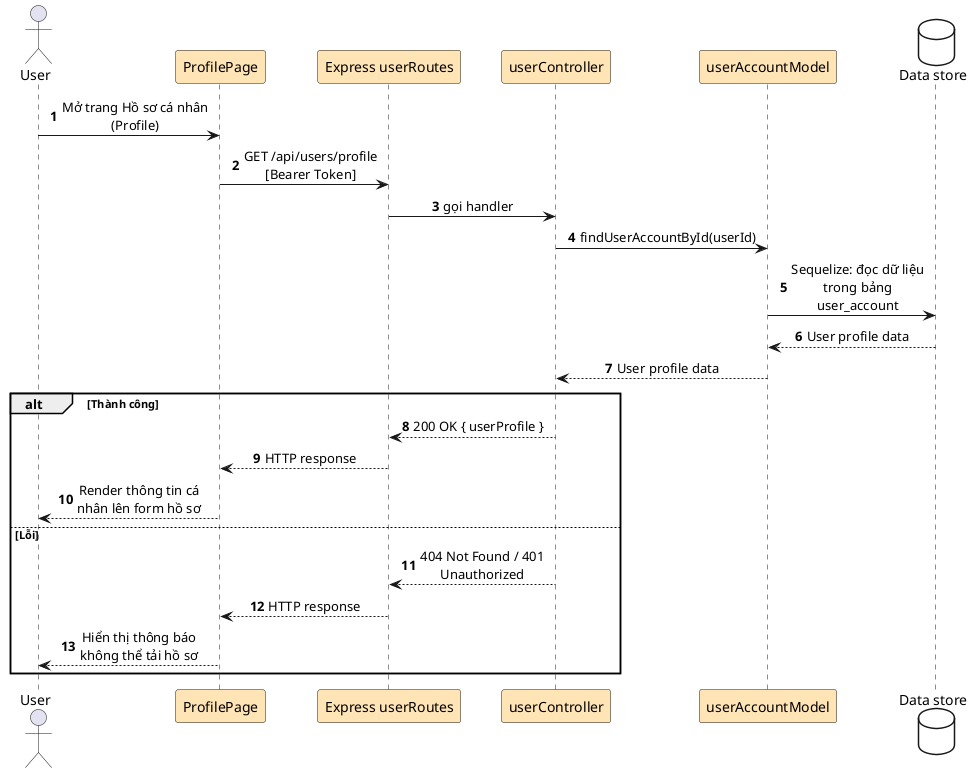
```plantuml
@startuml
skinparam sequenceMessageAlign center
skinparam maxMessageSize 150
autonumber

actor "User" as User
participant "ProfilePage" as FE #FFE4B5
participant "Express userRoutes" as Route #FFE4B5
participant "userController" as Ctrl #FFE4B5
participant "userAccountModel" as Model #FFE4B5
database "Data store" as DB #FFFFFF

User -> FE : Mở trang Hồ sơ cá nhân (Profile)
FE -> Route : GET /api/users/profile [Bearer Token]
Route -> Ctrl : gọi handler
Ctrl -> Model : findUserAccountById(userId)
Model -> DB : Sequelize: đọc dữ liệu trong bảng user_account
DB --> Model : User profile data
Model --> Ctrl : User profile data
alt Thành công
  Ctrl --> Route : 200 OK { userProfile }
  Route --> FE : HTTP response
  FE --> User : Render thông tin cá nhân lên form hồ sơ
else Lỗi
  Ctrl --> Route : 404 Not Found / 401 Unauthorized
  Route --> FE : HTTP response
  FE --> User : Hiển thị thông báo không thể tải hồ sơ
end
@enduml
```

### Sequence 2.2.2: Update profile

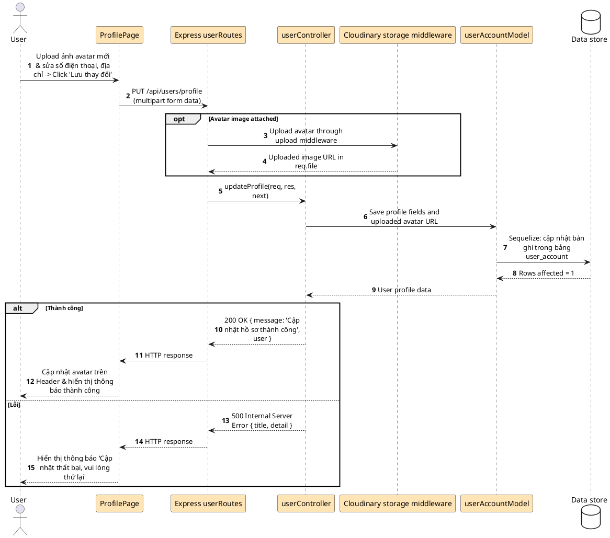
```plantuml
@startuml
skinparam sequenceMessageAlign center
skinparam maxMessageSize 150
autonumber

actor "User" as User
participant "ProfilePage" as FE #FFE4B5
participant "Express userRoutes" as Route #FFE4B5
participant "userController" as Ctrl #FFE4B5
participant "Cloudinary storage middleware" as Ext #FFE4B5
participant "userAccountModel" as Model #FFE4B5
database "Data store" as DB #FFFFFF

User -> FE : Upload ảnh avatar mới & sửa số điện thoại, địa chỉ -> Click 'Lưu thay đổi'
FE -> Route : PUT /api/users/profile (multipart form data)
opt Avatar image attached
  Route -> Ext : Upload avatar through upload middleware
  Ext --> Route : Uploaded image URL in req.file
end
Route -> Ctrl : updateProfile(req, res, next)
Ctrl -> Model : Save profile fields and uploaded avatar URL
Model -> DB : Sequelize: cập nhật bản ghi trong bảng user_account
DB --> Model : Rows affected = 1
Model --> Ctrl : User profile data
alt Thành công
  Ctrl --> Route : 200 OK { message: 'Cập nhật hồ sơ thành công', user }
  Route --> FE : HTTP response
  FE --> User : Cập nhật avatar trên Header & hiển thị thông báo thành công
else Lỗi
  Ctrl --> Route : 500 Internal Server Error { title, detail }
  Route --> FE : HTTP response
  FE --> User : Hiển thị thông báo 'Cập nhật thất bại, vui lòng thử lại'
end
@enduml
```

## 3 View Products

### Sequence 2.3.1 + 2.3.2 + 2.3.9: View product list / Search products / Filter products

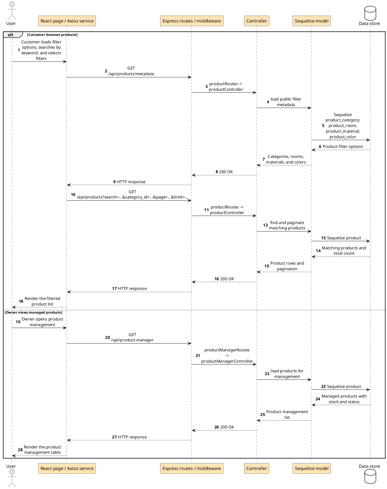
```plantuml
@startuml
skinparam sequenceMessageAlign center
skinparam maxMessageSize 150
autonumber

actor "User" as User
participant "React page / Axios service" as FE #FFE4B5
participant "Express routes / middleware" as Route #FFE4B5
participant "Controller" as Ctrl #FFE4B5
participant "Sequelize model" as Model #FFE4B5
database "Data store" as DB #FFFFFF

alt Customer browses products
  User -> FE : Customer loads filter options, searches by keyword, and selects filters
  FE -> Route : GET /api/products/metadata
  Route -> Ctrl : productRoutes -> productController
  Ctrl -> Model : load public filter metadata
  Model -> DB : Sequelize product_category; product_room; product_material; product_color
  DB --> Model : Product filter options
  Model --> Ctrl : Categories, rooms, materials, and colors
  Ctrl --> Route : 200 OK
  Route --> FE : HTTP response
  FE -> Route : GET /api/products?search=...&category_id=...&page=...&limit=...
  Route -> Ctrl : productRoutes -> productController
  Ctrl -> Model : find and paginate matching products
  Model -> DB : Sequelize product
  DB --> Model : Matching products and total count
  Model --> Ctrl : Product rows and pagination
  Ctrl --> Route : 200 OK
  Route --> FE : HTTP response
  FE --> User : Render the filtered product list
else Owner views managed products
  User -> FE : Owner opens product management
  FE -> Route : GET /api/product-manager
  Route -> Ctrl : productManagerRoutes -> productManagerController
  Ctrl -> Model : load products for management
  Model -> DB : Sequelize product
  DB --> Model : Managed products with stock and status
  Model --> Ctrl : Product management list
  Ctrl --> Route : 200 OK
  Route --> FE : HTTP response
  FE --> User : Render the product management table
end
@enduml
```

### Sequence 2.3.3 + 2.3.10: View product details

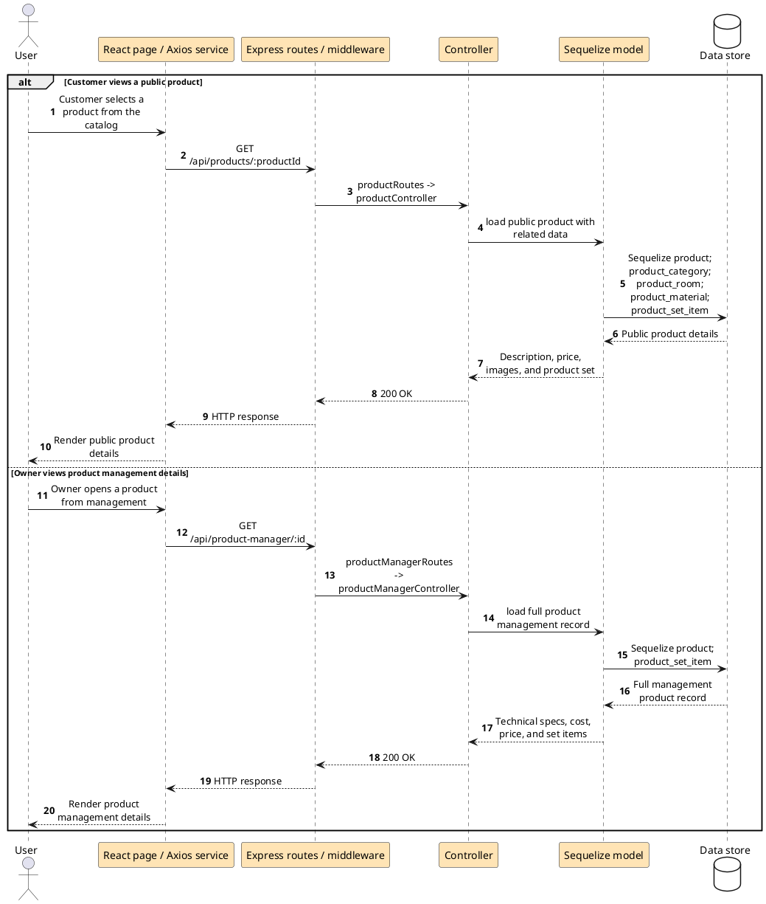
```plantuml
@startuml
skinparam sequenceMessageAlign center
skinparam maxMessageSize 150
autonumber

actor "User" as User
participant "React page / Axios service" as FE #FFE4B5
participant "Express routes / middleware" as Route #FFE4B5
participant "Controller" as Ctrl #FFE4B5
participant "Sequelize model" as Model #FFE4B5
database "Data store" as DB #FFFFFF

alt Customer views a public product
  User -> FE : Customer selects a product from the catalog
  FE -> Route : GET /api/products/:productId
  Route -> Ctrl : productRoutes -> productController
  Ctrl -> Model : load public product with related data
  Model -> DB : Sequelize product; product_category; product_room; product_material; product_set_item
  DB --> Model : Public product details
  Model --> Ctrl : Description, price, images, and product set
  Ctrl --> Route : 200 OK
  Route --> FE : HTTP response
  FE --> User : Render public product details
else Owner views product management details
  User -> FE : Owner opens a product from management
  FE -> Route : GET /api/product-manager/:id
  Route -> Ctrl : productManagerRoutes -> productManagerController
  Ctrl -> Model : load full product management record
  Model -> DB : Sequelize product; product_set_item
  DB --> Model : Full management product record
  Model --> Ctrl : Technical specs, cost, price, and set items
  Ctrl --> Route : 200 OK
  Route --> FE : HTTP response
  FE --> User : Render product management details
end
@enduml
```

## 4 Manage Cart

### Sequence 2.4.1: View cart

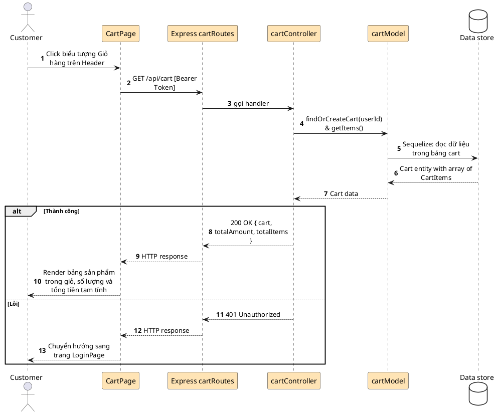
```plantuml
@startuml
skinparam sequenceMessageAlign center
skinparam maxMessageSize 150
autonumber

actor "Customer" as User
participant "CartPage" as FE #FFE4B5
participant "Express cartRoutes" as Route #FFE4B5
participant "cartController" as Ctrl #FFE4B5
participant "cartModel" as Model #FFE4B5
database "Data store" as DB #FFFFFF

User -> FE : Click biểu tượng Giỏ hàng trên Header
FE -> Route : GET /api/cart [Bearer Token]
Route -> Ctrl : gọi handler
Ctrl -> Model : findOrCreateCart(userId) & getItems()
Model -> DB : Sequelize: đọc dữ liệu trong bảng cart
DB --> Model : Cart entity with array of CartItems
Model --> Ctrl : Cart data
alt Thành công
  Ctrl --> Route : 200 OK { cart, totalAmount, totalItems }
  Route --> FE : HTTP response
  FE --> User : Render bảng sản phẩm trong giỏ, số lượng và tổng tiền tạm tính
else Lỗi
  Ctrl --> Route : 401 Unauthorized
  Route --> FE : HTTP response
  FE --> User : Chuyển hướng sang trang LoginPage
end
@enduml
```

### Sequence 2.4.2: Add product to cart

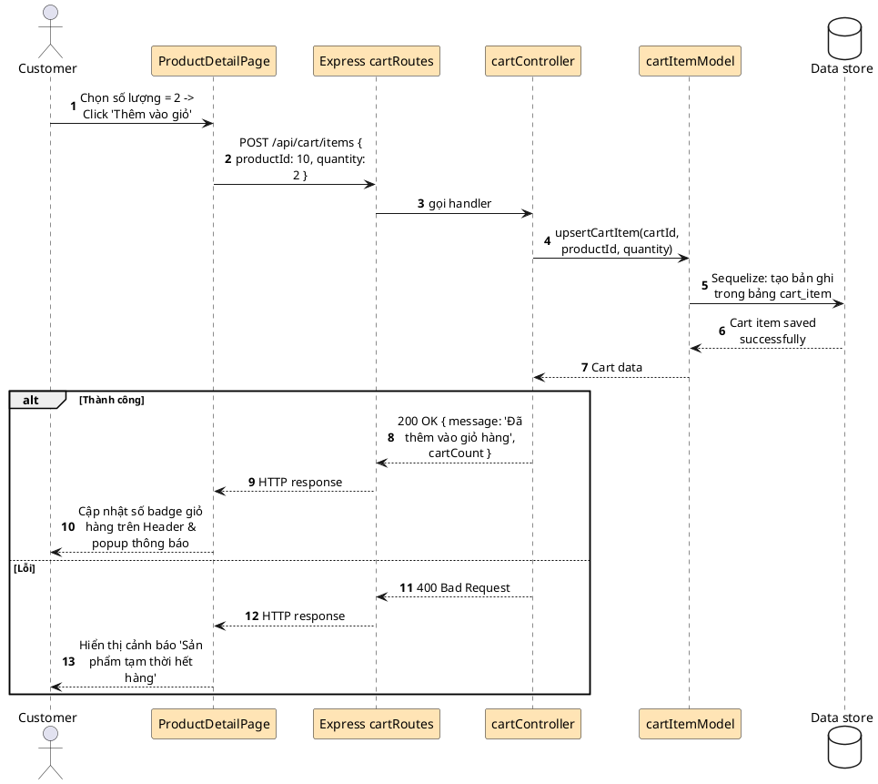
```plantuml
@startuml
skinparam sequenceMessageAlign center
skinparam maxMessageSize 150
autonumber

actor "Customer" as User
participant "ProductDetailPage" as FE #FFE4B5
participant "Express cartRoutes" as Route #FFE4B5
participant "cartController" as Ctrl #FFE4B5
participant "cartItemModel" as Model #FFE4B5
database "Data store" as DB #FFFFFF

User -> FE : Chọn số lượng = 2 -> Click 'Thêm vào giỏ'
FE -> Route : POST /api/cart/items { productId: 10, quantity: 2 }
Route -> Ctrl : gọi handler
Ctrl -> Model : upsertCartItem(cartId, productId, quantity)
Model -> DB : Sequelize: tạo bản ghi trong bảng cart_item
DB --> Model : Cart item saved successfully
Model --> Ctrl : Cart data
alt Thành công
  Ctrl --> Route : 200 OK { message: 'Đã thêm vào giỏ hàng', cartCount }
  Route --> FE : HTTP response
  FE --> User : Cập nhật số badge giỏ hàng trên Header & popup thông báo
else Lỗi
  Ctrl --> Route : 400 Bad Request
  Route --> FE : HTTP response
  FE --> User : Hiển thị cảnh báo 'Sản phẩm tạm thời hết hàng'
end
@enduml
```

### Sequence 2.4.3: Update quantity

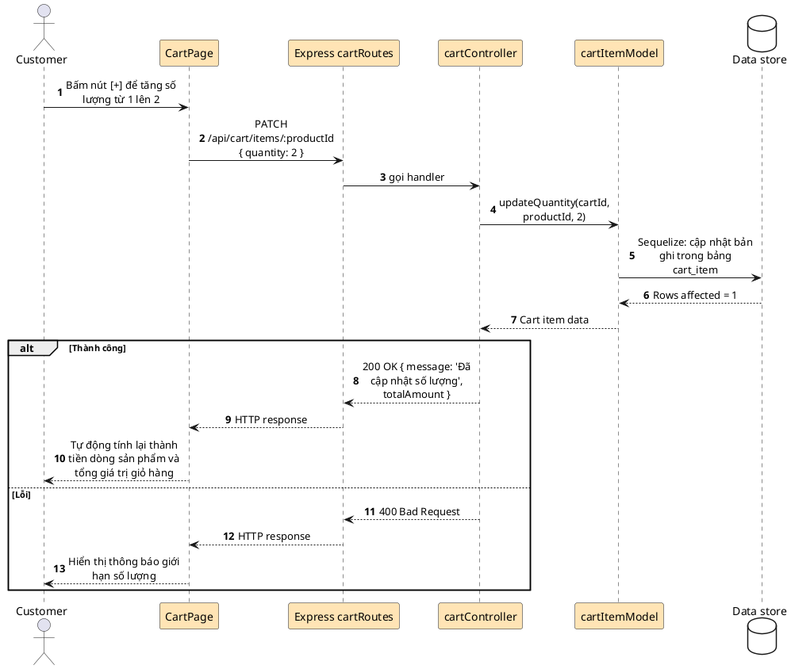
```plantuml
@startuml
skinparam sequenceMessageAlign center
skinparam maxMessageSize 150
autonumber

actor "Customer" as User
participant "CartPage" as FE #FFE4B5
participant "Express cartRoutes" as Route #FFE4B5
participant "cartController" as Ctrl #FFE4B5
participant "cartItemModel" as Model #FFE4B5
database "Data store" as DB #FFFFFF

User -> FE : Bấm nút [+] để tăng số lượng từ 1 lên 2
FE -> Route : PATCH /api/cart/items/:productId { quantity: 2 }
Route -> Ctrl : gọi handler
Ctrl -> Model : updateQuantity(cartId, productId, 2)
Model -> DB : Sequelize: cập nhật bản ghi trong bảng cart_item
DB --> Model : Rows affected = 1
Model --> Ctrl : Cart item data
alt Thành công
  Ctrl --> Route : 200 OK { message: 'Đã cập nhật số lượng', totalAmount }
  Route --> FE : HTTP response
  FE --> User : Tự động tính lại thành tiền dòng sản phẩm và tổng giá trị giỏ hàng
else Lỗi
  Ctrl --> Route : 400 Bad Request
  Route --> FE : HTTP response
  FE --> User : Hiển thị thông báo giới hạn số lượng
end
@enduml
```

### Sequence 2.4.4: Remove product from cart

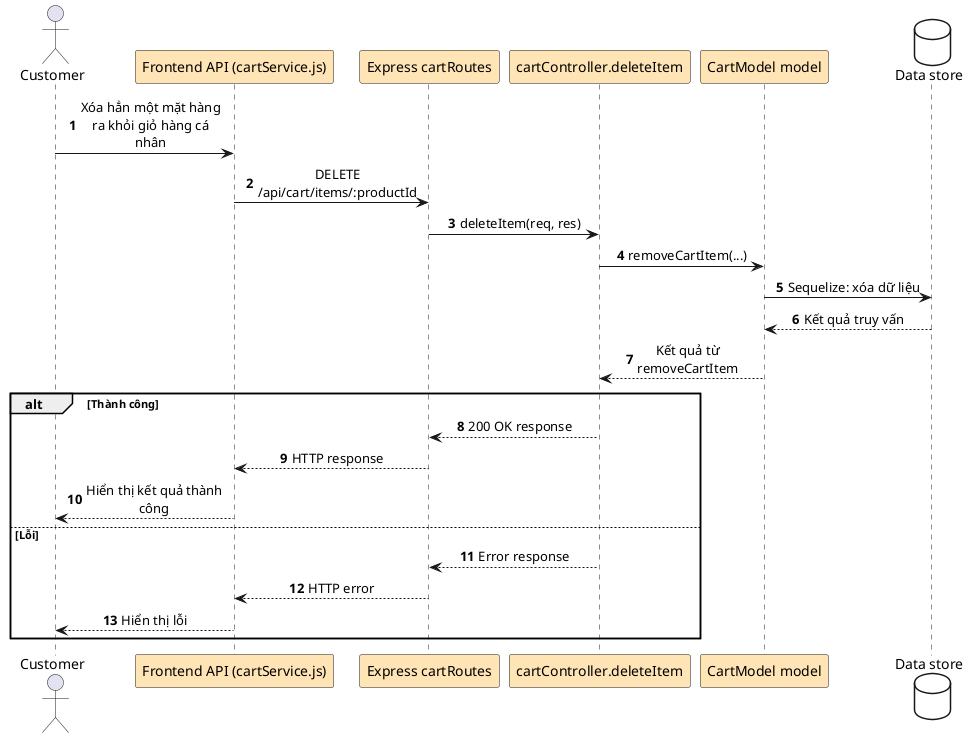
```plantuml
@startuml
skinparam maxMessageSize 150
skinparam sequenceMessageAlign center
autonumber
actor "Customer" as User
participant "Frontend API (cartService.js)" as FE #FFE4B5
participant "Express cartRoutes" as Route #FFE4B5
participant "cartController.deleteItem" as Ctrl #FFE4B5
participant "CartModel model" as Model #FFE4B5
database "Data store" as DB #FFFFFF
User -> FE : Xóa hẳn một mặt hàng ra khỏi giỏ hàng cá nhân
FE -> Route : DELETE /api/cart/items/:productId
Route -> Ctrl : deleteItem(req, res)
Ctrl -> Model : removeCartItem(...)
Model -> DB : Sequelize: xóa dữ liệu
DB --> Model : Kết quả truy vấn
Model --> Ctrl : Kết quả từ removeCartItem
alt Thành công
  Ctrl --> Route : 200 OK response
  Route --> FE : HTTP response
  FE --> User : Hiển thị kết quả thành công
else Lỗi
  Ctrl --> Route : Error response
  Route --> FE : HTTP error
  FE --> User : Hiển thị lỗi
end
@enduml
```

## 5 Manage Order

### Sequence 2.7.1: Create sales order

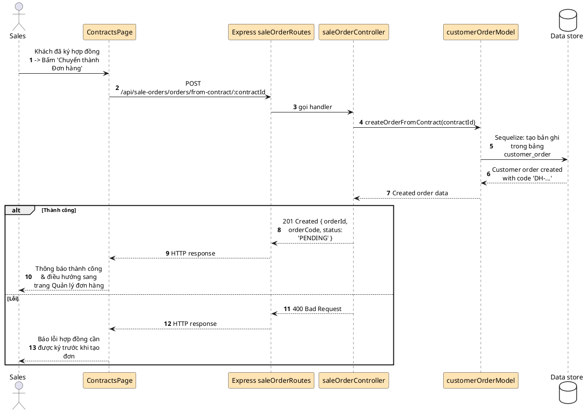
```plantuml
@startuml
skinparam sequenceMessageAlign center
skinparam maxMessageSize 150
autonumber

actor "Sales" as User
participant "ContractsPage" as FE #FFE4B5
participant "Express saleOrderRoutes" as Route #FFE4B5
participant "saleOrderController" as Ctrl #FFE4B5
participant "customerOrderModel" as Model #FFE4B5
database "Data store" as DB #FFFFFF

User -> FE : Khách đã ký hợp đồng -> Bấm 'Chuyển thành Đơn hàng'
FE -> Route : POST /api/sale-orders/orders/from-contract/:contractId
Route -> Ctrl : gọi handler
Ctrl -> Model : createOrderFromContract(contractId)
Model -> DB : Sequelize: tạo bản ghi trong bảng customer_order
DB --> Model : Customer order created with code 'DH-...'
  Model --> Ctrl : Created order data
alt Thành công
  Ctrl --> Route : 201 Created { orderId, orderCode, status: 'PENDING' }
  Route --> FE : HTTP response
  FE --> User : Thông báo thành công & điều hướng sang trang Quản lý đơn hàng
else Lỗi
  Ctrl --> Route : 400 Bad Request
  Route --> FE : HTTP response
  FE --> User : Báo lỗi hợp đồng cần được ký trước khi tạo đơn
end
@enduml
```

### Sequence 2.7.2 + 2.7.6 + 2.7.12: View order history / order list

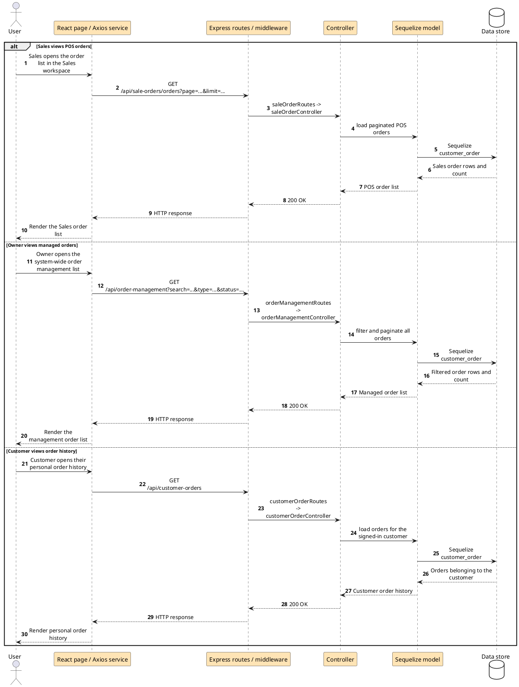
```plantuml
@startuml
skinparam sequenceMessageAlign center
skinparam maxMessageSize 150
autonumber

actor "User" as User
participant "React page / Axios service" as FE #FFE4B5
participant "Express routes / middleware" as Route #FFE4B5
participant "Controller" as Ctrl #FFE4B5
participant "Sequelize model" as Model #FFE4B5
database "Data store" as DB #FFFFFF

alt Sales views POS orders
  User -> FE : Sales opens the order list in the Sales workspace
  FE -> Route : GET /api/sale-orders/orders?page=...&limit=...
  Route -> Ctrl : saleOrderRoutes -> saleOrderController
  Ctrl -> Model : load paginated POS orders
  Model -> DB : Sequelize customer_order
  DB --> Model : Sales order rows and count
  Model --> Ctrl : POS order list
  Ctrl --> Route : 200 OK
  Route --> FE : HTTP response
  FE --> User : Render the Sales order list
else Owner views managed orders
  User -> FE : Owner opens the system-wide order management list
  FE -> Route : GET /api/order-management?search=...&type=...&status=...
  Route -> Ctrl : orderManagementRoutes -> orderManagementController
  Ctrl -> Model : filter and paginate all orders
  Model -> DB : Sequelize customer_order
  DB --> Model : Filtered order rows and count
  Model --> Ctrl : Managed order list
  Ctrl --> Route : 200 OK
  Route --> FE : HTTP response
  FE --> User : Render the management order list
else Customer views order history
  User -> FE : Customer opens their personal order history
  FE -> Route : GET /api/customer-orders
  Route -> Ctrl : customerOrderRoutes -> customerOrderController
  Ctrl -> Model : load orders for the signed-in customer
  Model -> DB : Sequelize customer_order
  DB --> Model : Orders belonging to the customer
  Model --> Ctrl : Customer order history
  Ctrl --> Route : 200 OK
  Route --> FE : HTTP response
  FE --> User : Render personal order history
end
@enduml
```

### Sequence 2.7.3 + 2.7.7 + 2.7.13: View order details

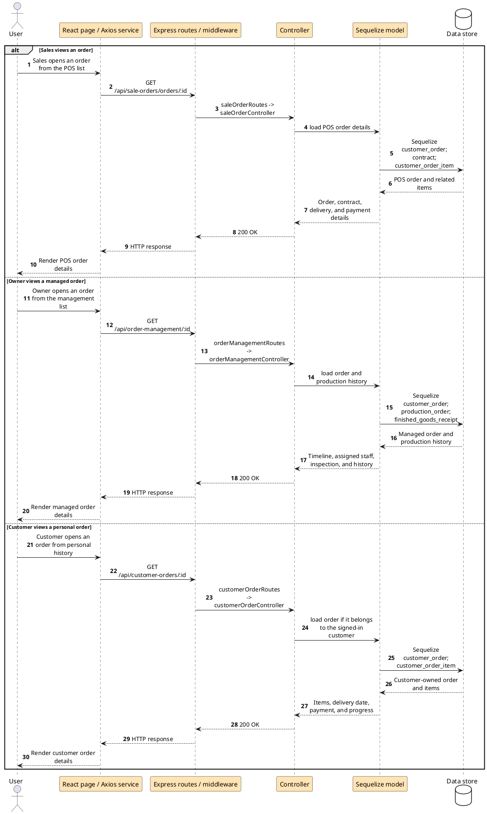
```plantuml
@startuml
skinparam sequenceMessageAlign center
skinparam maxMessageSize 150
autonumber

actor "User" as User
participant "React page / Axios service" as FE #FFE4B5
participant "Express routes / middleware" as Route #FFE4B5
participant "Controller" as Ctrl #FFE4B5
participant "Sequelize model" as Model #FFE4B5
database "Data store" as DB #FFFFFF

alt Sales views an order
  User -> FE : Sales opens an order from the POS list
  FE -> Route : GET /api/sale-orders/orders/:id
  Route -> Ctrl : saleOrderRoutes -> saleOrderController
  Ctrl -> Model : load POS order details
  Model -> DB : Sequelize customer_order; contract; customer_order_item
  DB --> Model : POS order and related items
  Model --> Ctrl : Order, contract, delivery, and payment details
  Ctrl --> Route : 200 OK
  Route --> FE : HTTP response
  FE --> User : Render POS order details
else Owner views a managed order
  User -> FE : Owner opens an order from the management list
  FE -> Route : GET /api/order-management/:id
  Route -> Ctrl : orderManagementRoutes -> orderManagementController
  Ctrl -> Model : load order and production history
  Model -> DB : Sequelize customer_order; production_order; finished_goods_receipt
  DB --> Model : Managed order and production history
  Model --> Ctrl : Timeline, assigned staff, inspection, and history
  Ctrl --> Route : 200 OK
  Route --> FE : HTTP response
  FE --> User : Render managed order details
else Customer views a personal order
  User -> FE : Customer opens an order from personal history
  FE -> Route : GET /api/customer-orders/:id
  Route -> Ctrl : customerOrderRoutes -> customerOrderController
  Ctrl -> Model : load order if it belongs to the signed-in customer
  Model -> DB : Sequelize customer_order; customer_order_item
  DB --> Model : Customer-owned order and items
  Model --> Ctrl : Items, delivery date, payment, and progress
  Ctrl --> Route : 200 OK
  Route --> FE : HTTP response
  FE --> User : Render customer order details
end
@enduml
```

### Sequence 2.7.4 + 2.7.5 + 2.7.9: Update order status

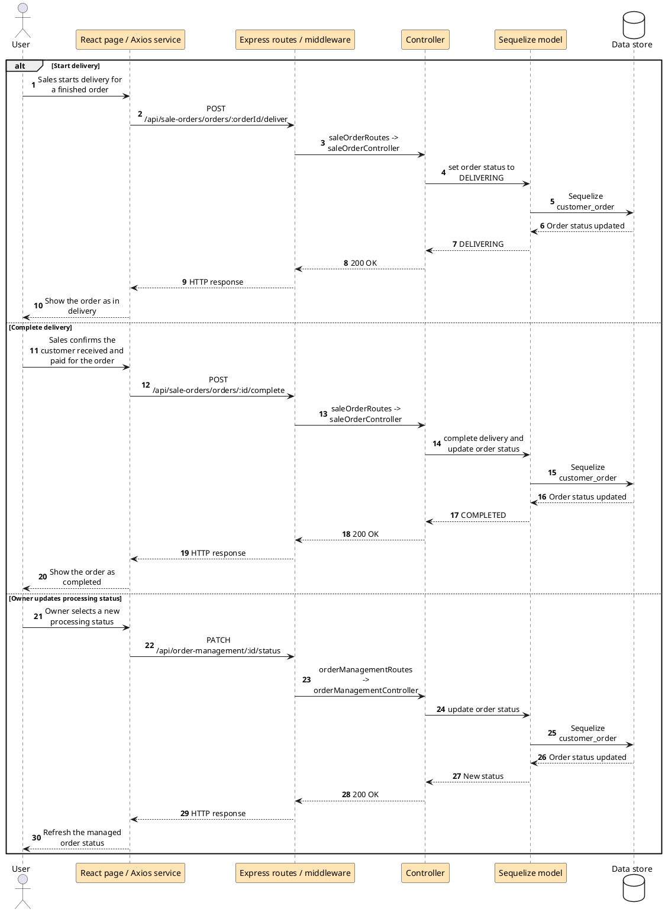
```plantuml
@startuml
skinparam sequenceMessageAlign center
skinparam maxMessageSize 150
autonumber

actor "User" as User
participant "React page / Axios service" as FE #FFE4B5
participant "Express routes / middleware" as Route #FFE4B5
participant "Controller" as Ctrl #FFE4B5
participant "Sequelize model" as Model #FFE4B5
database "Data store" as DB #FFFFFF

alt Start delivery
  User -> FE : Sales starts delivery for a finished order
  FE -> Route : POST /api/sale-orders/orders/:orderId/deliver
  Route -> Ctrl : saleOrderRoutes -> saleOrderController
  Ctrl -> Model : set order status to DELIVERING
  Model -> DB : Sequelize customer_order
  DB --> Model : Order status updated
  Model --> Ctrl : DELIVERING
  Ctrl --> Route : 200 OK
  Route --> FE : HTTP response
  FE --> User : Show the order as in delivery
else Complete delivery
  User -> FE : Sales confirms the customer received and paid for the order
  FE -> Route : POST /api/sale-orders/orders/:id/complete
  Route -> Ctrl : saleOrderRoutes -> saleOrderController
  Ctrl -> Model : complete delivery and update order status
  Model -> DB : Sequelize customer_order
  DB --> Model : Order status updated
  Model --> Ctrl : COMPLETED
  Ctrl --> Route : 200 OK
  Route --> FE : HTTP response
  FE --> User : Show the order as completed
else Owner updates processing status
  User -> FE : Owner selects a new processing status
  FE -> Route : PATCH /api/order-management/:id/status
  Route -> Ctrl : orderManagementRoutes -> orderManagementController
  Ctrl -> Model : update order status
  Model -> DB : Sequelize customer_order
  DB --> Model : Order status updated
  Model --> Ctrl : New status
  Ctrl --> Route : 200 OK
  Route --> FE : HTTP response
  FE --> User : Refresh the managed order status
end
@enduml
```

### Sequence 2.7.8: Cancel order

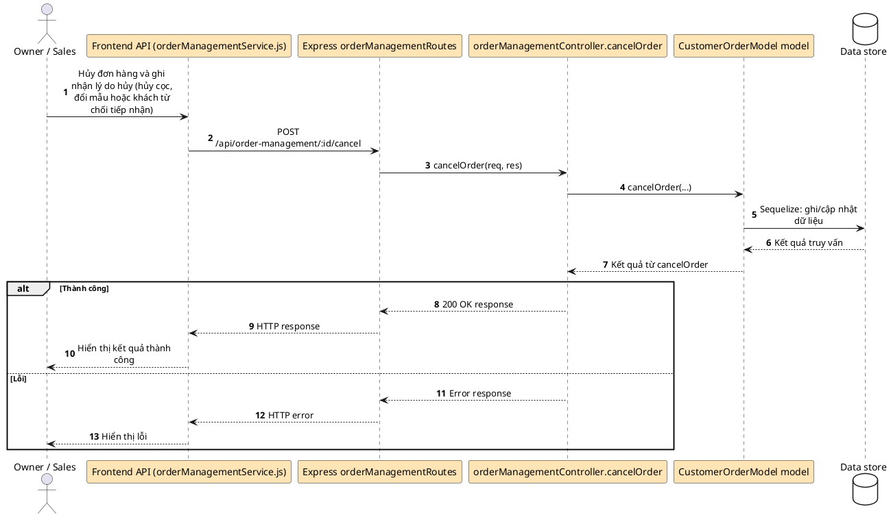
```plantuml
@startuml
skinparam maxMessageSize 150
skinparam sequenceMessageAlign center
autonumber
actor "Owner / Sales" as User
participant "Frontend API (orderManagementService.js)" as FE #FFE4B5
participant "Express orderManagementRoutes" as Route #FFE4B5
participant "orderManagementController.cancelOrder" as Ctrl #FFE4B5
participant "CustomerOrderModel model" as Model #FFE4B5
database "Data store" as DB #FFFFFF
User -> FE : Hủy đơn hàng và ghi nhận lý do hủy (hủy cọc, đổi mẫu hoặc khách từ chối tiếp nhận)
FE -> Route : POST /api/order-management/:id/cancel
Route -> Ctrl : cancelOrder(req, res)
Ctrl -> Model : cancelOrder(...)
Model -> DB : Sequelize: ghi/cập nhật dữ liệu
DB --> Model : Kết quả truy vấn
Model --> Ctrl : Kết quả từ cancelOrder
alt Thành công
  Ctrl --> Route : 200 OK response
  Route --> FE : HTTP response
  FE --> User : Hiển thị kết quả thành công
else Lỗi
  Ctrl --> Route : Error response
  Route --> FE : HTTP error
  FE --> User : Hiển thị lỗi
end
@enduml
```

### Sequence 2.7.10 + 2.7.11: Assign leader to order

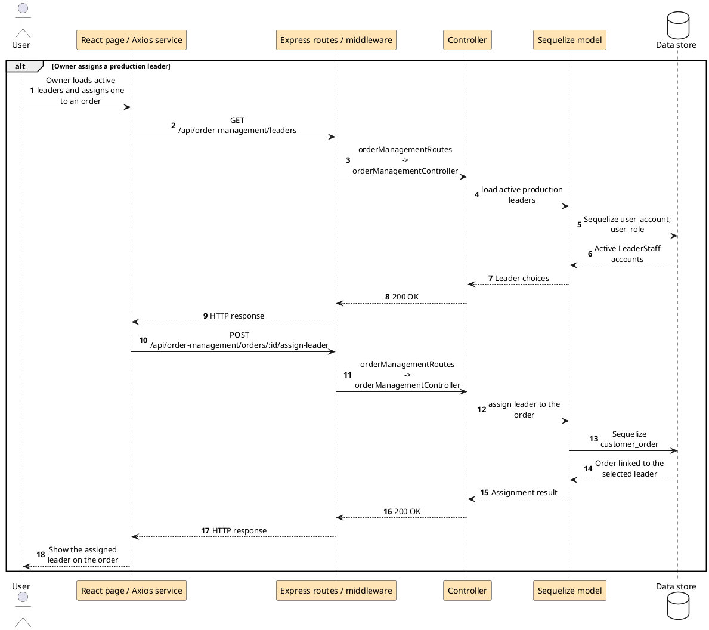
```plantuml
@startuml
skinparam sequenceMessageAlign center
skinparam maxMessageSize 150
autonumber

actor "User" as User
participant "React page / Axios service" as FE #FFE4B5
participant "Express routes / middleware" as Route #FFE4B5
participant "Controller" as Ctrl #FFE4B5
participant "Sequelize model" as Model #FFE4B5
database "Data store" as DB #FFFFFF

alt Owner assigns a production leader
  User -> FE : Owner loads active leaders and assigns one to an order
  FE -> Route : GET /api/order-management/leaders
  Route -> Ctrl : orderManagementRoutes -> orderManagementController
  Ctrl -> Model : load active production leaders
  Model -> DB : Sequelize user_account; user_role
  DB --> Model : Active LeaderStaff accounts
  Model --> Ctrl : Leader choices
  Ctrl --> Route : 200 OK
  Route --> FE : HTTP response
  FE -> Route : POST /api/order-management/orders/:id/assign-leader
  Route -> Ctrl : orderManagementRoutes -> orderManagementController
  Ctrl -> Model : assign leader to the order
  Model -> DB : Sequelize customer_order
  DB --> Model : Order linked to the selected leader
  Model --> Ctrl : Assignment result
  Ctrl --> Route : 200 OK
  Route --> FE : HTTP response
  FE --> User : Show the assigned leader on the order
end
@enduml
```

## 7 Submit Purchase Request

### Sequence 2.4.5: Submit Purchase Request

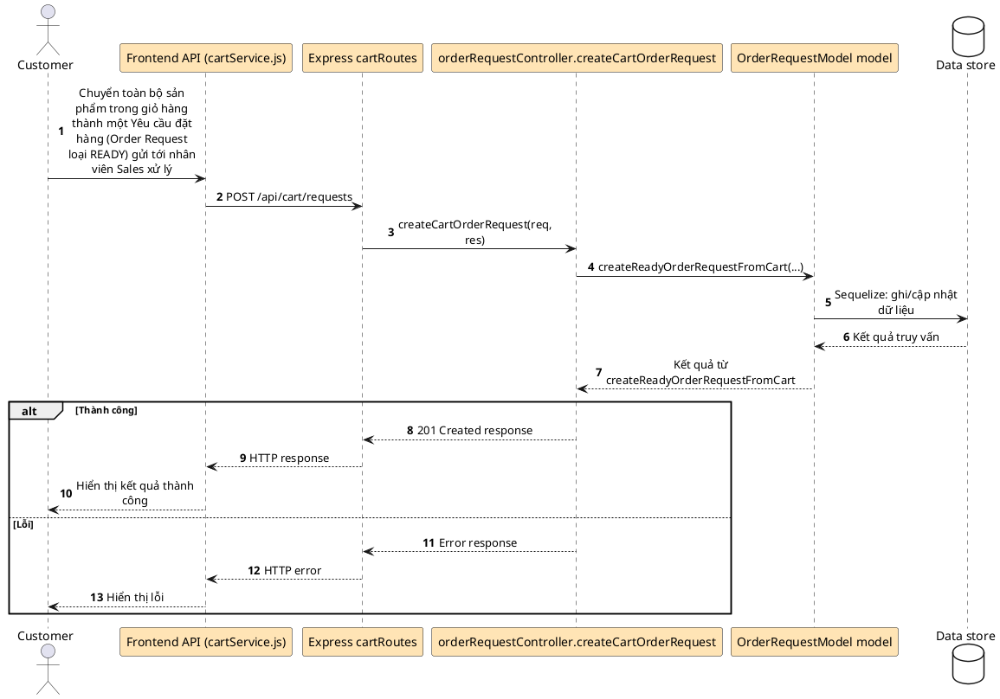
```plantuml
@startuml
skinparam maxMessageSize 150
skinparam sequenceMessageAlign center
autonumber
actor "Customer" as User
participant "Frontend API (cartService.js)" as FE #FFE4B5
participant "Express cartRoutes" as Route #FFE4B5
participant "orderRequestController.createCartOrderRequest" as Ctrl #FFE4B5
participant "OrderRequestModel model" as Model #FFE4B5
database "Data store" as DB #FFFFFF
User -> FE : Chuyển toàn bộ sản phẩm trong giỏ hàng thành một Yêu cầu đặt hàng (Order Request loại READY) gửi tới nhân viên Sales xử lý
FE -> Route : POST /api/cart/requests
Route -> Ctrl : createCartOrderRequest(req, res)
Ctrl -> Model : createReadyOrderRequestFromCart(...)
Model -> DB : Sequelize: ghi/cập nhật dữ liệu
DB --> Model : Kết quả truy vấn
Model --> Ctrl : Kết quả từ createReadyOrderRequestFromCart
alt Thành công
  Ctrl --> Route : 201 Created response
  Route --> FE : HTTP response
  FE --> User : Hiển thị kết quả thành công
else Lỗi
  Ctrl --> Route : Error response
  Route --> FE : HTTP error
  FE --> User : Hiển thị lỗi
end
@enduml
```

---

---

## 8 Manage Customer

### Sequence 2.6.2: View customer list

```plantuml
@startuml
skinparam sequenceMessageAlign center
skinparam maxMessageSize 150
autonumber

actor "Sales" as User
participant "CustomersPage" as FE #FFE4B5
participant "Express saleOrderRoutes" as Route #FFE4B5
participant "saleOrderController" as Ctrl #FFE4B5
participant "userAccountModel" as Model #FFE4B5
database "Data store" as DB #FFFFFF

User -> FE : Tìm khách hàng theo số điện thoại
FE -> Route : GET /api/sale-orders/customers?search=0901234567&search_by=PHONE
Route -> Ctrl : getSaleCustomers(req, res)
Ctrl -> Model : Find customers by the supplied search criteria
Model -> DB : Read matching customer account data
DB --> Model : Matching customer data
Model --> Ctrl : Customer account data
alt Thành công
  Ctrl --> Route : 200 OK { customer }
  Route --> FE : HTTP response
  FE --> User : Tự động điền họ tên, địa chỉ khách vào form hợp đồng
else Lỗi
  Ctrl --> Route : 200 OK { customer: null }
  Route --> FE : HTTP response
  FE --> User : Hiển thị tùy chọn tạo hồ sơ khách hàng mới
end
@enduml
```

### Sequence 2.6.3: View customer details

```plantuml
@startuml
skinparam maxMessageSize 150
skinparam sequenceMessageAlign center
autonumber

actor "Sales / Owner" as User
participant "Frontend API (saleOrderService.js)" as FE #FFE4B5
participant "Express saleOrderRoutes" as Route #FFE4B5
participant "saleOrderController.getSaleCustomerById" as Ctrl #FFE4B5
participant "SaleCustomerModel model" as Model #FFE4B5
database "Data store" as DB #FFFFFF

User -> FE : Xem lịch sử mua hàng, địa chỉ giao nhận và hợp đồng liên quan của một khách hàng
FE -> Route : GET /api/sale-orders/customers/:id
Route -> Ctrl : getSaleCustomerById(req, res)
Ctrl -> Model : findCustomerByIdModel(...)
Model -> DB : Sequelize: đọc dữ liệu
DB --> Model : Kết quả truy vấn
Model --> Ctrl : Kết quả từ findCustomerByIdModel
alt Thành công
  Ctrl --> Route : 200 OK response
  Route --> FE : HTTP response
  FE --> User : Hiển thị kết quả
else Lỗi
  Ctrl --> Route : Error response
  Route --> FE : HTTP error
  FE --> User : Hiển thị lỗi
end
@enduml
```

## 9 Manage Order Requirement

### Sequence 2.5.1 + 2.5.4: Create order requirement

```plantuml
@startuml
skinparam sequenceMessageAlign center
skinparam maxMessageSize 150
autonumber

actor "User" as User
participant "React page / Axios service" as FE #FFE4B5
participant "Express routes / middleware" as Route #FFE4B5
participant "Controller" as Ctrl #FFE4B5
participant "Sequelize model" as Model #FFE4B5
database "Data store" as DB #FFFFFF
participant "Cloudinary storage middleware" as Ext #FFE4B5
participant "Cloudinary API" as Ext #FFE4B5

alt Sales creates a custom requirement with design images
  User -> FE : Sales uploads design images, enters custom requirements, and submits
  FE -> Route : POST /api/sale-orders/upload-images (multipart/form-data)
  Route -> Ext : Upload design images through upload middleware
  Ext --> Route : Uploaded image URLs
  Route --> FE : 200 OK { image URLs }
  FE -> Route : POST /api/sale-orders/requests with uploaded image URLs
  Route -> Ctrl : saleOrderRoutes -> orderRequestController
  Ctrl -> Model : create request with items and image references
  Model -> DB : Sequelize order_request; order_request_item; order_request_image
  DB --> Model : New custom request and image references
  Model --> Ctrl : Created requirement
  Ctrl --> Route : 201 Created
  Route --> FE : HTTP response
  FE --> User : Show the new order requirement to Sales
end
@enduml
```

### Sequence 2.5.2: View order requirement list

```plantuml
@startuml
skinparam sequenceMessageAlign center
skinparam maxMessageSize 150
autonumber

actor "Sales" as User
participant "RequestsPage" as FE #FFE4B5
participant "Express saleOrderRoutes" as Route #FFE4B5
participant "saleOrderController" as Ctrl #FFE4B5
participant "orderRequestModel" as Model #FFE4B5
database "Data store" as DB #FFFFFF

User -> FE : Mở menu 'Yêu cầu đặt hàng' (/sale/requests)
FE -> Route : GET /api/sale-orders/requests?status=PENDING&page=1
Route -> Ctrl : gọi handler
Ctrl -> Model : findAllRequests({ where: { status }, include: [customer] })
Model -> DB : Sequelize: đọc dữ liệu trong bảng order_request
DB --> Model : List of order requests
Model --> Ctrl : Order request data
alt Thành công
  Ctrl --> Route : 200 OK { requests, total }
  Route --> FE : HTTP response
  FE --> User : Hiển thị bảng yêu cầu kèm nhãn READY hoặc CUSTOM và trạng thái PENDING
else Lỗi
  Ctrl --> Route : 500 Internal Server Error
  Route --> FE : HTTP response
  FE --> User : Hiển thị lỗi và nút 'Tải lại'
end
@enduml
```

### Sequence 2.5.5 + 2.5.7 + 2.5.8: Update customer request

```plantuml
@startuml
skinparam sequenceMessageAlign center
skinparam maxMessageSize 150
autonumber

actor "User" as User
participant "React page / Axios service" as FE #FFE4B5
participant "Express routes / middleware" as Route #FFE4B5
participant "Controller" as Ctrl #FFE4B5
participant "Sequelize model" as Model #FFE4B5
database "Data store" as DB #FFFFFF
participant "Cloudinary API" as Ext #FFE4B5

alt Sales edits request details
  User -> FE : Sales edits dimensions, material, estimated price, or notes
  FE -> Route : PUT /api/sale-orders/requests/:id
  Route -> Ctrl : saleOrderRoutes -> orderRequestController
  Ctrl -> Model : update request fields and items
  Model -> DB : Sequelize order_request; order_request_item
  DB --> Model : Updated request fields
  Model --> Ctrl : Updated request
  Ctrl --> Route : 200 OK
  Route --> FE : HTTP response
  FE --> User : Refresh request details
else Owner adds a design file
  User -> FE : Owner uploads an approved technical drawing to an existing request
  FE -> Route : PATCH /api/sale-orders/requests/:id/design (multipart/form-data)
  Route -> Ext : Upload design file through upload middleware
  Ext --> Route : Uploaded design URL in req.file
  Route -> Ctrl : updateDesignFile(req, res)
  Ctrl -> Model : Save design URL and request details
  Model -> DB : Sequelize order_request_image
  DB --> Model : Design file reference saved
  Model --> Ctrl : Updated attachments
  Ctrl --> Route : 200 OK
  Route --> FE : HTTP response
  FE --> User : Show the new design attachment
else Authorized user removes a design image
  User -> FE : User removes an image attached to the request
  FE -> Route : DELETE /api/sale-orders/requests/:id/design/:imageId
  Route -> Ctrl : saleOrderRoutes -> orderRequestController
  Ctrl -> Model : Delete the design image reference from the request
  Model -> DB : Sequelize order_request_image
  DB --> Model : Image and reference removed
  Model --> Ctrl : Updated attachments
  Ctrl --> Route : 200 OK
  Route --> FE : HTTP response
  FE --> User : Refresh request attachments
end
@enduml
```

## 10 Manage Customer Requests

### Sequence 2.5.3 + 2.5.10 + 2.5.12: View request details

```plantuml
@startuml
skinparam maxMessageSize 150
skinparam sequenceMessageAlign center
autonumber
actor "User" as User
participant "React page / Axios service" as FE #FFE4B5
participant "Express routes / middleware" as Route #FFE4B5
participant "Controller" as Ctrl #FFE4B5
participant "Application data" as Model #FFE4B5
database "Data store" as DB #FFFFFF
alt Sales views a request
  User -> FE : Sales opens a customer order request
  FE -> Route : GET /api/sale-orders/requests/:requestId
  Route -> Ctrl : saleOrderRoutes -> saleOrderController
  Ctrl -> Model : Load request, items, images, and customer data
  Model -> DB : Read request details
  DB --> Model : Request details
  Model --> Ctrl : Request details
  Ctrl --> Route : 200 OK
  Route --> FE : HTTP response
  FE --> User : Show request details
else Owner reviews a request
  User -> FE : Owner opens a design request for review
  FE -> Route : GET /api/order-management/owner/requests/:id
  Route -> Ctrl : orderManagementRoutes -> orderManagementController
  Ctrl -> Model : Load request, design, materials, and estimated price
  Model -> DB : Read request details
  DB --> Model : Request details
  Model --> Ctrl : Request details
  Ctrl --> Route : 200 OK
  Route --> FE : HTTP response
  FE --> User : Show request details for review
else Customer views own request
  User -> FE : Customer checks the status of a submitted request
  FE -> Route : GET /api/customer-orders/requests/:id
  Route -> Ctrl : customerOrderRoutes -> customerOrderController
  Ctrl -> Model : Load the customer's request and approval status
  Model -> DB : Read request details
  DB --> Model : Request details and status
  Model --> Ctrl : Request details and status
  Ctrl --> Route : 200 OK
  Route --> FE : HTTP response
  FE --> User : Show request progress and approval status
end
alt Request not found or access denied
  Ctrl --> Route : 404 Not Found / 403 Forbidden
  Route --> FE : HTTP error
  FE --> User : Show an access or not-found message
end
@enduml
```

### Sequence 2.5.9: View customer request list

```plantuml
@startuml
skinparam maxMessageSize 150
skinparam sequenceMessageAlign center
autonumber
actor "Owner" as User
participant "Frontend API (orderManagementService.js)" as FE #FFE4B5
participant "Express orderManagementRoutes" as Route #FFE4B5
participant "orderManagementController.getOwnerRequests" as Ctrl #FFE4B5
participant "SaleRequestModel model" as Model #FFE4B5
database "Data store" as DB #FFFFFF
User -> FE : Chủ xưởng xem danh sách các yêu cầu thiết kế đặt riêng (CUSTOM) đang chờ thẩm định tính khả thi sản xuất và giá thành
FE -> Route : GET /api/order-management/owner/requests
Route -> Ctrl : getOwnerRequests(req, res)
Ctrl -> Model : getRequestsWithPagination(...)
Model -> DB : Sequelize: truy vấn dữ liệu
DB --> Model : Kết quả truy vấn
Model --> Ctrl : Kết quả từ getRequestsWithPagination
alt Thành công
  Ctrl --> Route : 200 OK response
  Route --> FE : HTTP response
  FE --> User : Hiển thị kết quả thành công
else Lỗi
  Ctrl --> Route : Error response
  Route --> FE : HTTP error
  FE --> User : Hiển thị lỗi
end
@enduml
```

### Sequence 2.5.11: Update request information

```plantuml
@startuml
skinparam maxMessageSize 150
skinparam sequenceMessageAlign center
autonumber
actor "Owner" as User
participant "Frontend API (orderManagementService.js)" as FE #FFE4B5
participant "Express orderManagementRoutes" as Route #FFE4B5
participant "orderManagementController.reviewRequest" as Ctrl #FFE4B5
participant "SaleRequestModel model" as Model #FFE4B5
database "Data store" as DB #FFFFFF
User -> FE : Chủ xưởng phê duyệt (APPROVED) hoặc từ chối (REJECTED kèm lý do) yêu cầu thiết kế của khách hàng
FE -> Route : POST /api/order-management/owner/requests/:id/review
Route -> Ctrl : reviewRequest(req, res)
Ctrl -> Model : reviewOrderRequest(...)
Model -> DB : Sequelize: ghi/cập nhật dữ liệu
DB --> Model : Kết quả truy vấn
Model --> Ctrl : Kết quả từ reviewOrderRequest
alt Thành công
  Ctrl --> Route : 200 OK response
  Route --> FE : HTTP response
  FE --> User : Hiển thị kết quả thành công
else Lỗi
  Ctrl --> Route : Error response
  Route --> FE : HTTP error
  FE --> User : Hiển thị lỗi
end
@enduml
```

## 11 Manage Contract

### Sequence 2.5.6 + 2.6.1 + 2.6.4: Create contract / Convert Request to Order (draft contract step)

```plantuml
@startuml
skinparam sequenceMessageAlign center
skinparam maxMessageSize 150
autonumber

actor "User" as User
participant "React page / Axios service" as FE #FFE4B5
participant "Express routes / middleware" as Route #FFE4B5
participant "Controller" as Ctrl #FFE4B5
participant "Sequelize model" as Model #FFE4B5
database "Data store" as DB #FFFFFF

alt Sales creates an offline contract
  User -> FE : Sales searches products, selects a customer and items, and submits contract terms
  FE -> Route : GET /api/sale-orders/products?search=...
  Route -> Ctrl : saleOrderRoutes -> saleOrderController
  Ctrl -> Model : search products available for the sales form
  Model -> DB : Sequelize product
  DB --> Model : Matching available products
  Model --> Ctrl : Product choices
  Ctrl --> Route : 200 OK
  Route --> FE : HTTP response
  FE -> Route : POST /api/sale-orders/contracts
  Route -> Ctrl : saleOrderRoutes -> saleOrderController
  Ctrl -> Model : create draft contract and contract items
  Model -> DB : Sequelize contract; contract_item
  DB --> Model : New draft contract with items
  Model --> Ctrl : Created contract
  Ctrl --> Route : 201 Created
  Route --> FE : HTTP response
  FE --> User : Show the draft contract for customer signing
else Sales converts an approved request into a draft contract
  User -> FE : Sales reviews an approved customer request and creates its draft contract
  FE -> Route : POST /api/sale-orders/requests/:id/convert-to-contract
  Route -> Ctrl : saleOrderRoutes -> saleOrderController.convertRequestToContract
  Ctrl -> Model : Create a contract and contract items from the approved request
  Model -> DB : Read request data and save the draft contract
  DB --> Model : Draft contract created; request marked converted
  Model --> Ctrl : Draft contract details
  Ctrl --> Route : 201 Created
  Route --> FE : HTTP response
  FE --> User : Show the draft contract for customer signing
end
@enduml
```

### Sequence 2.6.5: View contract list

```plantuml
@startuml
skinparam maxMessageSize 150
skinparam sequenceMessageAlign center
autonumber
actor "Sales / Owner" as User
participant "Frontend API (saleOrderService.js)" as FE #FFE4B5
participant "Express saleOrderRoutes" as Route #FFE4B5
participant "saleOrderController.getContracts" as Ctrl #FFE4B5
participant "ContractModel model" as Model #FFE4B5
database "Data store" as DB #FFFFFF
User -> FE : Xem danh sách toàn bộ hợp đồng bán hàng (DRAFT, SIGNED, CANCELLED), hỗ trợ lọc theo trạng thái và thời gian
FE -> Route : GET /api/sale-orders/contracts
Route -> Ctrl : getContracts(req, res)
Ctrl -> Model : getContracts(...)
Model -> DB : Sequelize: truy vấn dữ liệu
DB --> Model : Kết quả truy vấn
Model --> Ctrl : Kết quả từ getContracts
alt Thành công
  Ctrl --> Route : 200 OK response
  Route --> FE : HTTP response
  FE --> User : Hiển thị kết quả thành công
else Lỗi
  Ctrl --> Route : Error response
  Route --> FE : HTTP error
  FE --> User : Hiển thị lỗi
end
@enduml
```

### Sequence 2.6.6: View contract details

```plantuml
@startuml
skinparam maxMessageSize 150
skinparam sequenceMessageAlign center
autonumber
actor "Sales / Owner" as User
participant "Frontend API (saleOrderService.js)" as FE #FFE4B5
participant "Express saleOrderRoutes" as Route #FFE4B5
participant "saleOrderController.getContractById" as Ctrl #FFE4B5
participant "ContractModel model" as Model #FFE4B5
database "Data store" as DB #FFFFFF
User -> FE : Xem chi tiết nội dung hợp đồng, danh sách món đồ, giá trị cọc, điều khoản thanh toán và thông tin khách hàng
FE -> Route : GET /api/sale-orders/contracts/:id
Route -> Ctrl : getContractById(req, res)
Ctrl -> Model : findContractById(...)
Model -> DB : Sequelize: truy vấn dữ liệu
DB --> Model : Kết quả truy vấn
Model --> Ctrl : Kết quả từ findContractById
alt Thành công
  Ctrl --> Route : 200 OK response
  Route --> FE : HTTP response
  FE --> User : Hiển thị kết quả thành công
else Lỗi
  Ctrl --> Route : Error response
  Route --> FE : HTTP error
  FE --> User : Hiển thị lỗi
end
@enduml
```

### Sequence 2.6.7: Create contract — Sign contract

```plantuml
@startuml
skinparam maxMessageSize 150
skinparam sequenceMessageAlign center
autonumber
actor "Sales / Owner" as User
participant "Frontend API (saleOrderService.js)" as FE #FFE4B5
participant "Express saleOrderRoutes" as Route #FFE4B5
participant "saleOrderController.signContract" as Ctrl #FFE4B5
participant "ContractModel model" as Model #FFE4B5
database "Data store" as DB #FFFFFF
User -> FE : Đánh dấu khách hàng đã ký hợp đồng tại cửa hàng (chuyển trạng thái sang SIGNED), làm căn cứ pháp lý để sinh đơn hàng
FE -> Route : POST /api/sale-orders/contracts/:id/sign
Route -> Ctrl : signContract(req, res)
Ctrl -> Model : signContract(...)
Model -> DB : Sequelize: ghi/cập nhật dữ liệu
DB --> Model : Kết quả truy vấn
Model --> Ctrl : Kết quả từ signContract
alt Thành công
  Ctrl --> Route : 200 OK response
  Route --> FE : HTTP response
  FE --> User : Hiển thị kết quả thành công
else Lỗi
  Ctrl --> Route : Error response
  Route --> FE : HTTP error
  FE --> User : Hiển thị lỗi
end
@enduml
```

---

## 12 Manage Accounts

### Sequence 2.2.3: View account list

```plantuml
@startuml
skinparam sequenceMessageAlign center
skinparam maxMessageSize 150
autonumber

actor "Owner" as User
participant "ManageStaffAccountsPage" as FE #FFE4B5
participant "Express staffAccountRoutes" as Route #FFE4B5
participant "staffAccountController" as Ctrl #FFE4B5
participant "userAccountModel" as Model #FFE4B5
database "Data store" as DB #FFFFFF

User -> FE : Truy cập mục 'Quản lý nhân sự' trên Dashboard Owner
FE -> Route : GET /api/staff-accounts?page=1&limit=10&role=ALL
Route -> Ctrl : gọi handler
Ctrl -> Model : getStaffAccounts(options)
Model -> DB : Sequelize: đọc dữ liệu trong bảng user_account
DB --> Model : { rows: staffList, count: total }
Model --> Ctrl : Staff account data
alt Thành công
  Ctrl --> Route : 200 OK { staffAccounts, totalCount, page }
  Route --> FE : HTTP response
  FE --> User : Render bảng danh sách nhân viên kèm trạng thái ACTIVE/INACTIVE
else Lỗi
  Ctrl --> Route : 403 Forbidden / 500 Error
  Route --> FE : HTTP response
  FE --> User : Chuyển hướng về trang lỗi hoặc báo lỗi tải dữ liệu
end
@enduml
```

### Sequence 2.2.4 + 2.2.6: Create new account

```plantuml
@startuml
skinparam sequenceMessageAlign center
skinparam maxMessageSize 150
autonumber

actor "User" as User
participant "React page / Axios service" as FE #FFE4B5
participant "Express routes / middleware" as Route #FFE4B5
participant "Controller" as Ctrl #FFE4B5
participant "Sequelize model" as Model #FFE4B5
database "Data store" as DB #FFFFFF

alt Owner creates a staff account
  User -> FE : Owner loads available roles, selects a role, and submits staff details
  FE -> Route : GET /api/staff-accounts/roles
  Route -> Ctrl : staffAccountRoutes -> staffAccountController
  Ctrl -> Model : load staff roles
  Model -> DB : Sequelize user_role
  DB --> Model : Configured staff roles
  Model --> Ctrl : Role list
  Ctrl --> Route : 200 OK
  Route --> FE : HTTP response
  FE -> Route : POST /api/staff-accounts
  Route -> Ctrl : staffAccountRoutes -> staffAccountController
  Ctrl -> Model : validate and create staff account
  Model -> DB : Sequelize user_account
  DB --> Model : New staff account
  Model --> Ctrl : Created account
  Ctrl --> Route : 201 Created
  Route --> FE : HTTP response
  FE --> User : Show the created account in the staff list
end
@enduml
```

### Sequence 2.2.5: View account details

```plantuml
@startuml
skinparam maxMessageSize 150
skinparam sequenceMessageAlign center
autonumber
actor "Owner" as User
participant "Frontend API (staffAccountService.js)" as FE #FFE4B5
participant "Express staffAccountRoutes" as Route #FFE4B5
participant "staffAccountController.getStaffAccountDetail" as Ctrl #FFE4B5
participant "userAccount.model model" as Model #FFE4B5
database "Data store" as DB #FFFFFF
User -> FE : Xem chi tiết thông tin cá nhân, quyền hạn và trạng thái của một tài khoản nhân viên cụ thể
FE -> Route : GET /api/staff-accounts/:id
Route -> Ctrl : getStaffAccountDetail(req, res)
Ctrl -> Model : getStaffAccountById(...)
Model -> DB : Sequelize: truy vấn dữ liệu
DB --> Model : Kết quả truy vấn
Model --> Ctrl : Kết quả từ getStaffAccountById
alt Thành công
  Ctrl --> Route : 200 OK response
  Route --> FE : HTTP response
  FE --> User : Hiển thị kết quả thành công
else Lỗi
  Ctrl --> Route : Error response
  Route --> FE : HTTP error
  FE --> User : Hiển thị lỗi
end
@enduml
```

### Sequence 2.2.7: Update account

```plantuml
@startuml
skinparam maxMessageSize 150
skinparam sequenceMessageAlign center
autonumber
actor "Owner" as User
participant "Frontend API (staffAccountService.js)" as FE #FFE4B5
participant "Express staffAccountRoutes" as Route #FFE4B5
participant "staffAccountController.updateStaffAccount" as Ctrl #FFE4B5
participant "userAccount.model model" as Model #FFE4B5
database "Data store" as DB #FFFFFF
User -> FE : Chỉnh sửa thông tin cá nhân và thay đổi vai trò công việc của nhân viên cấp dưới
FE -> Route : PUT /api/staff-accounts/:id
Route -> Ctrl : updateStaffAccount(req, res)
Ctrl -> Model : updateStaffAccountModel(...)
Model -> DB : Sequelize: cập nhật bản ghi
DB --> Model : Kết quả truy vấn
Model --> Ctrl : Kết quả từ getStaffAccountById
alt Thành công
  Ctrl --> Route : 200 OK response
  Route --> FE : HTTP response
  FE --> User : Hiển thị kết quả thành công
else Lỗi
  Ctrl --> Route : Error response
  Route --> FE : HTTP error
  FE --> User : Hiển thị lỗi
end
@enduml
```

### Sequence 2.2.8: Lock / unlock account

```plantuml
@startuml
skinparam maxMessageSize 150
skinparam sequenceMessageAlign center
autonumber
actor "Owner" as User
participant "Frontend API (staffAccountService.js)" as FE #FFE4B5
participant "Express staffAccountRoutes" as Route #FFE4B5
participant "staffAccountController.changeStaffAccountStatus" as Ctrl #FFE4B5
participant "userAccount.model model" as Model #FFE4B5
database "Data store" as DB #FFFFFF
User -> FE : Thay đổi trạng thái hoạt động của nhân viên giữa ACTIVE và INACTIVE (vô hiệu hóa quyền truy cập)
FE -> Route : PATCH /api/staff-accounts/:id/status
Route -> Ctrl : changeStaffAccountStatus(req, res)
Ctrl -> Model : updateUserAccountStatus(...)
Model -> DB : Sequelize: cập nhật trạng thái
DB --> Model : Kết quả truy vấn
Model --> Ctrl : Kết quả từ getStaffAccountById
alt Thành công
  Ctrl --> Route : 200 OK response
  Route --> FE : HTTP response
  FE --> User : Hiển thị kết quả thành công
else Lỗi
  Ctrl --> Route : Error response
  Route --> FE : HTTP error
  FE --> User : Hiển thị lỗi
end
@enduml
```

### Sequence 2.2.9: Delete account

```plantuml
@startuml
skinparam maxMessageSize 150
skinparam sequenceMessageAlign center
autonumber
actor "Owner" as User
participant "Frontend API (staffAccountService.js)" as FE #FFE4B5
participant "Express staffAccountRoutes" as Route #FFE4B5
participant "staffAccountController.removeStaffAccount" as Ctrl #FFE4B5
participant "userAccount.model model" as Model #FFE4B5
database "Data store" as DB #FFFFFF
User -> FE : Xóa tài khoản nhân viên khỏi hệ thống (chỉ khi chưa liên kết dữ liệu nghiệp vụ quan trọng)
FE -> Route : DELETE /api/staff-accounts/:id
Route -> Ctrl : removeStaffAccount(req, res)
Ctrl -> Model : deleteStaffAccountModel(...)
Model -> DB : Sequelize: xóa bản ghi
DB --> Model : Kết quả truy vấn
Model --> Ctrl : Kết quả từ getStaffAccountById
alt Thành công
  Ctrl --> Route : 200 OK response
  Route --> FE : HTTP response
  FE --> User : Hiển thị kết quả thành công
else Lỗi
  Ctrl --> Route : Error response
  Route --> FE : HTTP error
  FE --> User : Hiển thị lỗi
end
@enduml
```

---

## 13 Manage Warehouse

### Sequence 2.3.4 + 2.3.6 + 2.3.7 + 2.3.8 + 2.3.11 + 2.3.12: Create new product / Update product

```plantuml
@startuml
skinparam sequenceMessageAlign center
skinparam maxMessageSize 150
autonumber

actor "User" as User
participant "React page / Axios service" as FE #FFE4B5
participant "Express routes / middleware" as Route #FFE4B5
participant "Controller" as Ctrl #FFE4B5
participant "Sequelize model" as Model #FFE4B5
database "Data store" as DB #FFFFFF
participant "Cloudinary storage middleware" as Ext #FFE4B5

alt Create product
  User -> FE : Owner opens a new-product form and enters its details
  FE -> Route : GET /api/product-manager/metadata
  Route -> Ctrl : productManagerRoutes -> productManagerController
  Ctrl -> Model : load product form options
  Model -> DB : Sequelize product_category; product_room; product_material; product_color
  DB --> Model : Form options
  Model --> Ctrl : Product categories, rooms, materials, and colors
  Ctrl --> Route : 200 OK
  Route --> FE : HTTP response
  FE -> Route : GET /api/product-manager/next-code
  Route -> Ctrl : productManagerRoutes -> productManagerController
  Ctrl -> Model : generate next product code
  Model -> DB : Sequelize product
  DB --> Model : Next available code
  Model --> Ctrl : Suggested product code
  Ctrl --> Route : 200 OK
  Route --> FE : HTTP response
  opt Owner adds a new material or color option
    FE -> Route : POST /api/product-manager/materials or /colors
    Route -> Ctrl : productManagerRoutes -> productManagerController
    Ctrl -> Model : create selected material or color option
    Model -> DB : Sequelize product_material; product_color
    DB --> Model : Created option
    Model --> Ctrl : Updated form options
    Ctrl --> Route : 201 Created
    Route --> FE : HTTP response
  end
  FE -> Route : POST /api/product-manager (multipart form data)
  opt Product image attached
    Route -> Ext : Upload image through upload middleware
    Ext --> Route : Uploaded image URL in req.file
  end
  Route -> Ctrl : createProduct(req, res)
  Ctrl -> Model : create product and set items
  Model -> DB : Sequelize product; product_set_item
  DB --> Model : New product and child items
  Model --> Ctrl : Created product
  Ctrl --> Route : 201 Created
  Route --> FE : HTTP response
  FE --> User : Show the new product in management
else Update product
  User -> FE : Owner opens an existing product, edits it, and saves
  FE -> Route : GET /api/product-manager/metadata
  Route -> Ctrl : productManagerRoutes -> productManagerController
  Ctrl -> Model : load product form options
  Model -> DB : Sequelize product_category; product_room; product_material; product_color
  DB --> Model : Form options
  Model --> Ctrl : Product categories, rooms, materials, and colors
  Ctrl --> Route : 200 OK
  Route --> FE : HTTP response
  FE -> Route : PUT /api/product-manager/:id (multipart form data)
  opt New product image attached
    Route -> Ext : Upload image through upload middleware
    Ext --> Route : Uploaded image URL in req.file
  end
  Route -> Ctrl : updateProduct(req, res)
  Ctrl -> Model : update product and set items
  Model -> DB : Sequelize product; product_set_item
  DB --> Model : Updated product record
  Model --> Ctrl : Updated product
  Ctrl --> Route : 200 OK
  Route --> FE : HTTP response
  FE --> User : Refresh the product detail and management list
end
@enduml
```

### Sequence 2.3.5 + 2.9.1: Check stock quantity

```plantuml
@startuml
skinparam sequenceMessageAlign center
skinparam maxMessageSize 150
autonumber

actor "User" as User
participant "React page / Axios service" as FE #FFE4B5
participant "Express routes / middleware" as Route #FFE4B5
participant "Controller" as Ctrl #FFE4B5
participant "Sequelize model" as Model #FFE4B5
database "Data store" as DB #FFFFFF

alt Finished products
  User -> FE : Owner checks finished-product stock and low-stock items
  FE -> Route : GET /api/product-manager/stock-summary
  Route -> Ctrl : productManagerRoutes -> productManagerController
  Ctrl -> Model : aggregate finished-product stock
  Model -> DB : Sequelize product
  DB --> Model : Product stock totals and low-stock rows
  Model --> Ctrl : Finished product stock summary
  Ctrl --> Route : 200 OK
  Route --> FE : HTTP response
  FE --> User : Show finished-product quantities and alerts
else Raw materials
  User -> FE : Owner checks raw-material stock
  FE -> Route : GET /api/raw-materials/stock-summary
  Route -> Ctrl : rawMaterialRoutes -> rawMaterialController
  Ctrl -> Model : aggregate raw-material stock metrics
  Model -> DB : Sequelize raw_material
  DB --> Model : Raw material stock metrics
  Model --> Ctrl : Raw material stock summary
  Ctrl --> Route : 200 OK
  Route --> FE : HTTP response
  FE --> User : Show material quantities and alerts
end
@enduml
```

### Sequence 2.3.13: Delete product

```plantuml
@startuml
skinparam maxMessageSize 150
skinparam sequenceMessageAlign center
autonumber
actor "Owner" as User
participant "Frontend API (productManagerService.js)" as FE #FFE4B5
participant "Express productManagerRoutes" as Route #FFE4B5
participant "productManagerController.deleteProduct" as Ctrl #FFE4B5
participant "ProductModel model" as Model #FFE4B5
database "Data store" as DB #FFFFFF
User -> FE : Xóa sản phẩm khỏi danh mục hệ thống (chỉ cho phép khi sản phẩm chưa từng phát sinh hợp đồng hoặc đơn hàng)
FE -> Route : DELETE /api/product-manager/:id
Route -> Ctrl : deleteProduct(req, res)
Ctrl -> Model : deleteProductModel(...)
Model -> DB : Sequelize: xóa bản ghi
DB --> Model : Kết quả truy vấn
Model --> Ctrl : Kết quả từ findProductById
alt Thành công
  Ctrl --> Route : 200 OK response
  Route --> FE : HTTP response
  FE --> User : Hiển thị kết quả thành công
else Lỗi
  Ctrl --> Route : Error response
  Route --> FE : HTTP error
  FE --> User : Hiển thị lỗi
end
@enduml
```

---

### Sequence 2.9.2 + 2.9.5: Create material

```plantuml
@startuml
skinparam sequenceMessageAlign center
skinparam maxMessageSize 150
autonumber

actor "User" as User
participant "React page / Axios service" as FE #FFE4B5
participant "Express routes / middleware" as Route #FFE4B5
participant "Controller" as Ctrl #FFE4B5
participant "Sequelize model" as Model #FFE4B5
database "Data store" as DB #FFFFFF

alt Owner creates a raw material
  User -> FE : Owner obtains a suggested material code and submits material details
  FE -> Route : GET /api/raw-materials/next-code
  Route -> Ctrl : rawMaterialRoutes -> rawMaterialController
  Ctrl -> Model : generate next raw material code
  Model -> DB : Sequelize raw_material
  DB --> Model : Next material code
  Model --> Ctrl : Suggested code
  Ctrl --> Route : 200 OK
  Route --> FE : HTTP response
  FE -> Route : POST /api/raw-materials
  Route -> Ctrl : rawMaterialRoutes -> rawMaterialController
  Ctrl -> Model : create raw material
  Model -> DB : Sequelize raw_material
  DB --> Model : New raw material record
  Model --> Ctrl : Created material
  Ctrl --> Route : 201 Created
  Route --> FE : HTTP response
  FE --> User : Show the material in the warehouse list
end
@enduml
```

### Sequence 2.9.3 + 2.9.4: View material list

```plantuml
@startuml
skinparam sequenceMessageAlign center
skinparam maxMessageSize 150
autonumber

actor "Owner" as User
participant "ManageMaterialsPage" as FE #FFE4B5
participant "Express rawMaterialRoutes" as Route #FFE4B5
participant "rawMaterialController" as Ctrl #FFE4B5
participant "rawMaterialModel" as Model #FFE4B5
database "Data store" as DB #FFFFFF

alt View material list
  User -> FE : Owner opens the material list with pagination and filters
  FE -> Route : GET /api/raw-materials?page=1&limit=10
  Route -> Ctrl : rawMaterialRoutes -> rawMaterialController
  Ctrl -> Model : Load matching raw materials and total count
  Model -> DB : Read raw material list data
  DB --> Model : Materials and count
  Model --> Ctrl : Material list data
  Ctrl --> Route : 200 OK
  Route --> FE : HTTP response
  FE --> User : Show the material list and stock quantities
else View material details
  User -> FE : Owner selects a material
  FE -> Route : GET /api/raw-materials/:id
  Route -> Ctrl : rawMaterialRoutes -> rawMaterialController.getRawMaterialById
  Ctrl -> Model : Load material details and stock history
  Model -> DB : Read selected material data
  DB --> Model : Material details
  Model --> Ctrl : Technical details, latest purchase price, minimum stock, and history
  Ctrl --> Route : 200 OK
  Route --> FE : HTTP response
  FE --> User : Show material details
end
@enduml
```

### Sequence 2.9.6: Update material

```plantuml
@startuml
skinparam maxMessageSize 150
skinparam sequenceMessageAlign center
autonumber
actor "Owner" as User
participant "Frontend API (rawMaterialService.js)" as FE #FFE4B5
participant "Express rawMaterialRoutes" as Route #FFE4B5
participant "rawMaterialController.updateRawMaterial" as Ctrl #FFE4B5
participant "RawMaterialModel model" as Model #FFE4B5
database "Data store" as DB #FFFFFF
User -> FE : Chỉnh sửa tên gọi, đơn vị tính (m³, tấm, kg, hộp...), ngưỡng an toàn tồn kho của nguyên vật liệu
FE -> Route : PUT /api/raw-materials/:id
Route -> Ctrl : updateRawMaterial(req, res)
Ctrl -> Model : updateRawMaterialModel(...)
Model -> DB : Sequelize: cập nhật bản ghi
DB --> Model : Kết quả truy vấn
Model --> Ctrl : Kết quả từ findRawMaterialById
alt Thành công
  Ctrl --> Route : 200 OK response
  Route --> FE : HTTP response
  FE --> User : Hiển thị kết quả thành công
else Lỗi
  Ctrl --> Route : Error response
  Route --> FE : HTTP error
  FE --> User : Hiển thị lỗi
end
@enduml
```

### Sequence 2.9.7: Delete material

```plantuml
@startuml
skinparam maxMessageSize 150
skinparam sequenceMessageAlign center
autonumber
actor "Owner" as User
participant "Frontend API (rawMaterialService.js)" as FE #FFE4B5
participant "Express rawMaterialRoutes" as Route #FFE4B5
participant "rawMaterialController.deleteRawMaterial" as Ctrl #FFE4B5
participant "RawMaterialModel model" as Model #FFE4B5
database "Data store" as DB #FFFFFF
User -> FE : Xóa nguyên vật liệu khỏi danh mục kho (chỉ thực hiện được khi chưa phát sinh phiếu nhập/xuất kho liên quan)
FE -> Route : DELETE /api/raw-materials/:id
Route -> Ctrl : deleteRawMaterial(req, res)
Ctrl -> Model : deleteRawMaterialModel(...)
Model -> DB : Sequelize: xóa bản ghi
DB --> Model : Kết quả truy vấn
Model --> Ctrl : Kết quả từ findRawMaterialById
alt Thành công
  Ctrl --> Route : 200 OK response
  Route --> FE : HTTP response
  FE --> User : Hiển thị kết quả thành công
else Lỗi
  Ctrl --> Route : Error response
  Route --> FE : HTTP error
  FE --> User : Hiển thị lỗi
end
@enduml
```

---

## 14 Manage Suppliers

### Sequence 2.8.1: View supplier list

```plantuml
@startuml
skinparam sequenceMessageAlign center
skinparam maxMessageSize 150
autonumber

actor "Owner" as User
participant "ManageSuppliersPage" as FE #FFE4B5
participant "Express supplierRoutes" as Route #FFE4B5
participant "supplierController" as Ctrl #FFE4B5
participant "supplierModel" as Model #FFE4B5
database "Data store" as DB #FFFFFF

User -> FE : Mở menu 'Nhà cung cấp' trên Dashboard Owner
FE -> Route : GET /api/suppliers?page=1&limit=10
Route -> Ctrl : gọi handler
Ctrl -> Model : findAndCountAll({ limit, offset })
Model -> DB : Sequelize: đọc dữ liệu trong bảng supplier
  DB --> Model : Supplier rows and total count
  Model --> Ctrl : Supplier list data
alt Thành công
  Ctrl --> Route : 200 OK { suppliers, total }
  Route --> FE : HTTP response
  FE --> User : Render bảng danh sách nhà cung cấp kèm mã, SĐT, mã số thuế
else Lỗi
  Ctrl --> Route : 500 Error
  Route --> FE : HTTP response
  FE --> User : Báo lỗi không thể tải danh sách nhà cung cấp
end
@enduml
```

### Sequence 2.8.3 + 2.8.5: Create supplier

```plantuml
@startuml
skinparam sequenceMessageAlign center
skinparam maxMessageSize 150
autonumber

actor "User" as User
participant "React page / Axios service" as FE #FFE4B5
participant "Express routes / middleware" as Route #FFE4B5
participant "Controller" as Ctrl #FFE4B5
participant "Sequelize model" as Model #FFE4B5
database "Data store" as DB #FFFFFF

alt Owner creates a supplier
  User -> FE : Owner loads a suggested supplier code and submits supplier details
  FE -> Route : GET /api/suppliers/next-code
  Route -> Ctrl : supplierRoutes -> supplierController
  Ctrl -> Model : generate next supplier code
  Model -> DB : Sequelize supplier
  DB --> Model : Next available supplier code
  Model --> Ctrl : Suggested code
  Ctrl --> Route : 200 OK
  Route --> FE : HTTP response
  FE -> Route : POST /api/suppliers
  Route -> Ctrl : supplierRoutes -> supplierController
  Ctrl -> Model : create supplier
  Model -> DB : Sequelize supplier
  DB --> Model : New supplier record
  Model --> Ctrl : Created supplier
  Ctrl --> Route : 201 Created
  Route --> FE : HTTP response
  FE --> User : Show the new supplier in the directory
end
@enduml
```

### Sequence 2.8.4: View supplier details

```plantuml
@startuml
skinparam maxMessageSize 150
skinparam sequenceMessageAlign center
autonumber
actor "Owner" as User
participant "Frontend API (supplierService.js)" as FE #FFE4B5
participant "Express supplierRoutes" as Route #FFE4B5
participant "supplierController.getSupplierById" as Ctrl #FFE4B5
participant "SupplierModel model" as Model #FFE4B5
database "Data store" as DB #FFFFFF
User -> FE : Xem chi tiết thông tin liên hệ, mã số thuế, địa chỉ và lịch sử các phiếu nhập nguyên vật liệu liên kết
FE -> Route : GET /api/suppliers/:id
Route -> Ctrl : getSupplierById(req, res)
Ctrl -> Model : getSupplierWithReceiptHistory(...)
Model -> DB : Sequelize: truy vấn dữ liệu
DB --> Model : Kết quả truy vấn
Model --> Ctrl : Kết quả từ getSupplierWithReceiptHistory
alt Thành công
  Ctrl --> Route : 200 OK response
  Route --> FE : HTTP response
  FE --> User : Hiển thị kết quả thành công
else Lỗi
  Ctrl --> Route : Error response
  Route --> FE : HTTP error
  FE --> User : Hiển thị lỗi
end
@enduml
```

### Sequence 2.8.6: Update supplier

```plantuml
@startuml
skinparam maxMessageSize 150
skinparam sequenceMessageAlign center
autonumber
actor "Owner" as User
participant "Frontend API (supplierService.js)" as FE #FFE4B5
participant "Express supplierRoutes" as Route #FFE4B5
participant "supplierController.updateSupplier" as Ctrl #FFE4B5
participant "SupplierModel model" as Model #FFE4B5
database "Data store" as DB #FFFFFF
User -> FE : Chỉnh sửa số điện thoại, người liên hệ, email, địa chỉ và trạng thái hoạt động của đối tác cung ứng
FE -> Route : PUT /api/suppliers/:id
Route -> Ctrl : updateSupplier(req, res)
Ctrl -> Model : updateSupplierModel(...)
Model -> DB : Sequelize: cập nhật bản ghi
DB --> Model : Kết quả truy vấn
Model --> Ctrl : Kết quả từ findSupplierById
alt Thành công
  Ctrl --> Route : 200 OK response
  Route --> FE : HTTP response
  FE --> User : Hiển thị kết quả thành công
else Lỗi
  Ctrl --> Route : Error response
  Route --> FE : HTTP error
  FE --> User : Hiển thị lỗi
end
@enduml
```

### Sequence 2.8.7: Delete supplier

```plantuml
@startuml
skinparam maxMessageSize 150
skinparam sequenceMessageAlign center
autonumber
actor "Owner" as User
participant "Frontend API (supplierService.js)" as FE #FFE4B5
participant "Express supplierRoutes" as Route #FFE4B5
participant "supplierController.deleteSupplier" as Ctrl #FFE4B5
participant "SupplierModel model" as Model #FFE4B5
database "Data store" as DB #FFFFFF
User -> FE : Xóa nhà cung cấp khỏi danh bạ hệ thống (chỉ cho phép khi chưa phát sinh phiếu nhập kho nào)
FE -> Route : DELETE /api/suppliers/:id
Route -> Ctrl : deleteSupplier(req, res)
Ctrl -> Model : deleteSupplierModel(...)
Model -> DB : Sequelize: xóa bản ghi
DB --> Model : Kết quả truy vấn
Model --> Ctrl : Kết quả từ findSupplierById
alt Thành công
  Ctrl --> Route : 200 OK response
  Route --> FE : HTTP response
  FE --> User : Hiển thị kết quả thành công
else Lỗi
  Ctrl --> Route : Error response
  Route --> FE : HTTP error
  FE --> User : Hiển thị lỗi
end
@enduml
```

---

## 15 Manage Purchase Receipts

### Sequence 2.8.2 + 2.10.2 + 2.10.5: Create purchase receipt

```plantuml
@startuml
skinparam sequenceMessageAlign center
skinparam maxMessageSize 150
autonumber

actor "User" as User
participant "React page / Axios service" as FE #FFE4B5
participant "Express routes / middleware" as Route #FFE4B5
participant "Controller" as Ctrl #FFE4B5
participant "Sequelize model" as Model #FFE4B5
database "Data store" as DB #FFFFFF

alt Owner creates a purchase receipt
  User -> FE : Owner selects an active supplier, gets a receipt code, and enters material lines
  FE -> Route : GET /api/suppliers/active
  Route -> Ctrl : supplierRoutes -> supplierController
  Ctrl -> Model : load active suppliers for the receipt form
  Model -> DB : Sequelize supplier
  DB --> Model : Active supplier rows
  Model --> Ctrl : Supplier choices
  Ctrl --> Route : 200 OK
  Route --> FE : HTTP response
  FE -> Route : GET /api/purchase-receipts/next-code?date=...
  Route -> Ctrl : purchaseReceiptRoutes -> purchaseReceiptController
  Ctrl -> Model : generate next receipt code
  Model -> DB : Sequelize material_receipt
  DB --> Model : Next receipt code
  Model --> Ctrl : Suggested code
  Ctrl --> Route : 200 OK
  Route --> FE : HTTP response
  FE -> Route : POST /api/purchase-receipts
  Route -> Ctrl : purchaseReceiptRoutes -> purchaseReceiptController
  Ctrl -> Model : create receipt and receipt items
  Model -> DB : Sequelize material_receipt; material_receipt_item
  DB --> Model : New receipt and item rows
  Model --> Ctrl : Created receipt
  Ctrl --> Route : 201 Created
  Route --> FE : HTTP response
  FE --> User : Show the new purchase receipt
end
@enduml
```

### Sequence 2.10.1 + 2.10.3: View purchase receipt list

```plantuml
@startuml
skinparam sequenceMessageAlign center
skinparam maxMessageSize 150
autonumber

actor "User" as User
participant "React page / Axios service" as FE #FFE4B5
participant "Express routes / middleware" as Route #FFE4B5
participant "Controller" as Ctrl #FFE4B5
participant "Sequelize model" as Model #FFE4B5
database "Data store" as DB #FFFFFF

alt Owner opens purchase receipts
  User -> FE : Owner opens the receipt page
  FE -> Route : GET /api/purchase-receipts/summary
  Route -> Ctrl : purchaseReceiptRoutes -> purchaseReceiptController
  Ctrl -> Model : calculate receipt summary
  Model -> DB : Sequelize material_receipt
  DB --> Model : Receipt totals and status counts
  Model --> Ctrl : Summary cards
  Ctrl --> Route : 200 OK
  Route --> FE : HTTP response
  FE -> Route : GET /api/purchase-receipts?page=...&limit=...
  Route -> Ctrl : purchaseReceiptRoutes -> purchaseReceiptController
  Ctrl -> Model : load paginated receipts with suppliers
  Model -> DB : Sequelize material_receipt; supplier
  DB --> Model : Receipt rows and page count
  Model --> Ctrl : Receipt list
  Ctrl --> Route : 200 OK
  Route --> FE : HTTP response
  FE --> User : Render summary cards and the receipt table
end
@enduml
```

### Sequence 2.10.4: View receipt details

```plantuml
@startuml
skinparam maxMessageSize 150
skinparam sequenceMessageAlign center
autonumber
actor "Owner" as User
participant "Frontend API (purchaseReceiptService.js)" as FE #FFE4B5
participant "Express purchaseReceiptRoutes" as Route #FFE4B5
participant "purchaseReceiptController.getReceiptById" as Ctrl #FFE4B5
participant "MaterialReceiptModel model" as Model #FFE4B5
database "Data store" as DB #FFFFFF
User -> FE : Xem thông tin chi tiết nhà cung cấp, ngày nhập, người nhận hàng và bảng kê từng loại vật tư, số lượng, đơn giá nhập
FE -> Route : GET /api/purchase-receipts/:id
Route -> Ctrl : getReceiptById(req, res)
Ctrl -> Model : findReceiptById(...)
Model -> DB : Sequelize: truy vấn dữ liệu
DB --> Model : Kết quả truy vấn
Model --> Ctrl : Kết quả từ findReceiptById
alt Thành công
  Ctrl --> Route : 200 OK response
  Route --> FE : HTTP response
  FE --> User : Hiển thị kết quả thành công
else Lỗi
  Ctrl --> Route : Error response
  Route --> FE : HTTP error
  FE --> User : Hiển thị lỗi
end
@enduml
```

### Sequence 2.10.6: Update purchase receipt

```plantuml
@startuml
skinparam maxMessageSize 150
skinparam sequenceMessageAlign center
autonumber
actor "Owner" as User
participant "Frontend API (purchaseReceiptService.js)" as FE #FFE4B5
participant "Express purchaseReceiptRoutes" as Route #FFE4B5
participant "purchaseReceiptController.updateReceipt" as Ctrl #FFE4B5
participant "MaterialReceiptModel model" as Model #FFE4B5
database "Data store" as DB #FFFFFF
User -> FE : Chỉnh sửa số lượng, đơn giá, nhà cung cấp cho các phiếu nhập đang ở trạng thái DRAFT
FE -> Route : PUT /api/purchase-receipts/:id
Route -> Ctrl : updateReceipt(req, res)
Ctrl -> Model : updateReceiptWithItems(...)
Model -> DB : Sequelize: cập nhật phiếu nhập và các dòng vật tư
DB --> Model : Kết quả truy vấn
Model --> Ctrl : Kết quả từ findReceiptById
alt Thành công
  Ctrl --> Route : 200 OK response
  Route --> FE : HTTP response
  FE --> User : Hiển thị kết quả thành công
else Lỗi
  Ctrl --> Route : Error response
  Route --> FE : HTTP error
  FE --> User : Hiển thị lỗi
end
@enduml
```

### Sequence 2.10.7: Confirm purchase receipt

```plantuml
@startuml
skinparam sequenceMessageAlign center
skinparam maxMessageSize 150
autonumber

actor "Owner" as User
participant "ManagePurchaseReceiptsPage" as FE #FFE4B5
participant "Express purchaseReceiptRoutes" as Route #FFE4B5
participant "purchaseReceiptController" as Ctrl #FFE4B5
participant "materialReceiptModel & rawMaterialModel" as Model #FFE4B5
database "Data store" as DB #FFFFFF

User -> FE : Kiểm tra hàng thực nhận -> Bấm 'Xác nhận nhập kho'
FE -> Route : POST /api/purchase-receipts/:receiptId/confirm
Route -> Ctrl : gọi handler
Ctrl -> Model : confirmReceiptAndUpdateStock(receiptId)
Model -> DB : Sequelize: cập nhật bản ghi trong bảng material_receipt
DB --> Model : Receipt confirmed and material stock updated
Model --> Ctrl : Confirmed receipt data
alt Thành công
  Ctrl --> Route : 200 OK { message: 'Đã xác nhận nhập kho và cộng dồn tồn kho' }
  Route --> FE : HTTP response
  FE --> User : Chuyển badge trạng thái thành 'Đã nhập kho' & vô hiệu hóa nút sửa
else Lỗi
  Ctrl --> Route : 400 Bad Request
  Route --> FE : HTTP response
  FE --> User : Báo lỗi trạng thái phiếu không hợp lệ
end
@enduml
```

### Sequence 2.10.8: Manage Purchase Receipts — Cancel receipt

```plantuml
@startuml
skinparam maxMessageSize 150
skinparam sequenceMessageAlign center
autonumber
actor "Owner" as User
participant "Frontend API (purchaseReceiptService.js)" as FE #FFE4B5
participant "Express purchaseReceiptRoutes" as Route #FFE4B5
participant "purchaseReceiptController.cancelReceipt" as Ctrl #FFE4B5
participant "MaterialReceiptModel model" as Model #FFE4B5
database "Data store" as DB #FFFFFF
User -> FE : Hủy phiếu nhập kho; nếu phiếu đã từng CONFIRMED thì hệ thống tự động trừ hoàn lại số lượng tồn kho NVL tương ứng
FE -> Route : POST /api/purchase-receipts/:id/cancel
Route -> Ctrl : cancelReceipt(req, res)
Ctrl -> Model : updateReceiptWithItems(...)
Model -> DB : Sequelize: cập nhật phiếu nhập và tồn kho NVL
DB --> Model : Kết quả truy vấn
Model --> Ctrl : Kết quả từ findReceiptById
alt Thành công
  Ctrl --> Route : 200 OK response
  Route --> FE : HTTP response
  FE --> User : Hiển thị kết quả thành công
else Lỗi
  Ctrl --> Route : Error response
  Route --> FE : HTTP error
  FE --> User : Hiển thị lỗi
end
@enduml
```

### Sequence 2.10.9: Delete receipt

```plantuml
@startuml
skinparam maxMessageSize 150
skinparam sequenceMessageAlign center
autonumber
actor "Owner" as User
participant "Frontend API (purchaseReceiptService.js)" as FE #FFE4B5
participant "Express purchaseReceiptRoutes" as Route #FFE4B5
participant "purchaseReceiptController.deleteReceipt" as Ctrl #FFE4B5
participant "MaterialReceiptModel model" as Model #FFE4B5
database "Data store" as DB #FFFFFF
User -> FE : Xóa hẳn phiếu nhập kho khỏi hệ thống (chỉ áp dụng cho phiếu ở trạng thái DRAFT hoặc CANCELLED)
FE -> Route : DELETE /api/purchase-receipts/:id
Route -> Ctrl : deleteReceipt(req, res)
Ctrl -> Model : deleteReceiptModel(...)
Model -> DB : Sequelize: xóa phiếu nhập
DB --> Model : Kết quả truy vấn
Model --> Ctrl : Kết quả từ findReceiptById
alt Thành công
  Ctrl --> Route : 200 OK response
  Route --> FE : HTTP response
  FE --> User : Hiển thị kết quả thành công
else Lỗi
  Ctrl --> Route : Error response
  Route --> FE : HTTP error
  FE --> User : Hiển thị lỗi
end
@enduml
```

---

## 16 Manage Material Export

### Sequence 2.12.1 + 2.12.4: View material export slip list

```plantuml
@startuml
skinparam sequenceMessageAlign center
skinparam maxMessageSize 150
autonumber

actor "User" as User
participant "React page / Axios service" as FE #FFE4B5
participant "Express routes / middleware" as Route #FFE4B5
participant "Controller" as Ctrl #FFE4B5
participant "Sequelize model" as Model #FFE4B5
database "Data store" as DB #FFFFFF

alt Owner opens material exports
  User -> FE : Owner opens the material export page
  FE -> Route : GET /api/material-exports/summary
  Route -> Ctrl : materialExportRoutes -> materialExportController
  Ctrl -> Model : calculate export summary
  Model -> DB : Sequelize material_issue
  DB --> Model : Export totals and status counts
  Model --> Ctrl : Summary cards
  Ctrl --> Route : 200 OK
  Route --> FE : HTTP response
  FE -> Route : GET /api/material-exports?page=...&limit=...
  Route -> Ctrl : materialExportRoutes -> materialExportController
  Ctrl -> Model : load paginated export slips
  Model -> DB : Sequelize material_issue; production_order
  DB --> Model : Export rows and page count
  Model --> Ctrl : Material export list
  Ctrl --> Route : 200 OK
  Route --> FE : HTTP response
  FE --> User : Render summary cards and the export table
end
@enduml
```

### Sequence 2.12.2 + 2.12.3 + 2.12.6: Create material export slip

```plantuml
@startuml
skinparam sequenceMessageAlign center
skinparam maxMessageSize 150
autonumber

actor "User" as User
participant "React page / Axios service" as FE #FFE4B5
participant "Express routes / middleware" as Route #FFE4B5
participant "Controller" as Ctrl #FFE4B5
participant "Sequelize model" as Model #FFE4B5
database "Data store" as DB #FFFFFF

alt Owner creates a material export slip
  User -> FE : Owner selects a production order, gets a slip code, and enters material quantities
  FE -> Route : GET /api/material-exports/production-orders
  Route -> Ctrl : materialExportRoutes -> materialExportController
  Ctrl -> Model : load production orders eligible for material issue
  Model -> DB : Sequelize production_order
  DB --> Model : Eligible production orders
  Model --> Ctrl : Production order choices
  Ctrl --> Route : 200 OK
  Route --> FE : HTTP response
  FE -> Route : GET /api/material-exports/next-code?date=...
  Route -> Ctrl : materialExportRoutes -> materialExportController
  Ctrl -> Model : generate next export code
  Model -> DB : Sequelize material_issue
  DB --> Model : Next export slip code
  Model --> Ctrl : Suggested code
  Ctrl --> Route : 200 OK
  Route --> FE : HTTP response
  FE -> Route : POST /api/material-exports
  Route -> Ctrl : materialExportRoutes -> materialExportController
  Ctrl -> Model : create export slip and item rows
  Model -> DB : Sequelize material_issue; material_issue_item
  DB --> Model : New export slip and items
  Model --> Ctrl : Created slip
  Ctrl --> Route : 201 Created
  Route --> FE : HTTP response
  FE --> User : Show the new material export slip
end
@enduml
```

### Sequence 2.12.5: View material export slip details

```plantuml
@startuml
skinparam maxMessageSize 150
skinparam sequenceMessageAlign center
autonumber
actor "Owner" as User
participant "Frontend API (materialExportService.js)" as FE #FFE4B5
participant "Express materialExportRoutes" as Route #FFE4B5
participant "materialExportController.getMaterialExportById" as Ctrl #FFE4B5
participant "MaterialIssueModel model" as Model #FFE4B5
database "Data store" as DB #FFFFFF
User -> FE : Xem chi tiết lệnh gia công tương ứng, thợ nhận vật tư, danh sách từng loại gỗ/vải/ốc vít và số lượng xuất
FE -> Route : GET /api/material-exports/:id
Route -> Ctrl : getMaterialExportById(req, res)
Ctrl -> Model : findIssueById(...)
Model -> DB : Sequelize: truy vấn dữ liệu
DB --> Model : Kết quả truy vấn
Model --> Ctrl : Kết quả từ findIssueById
alt Thành công
  Ctrl --> Route : 200 OK response
  Route --> FE : HTTP response
  FE --> User : Hiển thị kết quả thành công
else Lỗi
  Ctrl --> Route : Error response
  Route --> FE : HTTP error
  FE --> User : Hiển thị lỗi
end
@enduml
```

### Sequence 2.12.7: Update material export slip

```plantuml
@startuml
skinparam maxMessageSize 150
skinparam sequenceMessageAlign center
autonumber
actor "Owner" as User
participant "Frontend API (materialExportService.js)" as FE #FFE4B5
participant "Express materialExportRoutes" as Route #FFE4B5
participant "materialExportController.updateMaterialExport" as Ctrl #FFE4B5
participant "MaterialIssueModel model" as Model #FFE4B5
database "Data store" as DB #FFFFFF
User -> FE : Chỉnh sửa định mức số lượng hoặc chủng loại vật tư xuất kho khi phiếu còn ở trạng thái DRAFT
FE -> Route : PUT /api/material-exports/:id
Route -> Ctrl : updateMaterialExport(req, res)
Ctrl -> Model : updateIssueWithItems(...)
Model -> DB : Sequelize: cập nhật phiếu xuất và các dòng vật tư
DB --> Model : Kết quả truy vấn
Model --> Ctrl : Kết quả từ findIssueById
alt Thành công
  Ctrl --> Route : 200 OK response
  Route --> FE : HTTP response
  FE --> User : Hiển thị kết quả thành công
else Lỗi
  Ctrl --> Route : Error response
  Route --> FE : HTTP error
  FE --> User : Hiển thị lỗi
end
@enduml
```

### Sequence 2.12.8: Confirm material export slip

```plantuml
@startuml
skinparam sequenceMessageAlign center
skinparam maxMessageSize 150
autonumber

actor "Owner" as User
participant "ManageMaterialExportPage" as FE #FFE4B5
participant "Express materialExportRoutes" as Route #FFE4B5
participant "materialExportController" as Ctrl #FFE4B5
participant "materialIssueModel & rawMaterialModel" as Model #FFE4B5
database "Data store" as DB #FFFFFF

User -> FE : Bàn giao gỗ/ốc vít cho thợ -> Bấm 'Xác nhận xuất kho'
FE -> Route : POST /api/material-exports/:issueId/confirm
Route -> Ctrl : gọi handler
Ctrl -> Model : confirmIssueAndDeductStock(issueId)
Model -> DB : Sequelize: cập nhật bản ghi trong bảng material_issue
DB --> Model : Export slip confirmed and material stock deducted
Model --> Ctrl : Confirmed export slip data
alt Thành công
  Ctrl --> Route : 200 OK { message: 'Đã xuất kho và giảm tồn kho nguyên vật liệu' }
  Route --> FE : HTTP response
  FE --> User : Chuyển nhãn thành 'Đã xuất kho' & cập nhật số lượng tồn mới
else Lỗi
  Ctrl --> Route : 400 Bad Request
  Route --> FE : HTTP response
  FE --> User : Báo lỗi tồn kho không đủ để xuất cho lệnh gia công
end
@enduml
```

### Sequence 2.12.9: Cancel material export slip

```plantuml
@startuml
skinparam maxMessageSize 150
skinparam sequenceMessageAlign center
autonumber
actor "Owner" as User
participant "Frontend API (materialExportService.js)" as FE #FFE4B5
participant "Express materialExportRoutes" as Route #FFE4B5
participant "materialExportController.cancelMaterialExport" as Ctrl #FFE4B5
participant "MaterialIssueModel model" as Model #FFE4B5
database "Data store" as DB #FFFFFF
User -> FE : Hủy phiếu xuất kho đang ở trạng thái DRAFT (chưa trừ tồn kho)
FE -> Route : POST /api/material-exports/:id/cancel
Route -> Ctrl : cancelMaterialExport(req, res)
Ctrl -> Model : updateIssueWithItems(...)
Model -> DB : Sequelize: cập nhật phiếu xuất
DB --> Model : Kết quả truy vấn
Model --> Ctrl : Kết quả từ findIssueById
alt Thành công
  Ctrl --> Route : 200 OK response
  Route --> FE : HTTP response
  FE --> User : Hiển thị kết quả thành công
else Lỗi
  Ctrl --> Route : Error response
  Route --> FE : HTTP error
  FE --> User : Hiển thị lỗi
end
@enduml
```

### Sequence 2.12.10: Delete material export slip

```plantuml
@startuml
skinparam maxMessageSize 150
skinparam sequenceMessageAlign center
autonumber
actor "Owner" as User
participant "Frontend API (materialExportService.js)" as FE #FFE4B5
participant "Express materialExportRoutes" as Route #FFE4B5
participant "materialExportController.deleteMaterialExport" as Ctrl #FFE4B5
participant "MaterialIssueModel model" as Model #FFE4B5
database "Data store" as DB #FFFFFF
User -> FE : Xóa phiếu xuất kho khỏi hệ thống (chỉ áp dụng cho phiếu ở trạng thái DRAFT hoặc CANCELLED)
FE -> Route : DELETE /api/material-exports/:id
Route -> Ctrl : deleteMaterialExport(req, res)
Ctrl -> Model : deleteIssue(...)
Model -> DB : Sequelize: xóa phiếu xuất
DB --> Model : Kết quả truy vấn
Model --> Ctrl : Kết quả từ findIssueById
alt Thành công
  Ctrl --> Route : 200 OK response
  Route --> FE : HTTP response
  FE --> User : Hiển thị kết quả thành công
else Lỗi
  Ctrl --> Route : Error response
  Route --> FE : HTTP error
  FE --> User : Hiển thị lỗi
end
@enduml
```

---

## 18 Manage Production Jobs

### Sequence 2.11.1 + 2.11.2 + 2.11.4: Create production order

```plantuml
@startuml
skinparam sequenceMessageAlign center
skinparam maxMessageSize 150
autonumber

actor "User" as User
participant "React page / Axios service" as FE #FFE4B5
participant "Express routes / middleware" as Route #FFE4B5
participant "Controller" as Ctrl #FFE4B5
participant "Sequelize model" as Model #FFE4B5
database "Data store" as DB #FFFFFF

alt Owner creates and assigns a production order
  User -> FE : Owner loads eligible orders and active leaders, then creates the job
  FE -> Route : GET /api/production-orders/eligible-orders
  Route -> Ctrl : productionOrderRoutes -> productionOrderController
  Ctrl -> Model : load eligible orders
  Model -> DB : Sequelize customer_order
  DB --> Model : Orders eligible for production
  Model --> Ctrl : Order choices
  Ctrl --> Route : 200 OK
  Route --> FE : HTTP response
  FE -> Route : GET /api/production-orders/staff-leaders
  Route -> Ctrl : productionOrderRoutes -> productionOrderController
  Ctrl -> Model : load active production leaders
  Model -> DB : Sequelize user_account; user_role
  DB --> Model : Active leader accounts
  Model --> Ctrl : Leader choices
  Ctrl --> Route : 200 OK
  Route --> FE : HTTP response
  FE -> Route : POST /api/production-orders
  Route -> Ctrl : productionOrderRoutes -> productionOrderController
  Ctrl -> Model : create production order and items
  Model -> DB : Sequelize production_order; production_order_item
  DB --> Model : New production order with leader assignment
  Model --> Ctrl : Created production job
  Ctrl --> Route : 201 Created
  Route --> FE : HTTP response
  FE --> User : Show the new assigned production job
end
@enduml
```

### Sequence 2.11.3 + 2.11.7: View assigned jobs / production orders

```plantuml
@startuml
skinparam sequenceMessageAlign center
skinparam maxMessageSize 150
autonumber

actor "User" as User
participant "React page / Axios service" as FE #FFE4B5
participant "Express routes / middleware" as Route #FFE4B5
participant "Controller" as Ctrl #FFE4B5
participant "Sequelize model" as Model #FFE4B5
database "Data store" as DB #FFFFFF

alt Owner views production orders
  User -> FE : Owner opens the production order list
  FE -> Route : GET /api/production-orders?status=...
  Route -> Ctrl : productionOrderRoutes -> productionOrderController
  Ctrl -> Model : load production orders
  Model -> DB : Sequelize production_order
  DB --> Model : Production order rows
  Model --> Ctrl : Production order list
  Ctrl --> Route : 200 OK
  Route --> FE : HTTP response
  FE --> User : Render the production management list
else Staff Leader views assigned jobs
  User -> FE : Staff Leader opens their assigned jobs
  FE -> Route : GET /api/leader-staff/orders
  Route -> Ctrl : leaderStaffRoutes -> leaderStaffController
  Ctrl -> Model : load jobs assigned to the current leader
  Model -> DB : Sequelize production_order; customer_order
  DB --> Model : Assigned production jobs
  Model --> Ctrl : Assigned job list
  Ctrl --> Route : 200 OK
  Route --> FE : HTTP response
  FE --> User : Render assigned production jobs
end
@enduml
```

### Sequence 2.11.5: Manage Production Jobs — Assign production leader

```plantuml
@startuml
skinparam maxMessageSize 150
skinparam sequenceMessageAlign center
autonumber
actor "Owner" as User
participant "Frontend API (productionOrderService.js)" as FE #FFE4B5
participant "Express productionOrderRoutes" as Route #FFE4B5
participant "productionOrderController.assignLeader" as Ctrl #FFE4B5
participant "ProductionOrderModel model" as Model #FFE4B5
database "Data store" as DB #FFFFFF
User -> FE : Phân công hoặc chuyển đổi Tổ trưởng xưởng (LeaderStaff) trực tiếp quản lý ca kíp gia công lệnh này
FE -> Route : PATCH /api/production-orders/:id/assign-leader
Route -> Ctrl : assignLeader(req, res)
Ctrl -> Model : assignLeaderToOrder(...)
Model -> DB : Sequelize: cập nhật phân công
DB --> Model : Kết quả truy vấn
Model --> Ctrl : Kết quả từ findProductionOrderById
alt Thành công
  Ctrl --> Route : 200 OK response
  Route --> FE : HTTP response
  FE --> User : Hiển thị kết quả thành công
else Lỗi
  Ctrl --> Route : Error response
  Route --> FE : HTTP error
  FE --> User : Hiển thị lỗi
end
@enduml
```

### Sequence 2.11.6: Manage Production Jobs — Cancel production order

```plantuml
@startuml
skinparam maxMessageSize 150
skinparam sequenceMessageAlign center
autonumber
actor "Owner" as User
participant "Frontend API (productionOrderService.js)" as FE #FFE4B5
participant "Express productionOrderRoutes" as Route #FFE4B5
participant "productionOrderController.cancelProductionOrderHandler" as Ctrl #FFE4B5
participant "ProductionOrderModel model" as Model #FFE4B5
database "Data store" as DB #FFFFFF
User -> FE : Hủy lệnh gia công khi có sự thay đổi từ phía khách hàng hoặc điều chỉnh kế hoạch sản xuất của xưởng
FE -> Route : POST /api/production-orders/:id/cancel
Route -> Ctrl : cancelProductionOrderHandler(req, res)
Ctrl -> Model : cancelProductionOrder(...)
Model -> DB : Sequelize: cập nhật trạng thái lệnh
DB --> Model : Kết quả truy vấn
Model --> Ctrl : Kết quả từ findProductionOrderById
alt Thành công
  Ctrl --> Route : 200 OK response
  Route --> FE : HTTP response
  FE --> User : Hiển thị kết quả thành công
else Lỗi
  Ctrl --> Route : Error response
  Route --> FE : HTTP error
  FE --> User : Hiển thị lỗi
end
@enduml
```

### Sequence 2.11.8: View job details

```plantuml
@startuml
skinparam maxMessageSize 150
skinparam sequenceMessageAlign center
autonumber
actor "LeaderStaff / Owner" as User
participant "Frontend API (leaderStaffService.js)" as FE #FFE4B5
participant "Express leaderStaffRoutes" as Route #FFE4B5
participant "leaderStaffController.getLeaderOrderDetail" as Ctrl #FFE4B5
participant "CustomerOrderModel model" as Model #FFE4B5
database "Data store" as DB #FFFFFF
User -> FE : Tổ trưởng kiểm tra chi tiết kích thước (Dài x Rộng x Cao cm), chất liệu khung/bề mặt, màu sắc và bản vẽ kỹ thuật chi tiết
FE -> Route : GET /api/leader-staff/orders/:id
Route -> Ctrl : getLeaderOrderDetail(req, res)
Ctrl -> Model : findOrderById(...)
Model -> DB : Sequelize: truy vấn dữ liệu
DB --> Model : Kết quả truy vấn
Model --> Ctrl : Kết quả từ findOrderById
alt Thành công
  Ctrl --> Route : 200 OK response
  Route --> FE : HTTP response
  FE --> User : Hiển thị kết quả thành công
else Lỗi
  Ctrl --> Route : Error response
  Route --> FE : HTTP error
  FE --> User : Hiển thị lỗi
end
@enduml
```

### Sequence 2.11.9 + 2.11.10: Update production progress

```plantuml
@startuml
skinparam sequenceMessageAlign center
skinparam maxMessageSize 150
autonumber

actor "User" as User
participant "React page / Axios service" as FE #FFE4B5
participant "Express routes / middleware" as Route #FFE4B5
participant "Controller" as Ctrl #FFE4B5
participant "Sequelize model" as Model #FFE4B5
database "Data store" as DB #FFFFFF

User -> FE : Staff Leader accepts the assigned job
FE -> Route : POST /api/leader-staff/orders/:id/accept
Route -> Ctrl : leaderStaffRoutes -> leaderStaffController
Ctrl -> Model : Mark production order as in progress
Model -> DB : Update production order status
DB --> Model : Updated production order
Model --> Ctrl : Accepted job
Ctrl --> Route : 200 OK
Route --> FE : HTTP response
FE --> User : Show the job as in progress
User -> FE : Staff Leader submits progress percentage and notes
FE -> Route : POST /api/leader-staff/orders/:orderId/progress
Route -> Ctrl : leaderStaffRoutes -> leaderStaffController
Ctrl -> Model : Save production progress and notes
Model -> DB : Update production progress
DB --> Model : Updated progress and notes
Model --> Ctrl : Progress update
Ctrl --> Route : 200 OK
Route --> FE : HTTP response
FE --> User : Refresh job progress
@enduml
```

### Sequence 2.13.1 + 2.13.2 + 2.13.3: Upload production images / inspect finished goods

```plantuml
@startuml
skinparam sequenceMessageAlign center
skinparam maxMessageSize 150
autonumber

actor "Staff Leader" as Leader
actor "Owner" as Owner
participant "React page / Axios service" as FE #FFE4B5
participant "Express routes / middleware" as Route #FFE4B5
participant "Controller" as Ctrl #FFE4B5
participant "Sequelize model" as Model #FFE4B5
database "Data store" as DB #FFFFFF
participant "Cloudinary API" as Ext #FFE4B5

Leader -> FE : Upload inspection images for completed production
  FE -> Route : POST /api/leader-staff/upload-inspection-image (multipart/form-data)
  Route -> Ctrl : leaderStaffRoutes -> upload middleware
  Route -> Ext : Upload inspection images through upload middleware
  Ext --> Route : Uploaded image URLs
  Route --> FE : 200 OK { image URLs }
  FE --> Leader : Show uploaded inspection images
FE -> Route : POST /api/leader-staff/orders/:orderId/submit-inspection
Route -> Ctrl : leaderStaffRoutes -> leaderStaffController
Ctrl -> Model : save inspection request and image references
Model -> DB : Sequelize production_order; production_order_image
DB --> Model : Inspection request submitted
Model --> Ctrl : Awaiting owner inspection
Ctrl --> Route : 200 OK
Route --> FE : HTTP response
FE --> Leader : Show the job as awaiting inspection
Owner -> FE : Review submitted images and record a decision
FE -> Route : POST /api/order-management/orders/:orderId/inspect
Route -> Ctrl : orderManagementRoutes -> orderManagementController
Ctrl -> Model : record inspection decision and update finished-goods stock when accepted
Model -> DB : Sequelize production_order; finished_goods_receipt; product
DB --> Model : Inspection result and related stock update
Model --> Ctrl : Accepted or rejected result
Ctrl --> Route : 200 OK
Route --> FE : HTTP response
FE --> Owner : Show the inspection decision and job status
@enduml
```

## 19 Manage Financial Reports

### Sequence 2.14.1 + 2.14.2 + 2.14.3: View financial reports

```plantuml
@startuml
skinparam sequenceMessageAlign center
skinparam maxMessageSize 150
autonumber

actor "User" as User
participant "React page / Axios service" as FE #FFE4B5
participant "Express routes / middleware" as Route #FFE4B5
participant "Controller" as Ctrl #FFE4B5
participant "Sequelize model" as Model #FFE4B5
database "Data store" as DB #FFFFFF

alt Summary and charts
  User -> FE : Owner selects a reporting period on the summary tab
  FE -> Route : GET /api/financial-reports/summary?startDate=...&endDate=...
  Route -> Ctrl : financialReportRoutes -> financialReportController
  Ctrl -> Model : calculate financial summary
  Model -> DB : Sequelize customer_order; material_receipt
  DB --> Model : Revenue and expense totals
  Model --> Ctrl : Summary and charts
  Ctrl --> Route : 200 OK
  Route --> FE : HTTP response
  FE --> User : Render financial summary
else Order revenue breakdown
  User -> FE : Owner selects the order revenue tab
  FE -> Route : GET /api/financial-reports/orders?startDate=...&endDate=...
  Route -> Ctrl : financialReportRoutes -> financialReportController
  Ctrl -> Model : load completed-order revenue breakdown
  Model -> DB : Sequelize customer_order
  DB --> Model : Order revenue rows and totals
  Model --> Ctrl : Order revenue report
  Ctrl --> Route : 200 OK
  Route --> FE : HTTP response
  FE --> User : Render order revenue details
else Material expense breakdown
  User -> FE : Owner selects the material expense tab
  FE -> Route : GET /api/financial-reports/receipts?startDate=...&endDate=...
  Route -> Ctrl : financialReportRoutes -> financialReportController
  Ctrl -> Model : load confirmed-receipt expense breakdown
  Model -> DB : Sequelize material_receipt
  DB --> Model : Receipt expense rows and totals
  Model --> Ctrl : Material expense report
  Ctrl --> Route : 200 OK
  Route --> FE : HTTP response
  FE --> User : Render material expense details
end
@enduml
```

### Sequence 2.14.4: Export financial reports

```plantuml
@startuml
skinparam sequenceMessageAlign center
skinparam maxMessageSize 150
autonumber
actor "Owner" as User
participant "Frontend API (financialReportService.js)" as FE #FFE4B5
participant "Express financialReportRoutes" as Route #FFE4B5
participant "financialReportController.exportFinancialReport" as Ctrl #FFE4B5
participant "financialReportModel model" as Model #FFE4B5
database "Data store" as DB #FFFFFF
User -> FE : Xuất toàn bộ dữ liệu báo cáo doanh thu, chi phí, danh sách đơn hàng và phiếu nhập kho ra định dạng CSV/Excel phục vụ lưu trữ kế toán
FE -> Route : GET /api/financial-reports/export
Route -> Ctrl : exportFinancialReport(req, res)
Ctrl -> Model : financialReportModel.getFinancialExportData(...)
Model -> DB : Sequelize: truy vấn dữ liệu
DB --> Model : Kết quả truy vấn
Model --> Ctrl : Kết quả từ financialReportModel.getFinancialExportData
alt Thành công
  Ctrl --> Route : 200 OK response
  Route --> FE : HTTP response
  FE --> User : Hiển thị kết quả thành công
else Lỗi
  Ctrl --> Route : Error response
  Route --> FE : HTTP error
  FE --> User : Hiển thị lỗi
end
@enduml
```
